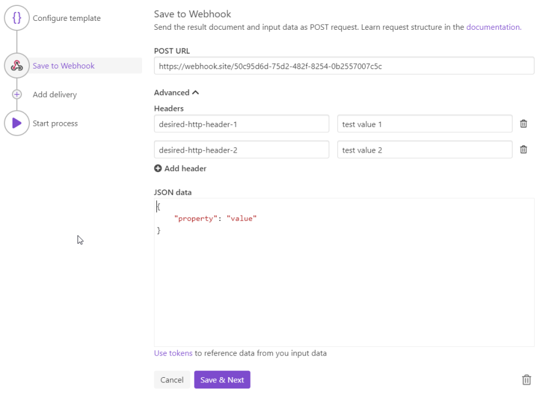

Webhook delivery
===================

The Webhook delivery sends a file generated by your process in a specified URL. First, you have to fill the URL where result object will be sent:

Optionally you can specify HTTP headers or JSON object that will be sent in the same request

As a result (see the "Raw Content" section), you will receive this object where "FileUrl" - is a link for downloading of a result file, "Data" - JSON that you added in the advanced option on the webhook delivery creation step.
As you can see specified HTTP-headers were added at the request object too (see the "Headers" section).

.. _use-tockens:

Use tokens in headers and JSON parameters
----------------------

.. include:: ../tokens-description-part.rst

.. image:: ../../../_static/img/user-guide/processes/webhook-delivery-tokens.png
    :alt: Tokens

.. note:: Review `the full list of available deliveries <../create-delivery.html#list-of-deliveries>`_.
