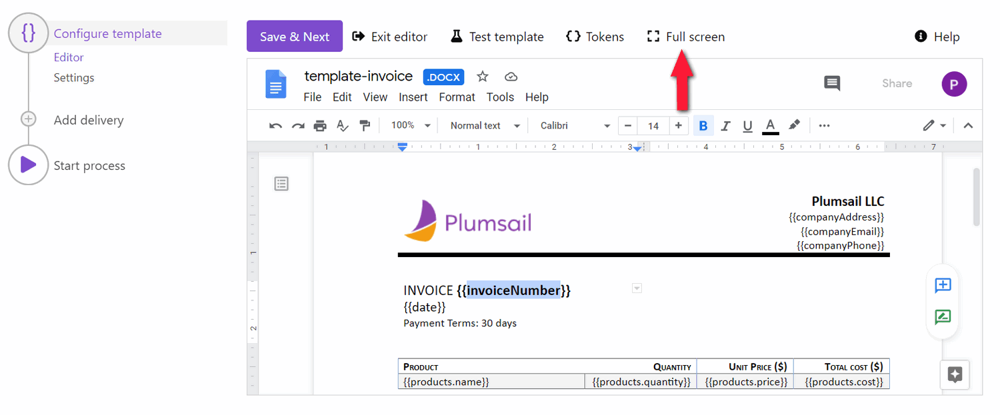

Prepare and test a template
===========================

After you `created the process <./create-process.html>`_, its first step **Configure template** will appear showing the substep **Editor**. Here you can start composing a template online or upload a pre-made one. 

.. contents:: Table of contents
    :local:
    :depth: 1

Templating syntax
~~~~~~~~~~~~~~~~~

To create your own templates easily, get acquainted with how the templating syntax works for supported formats:

- `DOCX template <../../document-generation/docx/index.html>`_
- `XLSX template <../../document-generation/xlsx/index.html>`_
- `PPTX template <../../document-generation/pptx/index.html>`_
- `Fillable PDF form <../../document-generation/fillable-pdf/index.html>`_
- `HTML template <../../document-generation/html/index.html>`_

Online Editor
~~~~~~~~~~~~~

The online editor allows you to create document templates and modify them online right in the Plumsail process.

For Office document templates, the editor mode in the Configure template step starts with the template preview. To start working on the document template online, click on the **Edit online** button:

.. image:: ../../_static/img/user-guide/processes/edit-online-button.png
    :alt: Edit online button

If you're working on the HTML template, you're able to make changes right away, because there is no preview mode.

.. note:: No online editor is available for fillable PDF form templates. You'll have only its preview on this step. You can consult our detailed description of `how to create fillable PDFs <../../document-generation/fillable-pdf/index.html>`_. 

The online editor provides a **full-screen mode** for more convenience in working with the template.  
Switch to a fullscreen and back by simply clicking on the button.

Complex Office document templates
~~~~~~~~~~~~~~~~~~~~~~~~~~~~~~~~~

Online editor for Word, Excel, and PowerPoint templates is based on Google Docs. 
That's why you may encounter incompatibilities for certain Microsoft Office features. For example, Google Docs doesn't support watermarks.

We recommend you to work on complex document templates outside the process. Use Upload/Download buttons for it:

.. image:: ../../_static/img/user-guide/processes/upload-download-button.png
    :alt: Edit HTML html template                

Test document template
~~~~~~~~~~~~~~~~~~~~~~

You can instantly check how all your modifications to the template will affect the resulting file.
Both the preview and the editor include the Test template button:

.. image:: ../../_static/img/user-guide/processes/test-button-template.png
    :alt: Test template button in Online editor

After you've clicked on the **Test template**, the dialog appears and you will see two options for testing the template. 

You can fill the testing form or submit JSON representing data for the document template. 

Read more about `testing templates <./test-template.html>`_. 

Save template
~~~~~~~~~~~~~

You can switch between preview and edit modes by clicking **Edit online** and **Exit editor**. But none of the changes will pass to the process until you press **Save&Next**. To confirm you're satisfied with the template result and ready to go to the next step, click on this button:

.. image:: ../../_static/img/user-guide/processes/save-button.png
    :alt: Save template button in Online editor

.. note:: Once you've finished with the template, you can proceed to `configure output file settings <./configure-settings.html>`_.