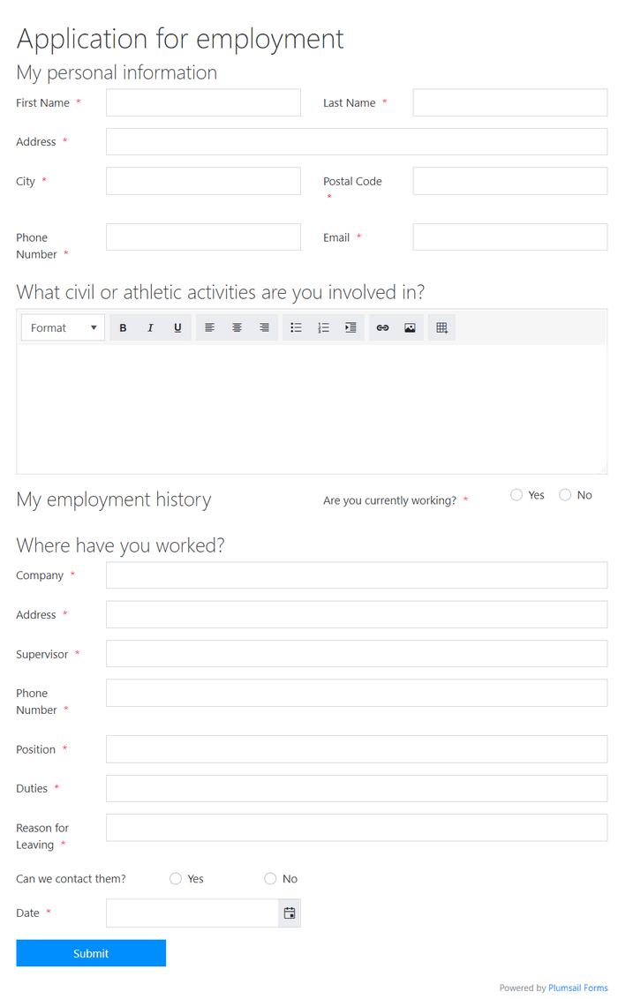
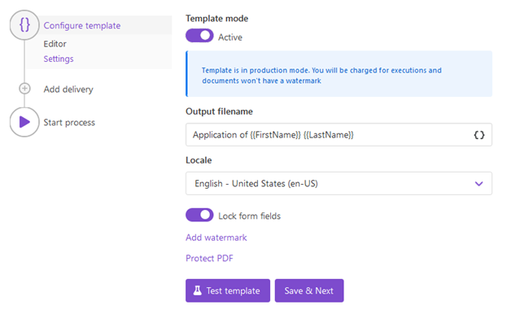
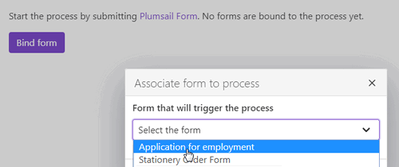

How to auto-populate fillable PDF on Plumsail Forms submission
==============================================================

In this article, you will learn how to automate the generation of documents in your company. For example, applications, orders, invoices, cards and others. We’ll show you how to automatically populate fillable PDF on `Plumsail Forms <https://plumsail.com/forms/>`_ submission by its integration with `Processes <../../../user-guide/processes/index.html>`_.

**Processes** are a `Plumsail Documents <https://plumsail.com/documents/>`_ feature with an intuitive interface for creating documents from templates. 

By means of **Plumsail Forms**, you can design elegant, responsive, and highly customizable forms for SharePoint Modern UI or any web page. In our example, we will collect data from a *Web Form*, apply it to a fillable PDF with the help of *Processes*.

.. contents::
    :local:
    :depth: 2

Create a fillable PDF
---------------------

Follow `this instruction <../../../document-generation/fillable-pdf/index.html>`_ to create a fillable PDF. `Download the template file <../../../_static/files/flow/how-tos/fill-in-pdf-form-template.pdf>`_ for this article.

.. image:: ../../../_static/img/flow/how-tos/fill-in-pdf-form-template.png
    :alt: fill in pdf form template

Create a Form
-------------

We have already designed an application for employment form. Here it is:

You can use our ready form template for an employment application. `Download the file <../../../_static/files/flow/how-tos/Application-for-employment.xfds>`_ and import it to the Plumsail Forms designer. 

To create such a form yourself, follow `this link <https://plumsail.com/docs/forms/design.html>`_ to learn more about how to design Plumsail Web Forms. 

**Understanding Internal Names of Form's fields**

It’s crucial to understand the **internal names** of Form's fields. They must correspond to fields' names in a fillable PDF. You can set internal names for Form’s fields in its general propeties:

Data from this field will fill in the corresponding field in our fillable PDF. Its name is **FirstName** as well.

SingleChoice fields in our Plumsail Form correspond to radio buttons in the fillable PDF. So, they should have not only the same general name but the same options. 

**Example**: We have a SingleChoice in the Plumsail form with **Yes** and **No** options. Its internal name is **CurrentlyWorking**. 

In fillable PDF we create **two** radio buttons. The general name is the same for two of them – **CurrentlyWorking**. 

.. image:: ../../../_static/img/flow/how-tos/general_name_rudiobutton.png
    :alt: name of radiobutton in PDF form

In properties options, we set a radio button choice – **Yes** for one and **No** for another radio button.

Configure the Process
-----------------------

When our fillable PDF and Plumsail Form are ready, we proceed to configure the Process. It will apply data from the form submission to the fillable PDF. 

Create a new process
~~~~~~~~~~~~~~~~~~~~

To create a new process, go to `the Processes section <https://account.plumsail.com/documents/processes>`_ in your Plumsail account. 

Click on the *Add process* button.

.. image:: ../../../_static/img/user-guide/processes/how-tos/add-process-button.png
    :alt: add process button

Set the Process name. 

.. image:: ../../../_static/img/flow/how-tos/create-new-process-plumsail-forms.png
    :alt: generate PDF from Plumsail Forms 

Upload the prepared fillable PDF as a template. 

Configure a template
~~~~~~~~~~~~~~~~~~~~~

Once you're done with the first step *Create Process*, press the *Submit* button, and you’ll proceed to the next – *Configure Template*:

- Fill in the name of the result file
- `Protect the result PDF <../../../user-guide/processes/create-process.html#add-watermark>`_ if you wish

You can test a template as well, to see how it will look at the end. Find out how to do it in `the description <../../../user-guide/processes/test-template.html>`_.

Delivery
~~~~~~~~

The next step is delivery. For demonstrating purposes, let us set an email delivery. 

Fill-in a recipient email. Add recipients for a copy or blind copy if you need. Define the subject of the letter. And write an email body. 

You can use tokens from your template to specify details in the email subject as we did, or in the body. The submitted data will be applied to them as well. Learn more by following `this link <../../../user-guide/processes/tokens-in-process-fields.html>`_.

.. image:: ../../../_static/img/flow/how-tos/send-email-populate-pdf.png
    :alt: send email delivery

You can configure as many deliveries as you need. Check all the available options and how to handle them `here <../../../user-guide/processes/create-delivery.html#list-of-available-deliveries>`_.

Start the Process on Plumsail Forms submission
~~~~~~~~~~~~~~~~~~~~~~~~~~~~~~~~~~~~~~~~~~~~~~

We will start our Process by submitting the Plumsail Web Form.

For that, we will bind it. Press the *Bind* button and select the form from the dropdown. 

Once we've done it, the Form will appear in the list of Plumsail Forms bound to this Process. 

Every time somebody submits the form, the Process of population fillable PDF documents will start. It will apply the Form submission data to the fillable PDF and send the result document by email.

See how the result file looks:

.. image:: ../../../_static/img/flow/how-tos/fill-in-pdf-form-result.png
    :alt: fill in pdf form result

Sign up for Plumsail Documents
------------------------------

To fully automize the generation and flow of your documents, `register a Plumsail account <https://auth.plumsail.com/Account/Register>`_. It's easy to get started and save time with the help of Plumsail Documents.

.. hint:: Check another article on `how to automatically populate fillable PDFs in Power Automate <../../../user-guide/processes/examples/fill-pdf-form-processes.html>`_. 

