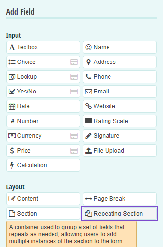
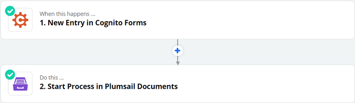
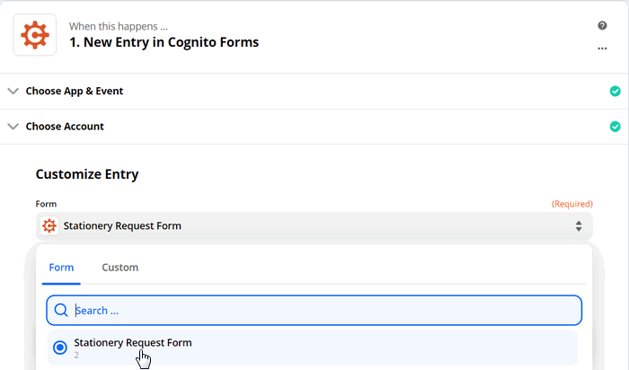
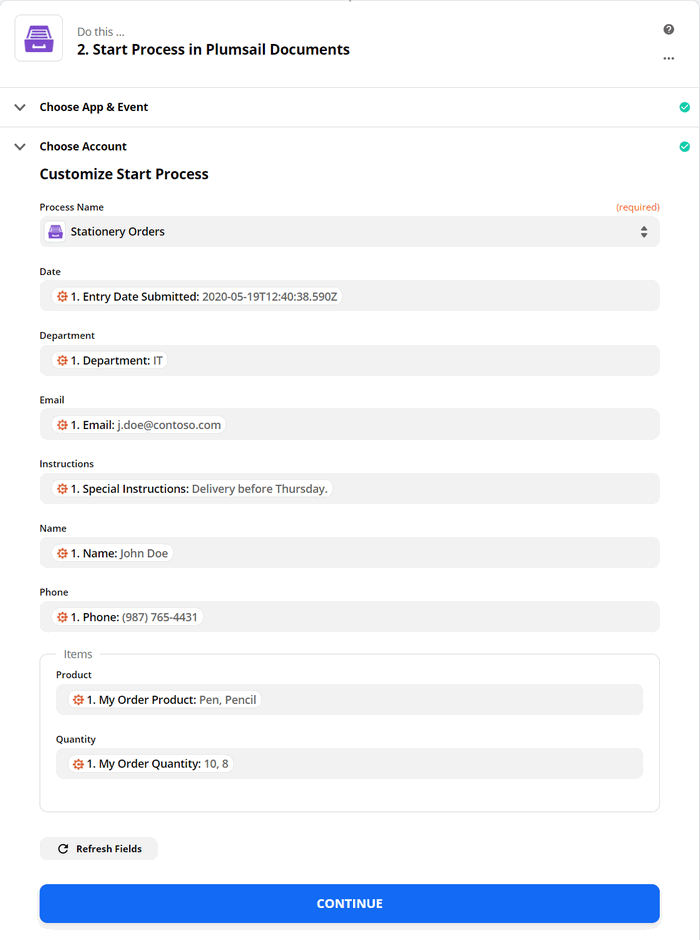

.. title:: Use Cognito Forms to populate Excel document templates and then convert to PDF using Zapier integration

.. meta::
   :description: An example of how to auto create Excel order requests from Cognito Forms entries and convert to PDF using Zapier integration

How to create Excel and PDF documents from Cognito Forms in Zapier
==================================================================

This article shows how to create PDF documents from an XLSX template on a `Cognito Form <https://www.cognitoforms.com/>`_ entry with the help of `Processes <../../../user-guide/processes/index.html>`_ in Zapier. It may help you to automate the generation of different documents like applications, requests, orders, etc., in your company. 

**Processes** are a `Plumsail Documents <https://plumsail.com/documents/>`_ feature with an intuitive interface for creating documents from templates.

**Cognito Forms** are an online form builder that allows you to create powerful forms for your website.

In this example, we will collect data from a Cognito Form, apply the data to our Excel template, and generate a new PDF document with the help of Processes in Zapier.

.. contents::
    :local:
    :depth: 2

Create a Form
-------------

We have already prepared a Cognito form for ordering stationery and office supplies. We will use data from its submission to apply to our template. If you haven't created any Cognito Forms before, you can `learn how to do it <https://www.cognitoforms.com/support/15/building-forms/creating-forms>`_.

Below is a screenshot of our form:

.. image:: ../../../_static/img/flow/how-tos/stationery-request-cognito-form.png
    :alt: Cognito Form image

We used the *Repeating Section* layout to allow users to add more products. You may also use the *Basic Sales Form* template to add this functionality:

.. include:: ../examples/stationary-order-process-part.rst

Start the Process
~~~~~~~~~~~~~~~~~
We will start our Process from Zapier. 

Create a Zap
-------------
Zap is an automated connection between web services in Zapier. 
You can create it from scratch following the steps explained below.

Or you can utilize the zap template. Click **Use this zap**, and then just customize the steps as it's described further in this article.

|Widget|

.. |Widget| raw:: html

    

This is how our Zap looks:

Below is a step-by-step description.

New entry in Cognito Forms
~~~~~~~~~~~~~~~~~~~~~~~~~~

We need to start the Zap everytime somebody submits our stationery request form. For that, search for  *Cognito Forms* in Zapier and add *New entry* as a trigger.

If this is your first Zap with Cognito Forms, on this step, sign in to your Cognito Account from Zapier to use your forms inside Zaps.

Then, you'll need to pick the form you want to track in the dropdown.

The last thing to do with the trigger - **Find data**. Press "Test trigger" to find data. It will allow you to use the trigger output on the next step.

Start process in Plumsail Documents
~~~~~~~~~~~~~~~~~~~~~~~~~~~~~~~~~~~

Once the trigger is set, search for Plumsail Documents and add an action *Start process*.

.. image:: ../../../_static/img/user-guide/processes/how-tos/start-process-zapier.png
    :alt: start process from Zapier action

Click Continue. If this is your first Zap, at this point, you'll need to Sign in to your Plumsail Account from Zapier to establish a connection between the app and your account. If you already have a Plumsail account tied to the app, you can add another one at this step, and use it instead.

Customize Start Process
***********************

Choose the process you want to start by this Zap from the dropdown. 
Then, you need to specify the data in JSON. This data will be applied to the template to personalize documents.

.. important:: Properties from the JSON object should correspond to tokens used in your template. Learn more about templates `here <../user-guide/processes/create-template.html>`_.

Use the output from the trigger to specify values:

Our Zap is ready. See how the resulting file looks:

.. image:: ../../../_static/img/flow/how-tos/result-file-cognito-xlsx.png
    :alt: Final document

Sign up for Plumsail Documents
------------------------------

As you can see, it's simple to automize the generation of documents on Cognito Forms submission. If you're new to Plumsail Documents, `register an account <https://auth.plumsail.com/Account/Register?ReturnUrl=https://account.plumsail.com/documents/processes/reg>`_ and follow the steps described in the article to set the process for automatic creation of PDFs from Cognito Forms.

.. hint:: See how to `create PDF documents from a DOCX template from Cognito Forms entries in Zapier <../../../user-guide/processes/examples/create-word-and-pdf-documents-from-cognito-forms-zapier.html>`_.