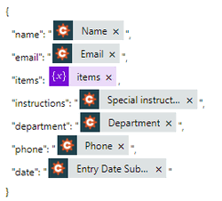

How to create Excel and PDF documents from Cognito Forms in Power Automate (Microsoft Flow) and Azure Logic Apps
================================================================================================================

This article shows how to create PDF documents from an XLSX template on a `Cognito Form <https://www.cognitoforms.com/>`_ submission with the help of `Processes <../../../user-guide/processes/index.html>`_ in Power Automate (MS Flow). It may help you to automate the generation of different documents like applications, requests, orders, etc., in your company. 

**Processes** are a `Plumsail Documents <https://plumsail.com/documents/>`_ feature with an intuitive interface for creating documents from templates.

**Cognito Forms** are an online form builder that allows you to create powerful forms for your website.

In this example, we will collect data from a Cognito Form, apply the data to our Excel template, and generate a new PDF document with the help of Processes in Power Automate (Microsoft Flow).

.. contents::
    :local:
    :depth: 2

Create a Form
-------------

We have already prepared a Cognito form for ordering stationery and office supplies. We will use data from its submission to apply to our template. If you haven't created any Cognito Forms before, you can learn how to do it `here <https://www.cognitoforms.com/support/15/building-forms/creating-forms>`_.

Below is a screenshot of our form:

We used the *Repeating Section* layout to allow users to add more products. You may also use the *Basic Sales Form* template to add this functionality:

.. image:: ../../../_static/img/flow/how-tos/add-repeating-section-cognito.png
    :alt: Cognito Form repeating section

.. include:: ../examples/stationary-order-process-part.rst

Start the Process
~~~~~~~~~~~~~~~~~
We will start our Process from Power Automate (Microsoft Flow). 

Create a Flow
-------------

This is how our Flow looks:

.. image:: ../../../_static/img/flow/how-tos/Cognito-Forms-XLSX-PDF-flowp.png
    :alt: xlsx to pdf from Cognito flow

Check out the Flow steps described below.

Form is submitted
~~~~~~~~~~~~~~~~~

We need to start the Flow everytime somebody submits our stationery request form. For that, search for  *Cognito Forms* in Power Automate and add *Cognito Forms - When a new entry is created* as a trigger.

If this is your first Flow with Cognito Forms, on this step, sign in to your Cognito Account from MS Flow to use your forms inside Flows.

Then, you'll need to pick the form you want to track in the dropdown.

.. image:: ../../../_static/img/flow/how-tos/cognito-trigger.png
    :alt: Cognito Form trigger

Initialize variable
~~~~~~~~~~~~~~~~~~~

We need to build an array with the data from the Repeating Form's Section to use it in the JSON **Template data** in *Start document generation process* action. So, we create an array of variable *items*. 

.. image:: ../../../_static/img/flow/how-tos/initialize-variable-cognito-forms.png
    :alt: Initialize variable

Start document generation process
~~~~~~~~~~~~~~~~~~~~~~~~~~~~~~~~~

This is the action from `Plumsail Documents connector <../../../getting-started/use-from-flow.html>`_. This action is suitable for starting the Process of generating documents from a template. You can find more information about this action by visiting `this page <../../../flow/actions/document-processing.html#start-document-generation-process>`_.

Using the action for the first time, you’ll be asked for *''Connection Name''* and *''Access Key''*. 

.. image:: ../../../_static/img/getting-started/create-flow-connection.png
    :alt: create flow connection

You can type any name for the connection. For example, *''Plumsail Documents''*. 

Then `create an API key in your Plumsail Account page <https://plumsail.com/docs/documents/v1.x/getting-started/sign-up.html>`_, copy and paste it to *''Access Key''* field.

The action has two parameters:

.. image:: ../../../_static/img/user-guide/processes/how-tos/start-generation-docs-action.png
    :alt: start generation documents action

- *Process name*. Select the process you need from available ones. 
- *Template data*. Specify source data in JSON format:

This object contains information from our form. We selected the dynamic content from the output of *Cognito Forms - When a new entry is created* action and from the *Initialize variable* step:

Use the ready document in Flow
~~~~~~~~~~~~~~~~~~~~~~~~~~~~~~

You can stop on the step **Start document generation process**. 

Steps described above are enough for generating PDFs from an XSLX template based on the Cognito Form submission. Your result file will be saved to OneDrive in this case. See how it will look:

.. image:: ../../../_static/img/flow/how-tos/result-file-cognito-xlsx.png
    :alt: Final document

But if you need an advanced logic, it's possible to work with the result file right in the Flow. 

Here is an example of how you can send the ready document for approval. 

Add an action *Create an approval* from the *Approvals* connector. Select an output of the previous step for an attachment.

.. image:: ../../../_static/img/user-guide/processes/how-tos/create-an-approval.png
    :alt: send pdf for approval

Sign up for Plumsail Documents
------------------------------

As you can see, it's simple to automize the generation of documents on Cognito Forms submission. If you're new to Plumsail Documents, `register an account <https://auth.plumsail.com/Account/Register>`_ and follow the steps described in the article to set the process for automatic creation of PDFs from Cognito Forms.

.. hint:: You can generate PDFs from Web Forms even without Power Automate (Microsoft Flow). Check the article `How to generate PDF documents from a DOCX template on Plumsail Forms submission <../../../user-guide/processes/examples/create-word-and-pdf-documents-from-plumsail-forms.html>`_.