.. title:: How to use Google Sheets data to populate your custom document templates 

.. meta::
   :description: When a new row is added to Google Sheets, generate customized documents from its data.

Create contracts from Google Sheets with Zapier automation
==========================================================

In this article, we’ll describe how to use Zapier automation to create contracts from new Google Sheets rows. 
We’ll use `Plumsail Documents <https://plumsail.com/documents/>`_ integration in Zapier in conjunction with Google Spreadsheets integration to accomplish the task.

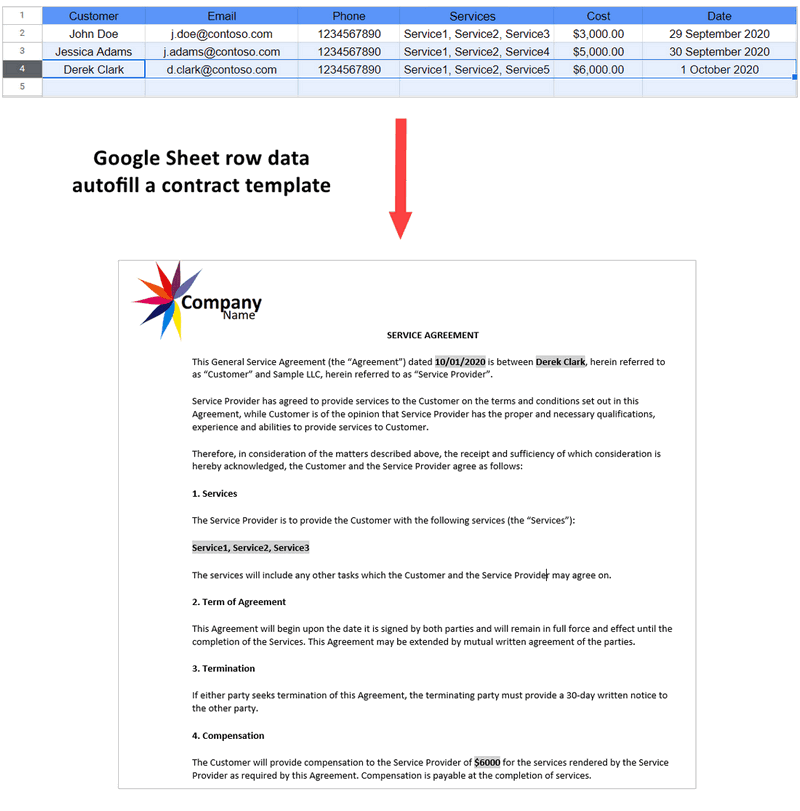

It might be useful for those who use Google Suite to operate business processes. 
Imagine that you have a Google form and an associated Google sheet where form's submissions are stored, and you want to start document creation every time a new row is added to the spreadsheet. 
It's just one case out of many. New sheet rows may come from any sources. 

To stick to the following steps, you're required to have:

- Plumsail Documents account (if you haven’t a Plumsail account yet, `register for a 30-day free period <https://auth.plumsail.com/Account/Register?ReturnUrl=https://account.plumsail.com/documents/processes/reg>`_)
-	Google account
- Zapier account

.. contents::
    :local:
    :depth: 2

Set up contract creation process in Plumsail Documents
~~~~~~~~~~~~~~~~~~~~~~~~~~~~~~~~~~~~~~~~~~~~~~~~~~~~~~

Go to `the Processes section <https://auth.plumsail.com/account/Register?ReturnUrl=https://account.plumsail.com/documents/processes/reg>`_ in your Plumsail account to create a new process that will autofill a document template from a Google sheet. 
Click on the *Add process* button:

.. image:: ../../../_static/img/user-guide/processes/how-tos/add-process-button.png
    :alt: add process button

Make up the process name and select a template type. In our case, it's **DOCX**:

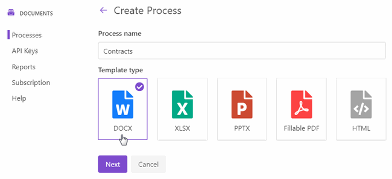

Configure contract template
----------------------------

Click *Next* and you'll proceed to the **Configure template** step. It includes 2 substeps:

- Editor;
- Settings.

In `Editor <../../../user-guide/processes/online-editor.html>`_, you can compose templates from scratch or upload pre-made ones. It's also possible to modify the uploaded template online.

We have composed our contract template right in the online editor:

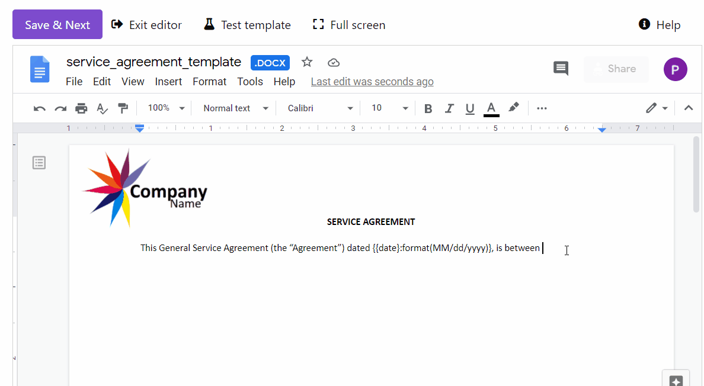

**Download the template**. Feel free to `download the ready template <../../../_static/files/user-guide/processes/contract-template.docx>`_ to your computer and then upload the template file to the process. 

**Templating syntax**. For you not to have difficulties when creating your own templates, let's take a quick look at how the templating syntax works.
The main rule is that everything in :code:`{{curly braces}}` is a variable where the templating engine applies specified data. In our case, for example, the real name of the customer will replace :code:`{{customer}}` token, and so on.

With Plumsail Documents templating syntax, it's also simple to implement more complex scenarios with tables, lists, charts, and even value and conditional formatting. The simplest example from our template is a value formatter to reduce date to the required format:

.. code::

    {{date }:format(MM/dd/yyyy)}
    
Check out the detailed information on `how Word DOCX templates work <../../../document-generation/docx/index.html>`_. 

**Test template**. After uploading or modifying the template, you can test it to get an idea of how the resulting document will look. 

Click on the *Test template*. You will see the dialog where you can fill in the auto-generated testing form. 
Form fields are created based tokens from your document template. You can `adjust the look of the testing form by changing token types <../custom-testing-form.html>`_.

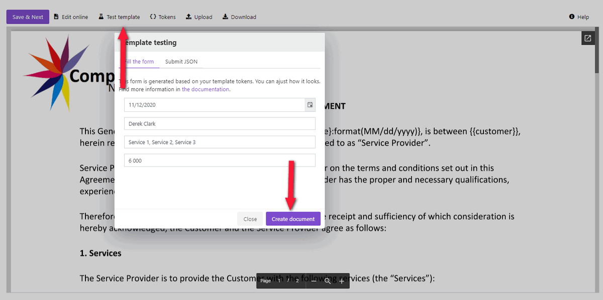

The resulting document will appear in a new tab. Once you're satisfied with it, proceed to the **Settings** substep.

Here you customize the following parameters:

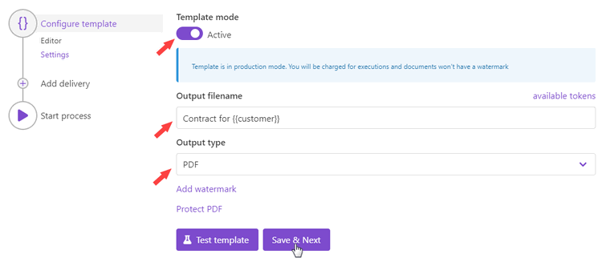

**Template mode**. It is *Testing* by default. The process runs in testing mode are free, but result documents have a Plumsail watermark. Change it to *Active* to remove the watermark.

**Output filename**. Use tokens to make it personalized. They work the same way as in the template. 

**Output type**. By default, it is the same as your template's format. In this particular case, it's DOCX. We're changing it to PDF to save contracts in PDF.

.. hint:: You can `protect your final PDF document with a watermark, by setting a password, or disabling some actions <../configure-settings.html#add-watermark>`_. 

**Test template**. You can test the template from the Settings as well - to check how the customized settings will appear in the resulting document. The procedure is the same as we've done in the Editor substep.

Save contracts to Google Drive
------------------------------

The next step of the process is delivery - a way where to send or store generated documents. You can add as many deliveries as you need. 
 
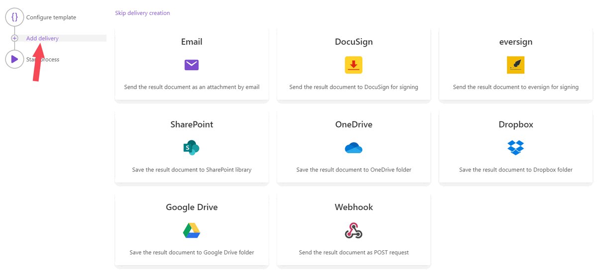

For demonstration purposes, we selected `saving ready contracts to Google Drive <../deliveries/google-drive.html>`_.

First, connect to your Google Drive from the Plumsail account. Then, make up the folder name where to store completed contracts.

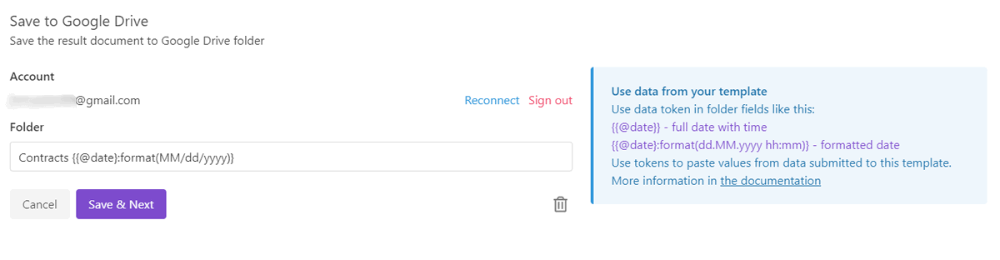

As we've already mentioned, you can add more than one delivery. For example, additionally, to Google Drive, you can assign such e-signing deliveries as eversign or DocuSign, and send contracts for e-signature. Please, check out the `full list of available deliveries <../../../user-guide/processes/create-delivery.html>`_.

Start contract creation process
-------------------------------

We'll start our process from Zapier.

Create Zapier automation
~~~~~~~~~~~~~~~~~~~~~~~~

Zapier automation, or as it's shortly called Zap, is a connection between web services in Zapier. 

You can create a Zapier automation from scratch, or you can utilize the zap template. Click **Use this zap**, and then just customize it as we'll describe further.

|Widget|

.. |Widget| raw:: html

    

This is how our completed Zap looks:

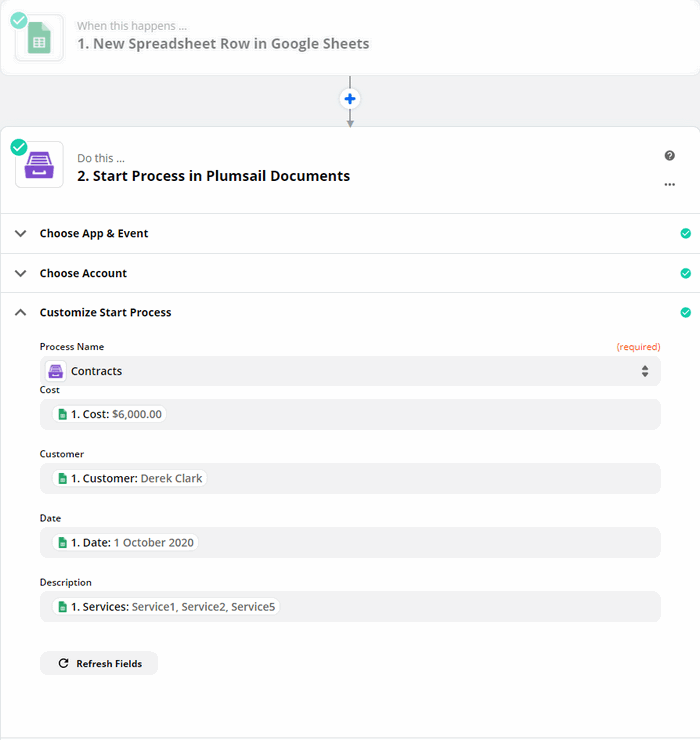

New spreadsheet row in Google Sheets
------------------------------------

We need to start the contract creation process every time a new row is added to the Google spreadsheet. That's why we use a trigger from the Google Sheets integration - **New Spreadsheet Row in Google Sheets**. 

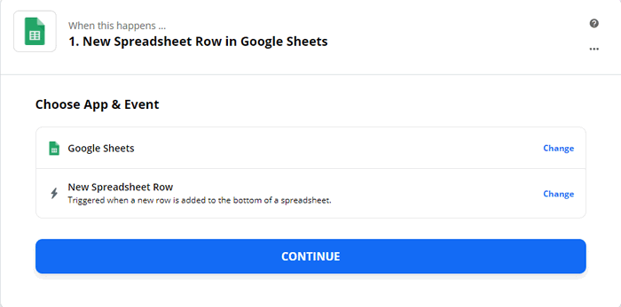

To proceed, you'll need to sign in to your Google account from Zapier. After that, Zapier enables you to customize the trigger. Please, select the required spreadsheet and worksheet. 

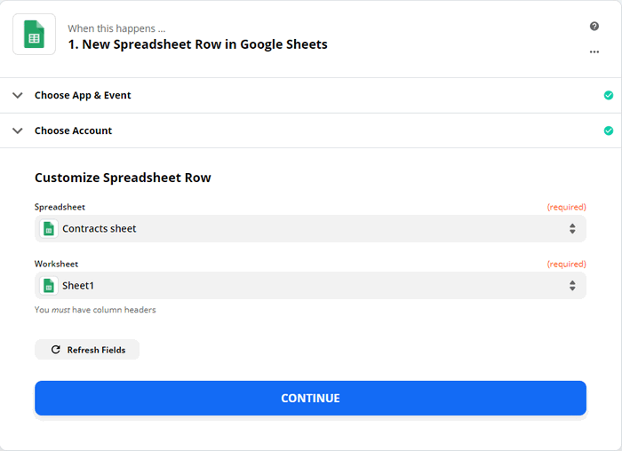

And the final step in the trigger is to test it. It's needed for pulling sample data from Google Sheets. Don't skip testing, otherwise, you won't be able to use the trigger outputs in the next step.

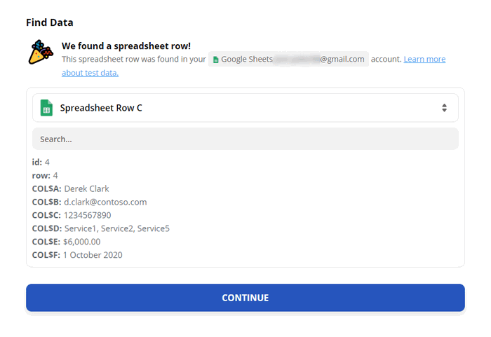

Start process in Plumsail Documents
-----------------------------------

The action to execute when the trigger happens is from the Plumsail Documents integration - **Start process**. 

.. image:: ../../../_static/img/user-guide/processes/how-tos/start-process-zapier.png
    :alt: start process from Zapier action

Click *Continue*. If this is your first Zap, at this point, you'll need to Sign in to your Plumsail Account from Zapier to establish a connection between the app and your account. If you already have a Plumsail account tied to the app, you can add another one at this step, and use it instead.

Customize the action:

- Expand the dropdown to choose the process you need to track by this zap:

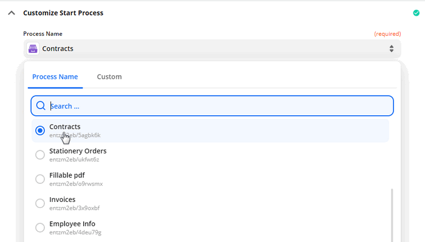

- Once you've selected the process, you'll see tokens from the contract template as fields to complete. Use output from the Google Sheets trigger to fill them.

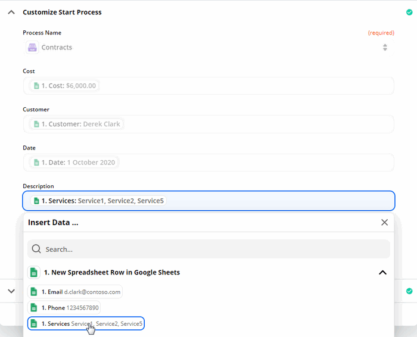

Click *Done editing*, and turn on your zap. 

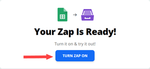

That's it! From now, each new row in the Google spreadsheet will launch a process of creating contracts. 
You can adjust this scenario to your needs, and create other documents from Google Sheets like sales proposals, applications, invoices, and more.

.. hint:: Check out `other integrations examples with Plumsail Documents <https://plumsail.com/documents/integrations/>`_ to automate your document processes. 

