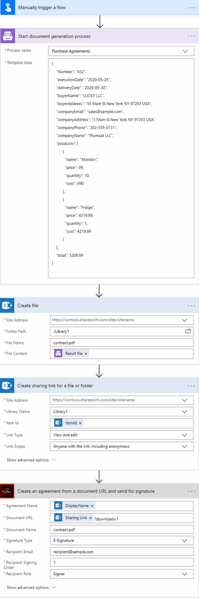
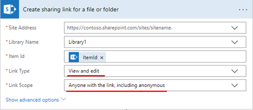

How to create a document from a template in Power Automate (Microsoft Flow) and sign it using AdobeSign
######################################################################################

This article is a ready-to-use solution on how to create a PDF document from a template and sign it using `AdobeSign <https://acrobat.adobe.com/us/en/sign.html>`_.

With the help of `Processes <../../../user-guide/processes/index.html>`_, we will create a purchase agreement from a DOCX template, save in SharePoint document library and send for signing using the **AdobeSign** connector for Power Automate (Flow). 

This is how the result document will look after signing:

.. image:: ../../../_static/img/flow/how-tos/signed_contract.png
    :alt: signed contract

.. contents::
    :local:
    :depth: 2

Configure the Process
~~~~~~~~~~~~~~~~~~~~~

Before creating the Flow, we need to set a Process, which will create our purchase agreement in PDF format from a DOCX template.

Create a new process
--------------------

First, go to `the Processes section <https://account.plumsail.com/documents/processes>`_ in your Plumsail account. 

Click on the *Add process* button.

.. image:: ../../../_static/img/user-guide/processes/how-tos/add-process-button.png
    :alt: add process button

Set the Process name. 

.. image:: ../../../_static/img/flow/how-tos/purchase-agreements-process.png
    :alt: create a new process

Upload the template you're gonna use. In this example, we'll create a PDF purchase agreement from a DOCX template. And below is our template's screenshot. You can download it by `this link <../../../_static/files/flow/how-tos/CONTRACT_TEMPLATE.docx>`_.

.. image:: ../../../_static/img/flow/how-tos/agreement-template.png
    :alt: Agreement DOCX template

When creating your own templates, mind the templating language. Plumsail Word DOCX templates use a different approach than most other templating solutions. It uses a minimal amount of syntax to make your work done.

In short, the templating engine thinks that everything between curly :code:`{{ }}` brackets is variables where it will apply your specified data. 
Read `this article <../../../document-generation/docx/how-it-works.html>`_ to get familiar with the templating engine.

Configure a template
--------------------

Once you're done with the first step *Create Process*, press the *Submit* button, and you’ll proceed to the next – *Configure Template*:

- Fill in the name of the result file
- Select PDF format for the output file
- `Protect the result PDF <../../../user-guide/processes/create-process.html#add-watermark>`_ if you wish

.. image:: ../../../_static/img/flow/how-tos/configure-template-signNow.png
    :alt: Configure template

You can test a template as well, to see how it will look at the end. After clicking on the *Test template* button, you’ll need to ‘feed’ a template with your data in JSON format. In our case, it might be the following:

JSON data
*********

.. code:: json

    {
        "Number": "432",
        "execution.date":"2020-05-25",
        "delivery.date":"2020-05-30",
        "buyer.name":"LUCKY LLC",
        "buyer.address":"55 Main St.New York NY 97203 USA",
        "company": {
           "email": "sales@sample.com",
           "address": "3 Main St.New York NY 97203 USA",
           "phone": "202-555-0131",
           "name": "Plumsail LLC"
        },
        "items": [
            {
                "product": {
                   "name": "Monitor",
                   "price": 99
                 },
                "quantity": 10,
                "cost": 990
                },
                {
                "product": {
                    "name": "Fridge",
                    "price": 4219.99
                },
                "quantity": 1,
                "cost": 4219.99
              }
        ],
        "total": 5209.99
    }

.. image:: ../../../_static/img/flow/how-tos/test-template-sign-now.png
    :alt: test template

Delivery
--------

The next step is delivery. For demonstrating purpose, we’ll store the result file in `OneDrive <../../../user-guide/processes/deliveries/one-drive.html>`_. But there are `other options <../../../user-guide/processes/create-delivery.html#list-of-available-deliveries>`_.

Select the folder where the ready document will be saved. Fill in the file's name. You don't need to put :code:`.extension`, it'll be done automatically based on the output file type you set on the *Configure template* step.

.. image:: ../../../_static/img/flow/how-tos/onedrive-signnow.png
    :alt: onedrive-delivery

You can configure as many deliveries as you need.

Start the Process
-----------------

We will start our Process from Power Automate (Flow). 

Create a Flow
~~~~~~~~~~~~~

This is how our Flow looks:

Check out the Flow steps described below.

Flow trigger
------------

After you’ve opened `My Flows <https://emea.flow.microsoft.com/manage/flows>`_, create a new one, and select a trigger. You can pick any, for example, trigger a Flow when an opportunity in CRM is closed, or a new item is added to SharePoint list. We will pick *'Manually trigger a Flow'* just for demonstration purposes.

Start document generation process
---------------------------------

This is the action from `Plumsail Documents connector <../../../getting-started/use-from-flow.html>`_. This action is suitable for starting the Process of generating documents from a template. You can find more information about this action by visiting `this page <../../../flow/actions/document-processing.html#start-document-generation-process>`_.

Mind, If you use the Plumsail documents action for the first time, you’ll be asked for *'Connection Name'* and *'Access Key'*. You can type any name for the connection. For example, *'Plumsail Documents'*.

Then `create an API key in your Plumsail Account page <../../../getting-started/sign-up.html>`_, copy and paste it to the *'Access Key'* field.

The **Start document generation process** action has two parameters:

- *Process name*. Select the process you need from available ones. 
- *Template data*. Specify source data in JSON format as we did on `the step of testing <../../../flow/how-tos/documents/create-a-document-from-template-and-sign-Abobesign-processes.html#json-data>`_ the template. 

.. image:: ../../../_static/img/flow/how-tos/template-data-signnow.png
    :alt: Template data

Create file
-----------

Use this action to store the completed agreement in SharePoint document library. Specify a SharePoint site URL, a library, the name of the document with :code:`.PDF` extension, and for *File content* choose :code:`Result file` – an output from the *Start document generation* step.

Create sharing link for a file or folder
----------------------------------------

We will need to share our contract with AdobeSign, that’s why a sharing link is needed. Pay attention to choose the right link type and scope – they should be *'View and edit'* and *'Anyone with the link, including anonymous'* respectively. 

There is a tricky moment for SharePoint site collection – you may be not allowed to share files from libraries of your SP site. In the case of such a setting, the Flow will fail on this step. We need to change the settings.

For that, go to SharePoint Admin Center, navigate to Active sites, choose yours and click on the button *'Sharing'* to edit the settings. 

For our purpose, the site content can be shared with anyone.

You may be worried about sensitive information while sharing files, but there is no reason for it; nobody can use the link, but the AdobeSign application for getting content to create an agreement for further usage in AdobeSign. 

Moreover, there is another action in AdobeSign connector for Power Automate (Microsoft Flow) to upload documents directly, but unfortunately, it doesn’t work now because of a lack of code integration. We believe that it will be fixed in the future.

Create an agreement from a document URL, and send for signature
---------------------------------------------------------------

This action creates an agreement, saves it in the AbobeSign account and sends it to your partner for signature. 

You can put any name for *'Agreement name'*. 

For Document URL field select an output from the previous step, and add :code:`?download=1` to make the link direct. Otherwise, it won’t work.

Don’t forget to specify a file extension with :code:`.PDF`

The Flow is ready. Now you know how to simplify your workflow processes with the help of Processes by Plumsail Documents and its connector for Power Automate (Flow). If you haven't a Plumsail account yet, `sign up <https://auth.plumsail.com/Account/Register?ReturnUrl=https://account.plumsail.com/documents/processes/reg>`_ to get started.

.. hint:: If you use a SignNow system for e-signs or just want to compare AdobeSign with an alternative, read our article `How to create a document from a template and sign it using SignNow <../../../flow/how-tos/documents/create-document-from-template-and-SignNow-processes.html>`_.

.. |adobe_sign_flow| image:: /_static/img/flow/how-tos/adobe_sign_flow.png
.. |get_content| image:: /_static/img/flow/how-tos/get_content_as.png
.. |create_docx| image:: /_static/img/flow/how-tos/docx_from_template_as.png
.. |convert_to_pdf| image:: /_static/img/flow/how-tos/convert_to_pdf_as.png
.. |adobesign_action| image:: /_static/img/flow/how-tos/adobe_sign_action.png

.. _Power Automate (Microsoft Flow): https://flow.microsoft.com/en-us/
.. _AdobeSign: https://acrobat.adobe.com/us/en/sign.html
.. _Plumsail Documents: https://plumsail.com/documents/
.. _AdobeSign connector: https://docs.microsoft.com/en-us/connectors/adobesign/
.. _My Flows: https://emea.flow.microsoft.com/manage/flows
.. _this page: https://plumsail.com/docs/documents/v1.x/flow/actions/document-processing.html#create-docx-document-from-template
.. _Plumsail Documents connector: https://plumsail.com/actions/documents/
.. _create an API key in your Plumsail Account page: https://plumsail.com/docs/documents/v1.x/getting-started/sign-up.html
.. _Download: https://plumsailonline.sharepoint.com/:w:/s/Anjelika/EWJQZezSnjNJtrX5CkhDZ4oB6yHZ3bsxZfcO3nbYzwqleA?e=0eD1iR
.. _here: https://plumsail.com/docs/documents/v1.x/document-generation/docx/how-it-works.html
.. _DOCX: https://plumsail.com/docs/documents/v1.x/flow/how-tos/documents/create-docx-from-template.html
.. _XLXS: https://plumsail.com/docs/documents/v1.x/flow/how-tos/documents/create-xlsx-from-template.html
.. _HTML: https://plumsail.com/docs/documents/v1.x/flow/how-tos/documents/create-html-from-template.html
.. _TXT: https://plumsail.com/docs/documents/v1.x/flow/how-tos/documents/create-text-from-template.html
.. _Older MS office formats into new ones: https://plumsail.com/docs/documents/v1.x/flow/how-tos/documents/convert-doc-to-docx-xls-to-xlsx-ppt-to-pptx.html
.. _HTML to PDF: https://plumsail.com/docs/documents/v1.x/flow/how-tos/documents/convert-html-to-pdf.html
.. _Email message to PDF: https://plumsail.com/docs/documents/v1.x/flow/how-tos/documents/convert-email-to-pdf.html
.. _sign up for an account: https://account.plumsail.com/
.. _See here: https://plumsail.com/docs/documents/v1.x/flow/how-tos/documents/index.html

