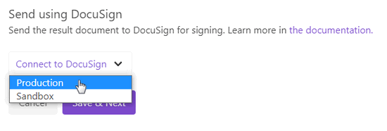

.. title:: Create PDF documents from a template and send them for e-signature with DocuSign

.. meta::
   :description: Generate sales contracts from a template and sign using DocuSign and Plumsail Documents

How to automatically create a document from a template and electronically sign it using DocuSign
================================================================================================

From this article, you will learn how to create a PDF document from a template and electronically sign it using `DocuSign <https://www.docusign.com/>`_. 

We'll create a PDF contract from a Word template and send it for signing using DocuSign delivery in `Plumsail Documents processes <../index.html>`_.

This is how the signed agreement will appear as a result:

We will do everything in the Plumsail account. If you haven’t one yet, feel free to `register a 1-month free account <https://auth.plumsail.com/Account/Register?ReturnUrl=https://account.plumsail.com/documents/processes/reg>`_.  

.. contents::
    :local:
    :depth: 1

Create new process
~~~~~~~~~~~~~~~~~~

To start with, go to `the Processes section <https://account.plumsail.com/documents/processes>`_ in your Plumsail account. 

Click on the *Add process* button.

.. image:: ../../../_static/img/user-guide/processes/how-tos/add-process-button.png
    :alt: add process button

Make up a name for the process. Then select the template type. In this particular case, tick the DOCX type because we'll create a purchase agreement from the DOCX template.

.. image:: ../../../_static/img/flow/how-tos/purchase-agreements-process.png
    :alt: create a new process

Configure document template
~~~~~~~~~~~~~~~~~~~~~~~~~~~

You have created the process and jumped into its first step - **Configure template**. Here are two substeps:

- Editor;
- and Settings.

Work on document template in Editor
-----------------------------------

In `Editor <../../../user-guide/processes/online-editor.html>`_, you can compose document templates online, or upload pre-made ones and modify them in case of need. 

`Download the contract template <../../../_static/files/user-guide/processes/contract-template-docusign.docx>`_ we've prepared for this case and upload it to the process.

Once you did it, you'll see the template preview:

You may notice :code:`{{tokens}}` in the document template. We highlighted a couple of them purple to attract your attention and describe how the templating syntax works. 

**Word DOCX templating syntax.** Everything in :code:`{{curly braces}}` is variables that the templating engine will replace with specified data. 
Also, in our template there are nested tags referring to products - :code:`{{products.name}}`, :code:`{{products.quantity}}`, :code:`{{products.price}}`, and :code:`{{products.cost}}`. 
 
They let the process know that we want to display properties from some object. In our example, it's a collection of products.   
The templating engine will automatically understand that there are multiple products and create table rows for each of them. 

Find out `more information on Plumsail Documents Word templates <../../../document-generation/docx/index.html>`_ in the documentation.

**Insert signing tags into the template**. You can insert special tags into the template to define the location of e-signatures and other associated information like initials, the date signed for a particular signer.
These tags are not related to Plumsail Documents templating syntax. They're from DocuSign. They ease the process of signing.
Signers don't need to search for the place where to sign and then drag and drop fields manually. 

We placed some of the DocuSign tags at the end of the document template and made them invisible by changing the font color to white:

This is how they will appear for the signer. Names and dates will be auto-filled.

`More information on DocuSign signature and other related tags <../deliveries/docusign.html#use-signature-and-other-related-tags>`_ is in our documentation.

Test document template
----------------------

To see how the resulting document will look, you can test your template. For that, click the *Test template* button. 

You will see the dialog where you can fill in the auto-generated testing form. 
Form fields are created based on tokens from your document template. You can `adjust the look of the testing form by changing token types <../custom-testing-form.html>`_.

.. image:: ../../../_static/img/user-guide/processes/how-tos/test-template-docusign.png
    :alt: test template

Once you've tested the template, press *Save&Next* to proceed further - to the **Settings** substep.

Customize document settings
---------------------------

- Switch the Template mode to *Active*. It will remove a Plumsail watermark from the resulting document.
- Fill in the name of the result file.
- Select PDF format for the output file.
- `Protect the result PDF <../configure-settings.html#add-watermark>`_ if required.

.. image:: ../../../_static/img/user-guide/processes/how-tos/configure-template-docusign.png
    :alt: Configure template

Send document to DocuSign for eSignatures
~~~~~~~~~~~~~~~~~~~~~~~~~~~~~~~~~~~~~~~~~

After you have pressed *Save&Next*, you'll be offered to add a delivery - a way where to save or send resulting documents.
Select the DocuSign delivery to send the ready contract to DocuSign for signing.

To start customizing details, connect to your DocuSign aссount. At this point, you can choose either Production or Sandbox mode. 
Sandbox suits if you need to test and evaluate the system. 
Please, mind that Sandbox and Production environments mean separate accounts in DocuSign.

When the connection between Plumsail and DocuSign accounts is established, you'll be able to customize DocuSign settings according to your needs.

Email subject and message
--------------------------

To make the content of the email subject and message dynamic, you can use tokens from the template. They will work just the same way as in the template. Meaning they will be replaced by specified data too. 

Look at the picture:

We inserted :code:`{{buyerName}}` and :code:`{{Number}}` tokens, and they will transform to the real name of the customer and the contract number dynamically every time.

You don't have to personalize the message manually.

Recipients
----------

It's possible to add as many recipients as you need. In this example, we added just two - from the vendor company and from the customer side. 
We assigned their roles - :code:`Needs to sign`. There are other options you can select.

.. image:: ../../../_static/img/user-guide/processes/how-tos/docusign-recepients.png
    :alt: add recipients and assign their roles

Advanced settings
-----------------

Expand *Advanced* to customize more settings. For instance, we enable *Sequential signing* that means the strict order in which recipients should receive and sign the document.
It's essential for us that our CEO signs the contract first, and the customer receives the copy signed by the vendor for signing.

To change the order, you can drag and drop recipients like this:

Also, in advanced settings of the DocuSign delivery, you can set an expiration period and reminders.

The DocuSign delivery step is completed. Press *Save&Next*. 

You can add as many deliveries as you need. For example, if you want to store your contracts somewhere, you can choose Cloud storage deliveries like *OneDrive*, *Google Drive*, *Dropbox*, and others. 

Check out the `full list of deliveries and how to manage them <../create-delivery.html#list-of-deliveries>`_.

Start process to generate documents and send them for eSignatures
~~~~~~~~~~~~~~~~~~~~~~~~~~~~~~~~~~~~~~~~~~~~~~~~~~~~~~~~~~~~~~~~~

There are several ways of launching the process. We picked up starting the process from the Plumsail web form.

Thus, every time somebody submits the form, the process will start and create purchase agreements, then will send them to DocuSign for signing. 

Here is how our pre-made Plumsail form looks:

.. image:: ../../../_static/img/user-guide/processes/how-tos/contract-form-esignature.png
    :alt: web form for sales contracts

`Feel free to download the web form for creating sales contracts <../../../_static/files/user-guide/processes/purchase-agreement-form.json>`_ we have prepared. Then `go to the Forms <https://account.plumsail.com/forms/forms>`_ in your Plumsail account. Click on *Create form*, and you'll jump into the web designer of Plumsail Forms. There you can import the JSON file you've recently downloaded:

Save, and that's it - you have the required form.

We won't go into much detail here on how to create Plumsail web forms. You can `learn how to design web forms from the documentation <https://plumsail.com/docs/forms-web/design.html>`_.

Bind web form to process
------------------------

Now you need to associate this web form with the process. On the step **Start process**, switch to a tab *Web Form*. Click on *Bind form*.

You'll see the dialog with the dropdown showing all your Plumsail forms. Select the form for creating purchase agreements. Press *Bind*.

From now submissions of the bound form will trigger the process. Submission data will populate the DOCX template, the process will convert it to PDF and will send it to DocuSign for signing.

Integrate with your services
~~~~~~~~~~~~~~~~~~~~~~~~~~~~

It's possible to trigger the process from your favorite services and pass their data to populate the template and send the result to DocuSign. 
For that, you can use such integration platforms as `Zapier <../../../getting-started/use-from-zapier.html>`_ and `Power Automate <../../../getting-started/use-from-flow.html>`_. 

For instance, you can start the process of creating and sending contracts for eSignatures in DocuSign:

- `from various web forms like Microsoft Forms, Cognito Forms, Typeform, and others <https://plumsail.com/documents/integrations/category/forms-and-surveys>`_;
- `from CRM's - Dynamics, Pipedrive, and others <https://plumsail.com/documents/integrations/category/sales-and-crm>`_.

It's just a couple of ideas out of many for you to get inspired. Find more `in the integrations section <https://plumsail.com/documents/integrations/>`_. 

Drop us a line to `support@plumsail.com <support@plumsail.com>`_ in case you encounter any difficulties or get any questions.

