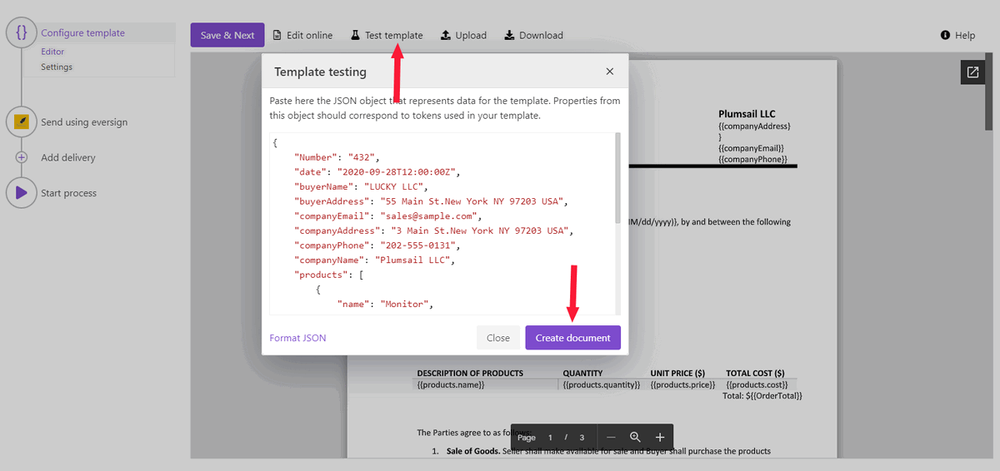
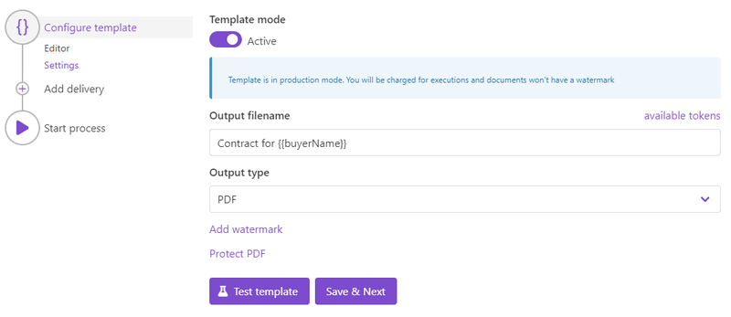
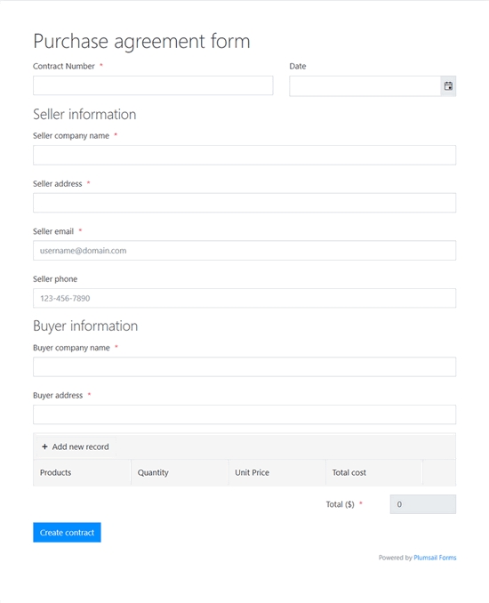

.. title:: Automatically create PDF documents from a Word template and send them for e-signature to eversign

.. meta::
   :description: Generate sales contracts from a template and sign using eversign and Plumsail Documents

How to automatically generate documents from a template and send to eversign for e-signing
==========================================================================================

This how-to guide describes a way to create a document from a template and send it for electronical signing to `eversign <https://eversign.com/>`_.

We'll create a sales contract in PDF from a Word template and will send to eversign using eversign delivery in Plumsail Documents processes.

As a result, we'll get the sales contract electronically signed:

To build the following automation, you need to have a Plumsail account. If you haven't one yet, `register to get a 30-day free trial <https://auth.plumsail.com/Account/Register?ReturnUrl=https://account.plumsail.com/documents/processes/reg>`_. 

.. contents::
    :local:
    :depth: 1

Create new process
~~~~~~~~~~~~~~~~~~

Go to `the Processes section <https://auth.plumsail.com/account/Register?ReturnUrl=https://account.plumsail.com/documents/processes/reg>`_ in your Plumsail account and add a new process. 
Then you'll need to fill in the process name and select the template format. To stick to this guide, select **DOCX**:

.. image:: ../../../_static/img/flow/how-tos/purchase-agreements-process.png
    :alt: create a new process

Configure document template
~~~~~~~~~~~~~~~~~~~~~~~~~~~

You have created the process and jumped into its first step - **Configure template**, consisting of two substeps:

- Editor;
- and Settings.

In `Editor <../../../user-guide/processes/online-editor.html>`_, you can compose document templates online, or upload pre-made ones and modify them in case of need. 

`Download the contract template <../../../_static/files/user-guide/processes/contract-template-eversign.docx>`_ we've prepared for this case and upload it to the process.

.. image:: ../../../_static/img/user-guide/processes/how-tos/upload-template-esignature.png
    :alt: upload template file

Once you did it, you'll see the template preview:

.. image:: ../../../_static/img/user-guide/processes/how-tos/esignature-contract-preview.png
    :alt: preview of document template

You may notice :code:`{{tokens}}` in the document template. We highlighted a couple of them purple to attract your notice and describe how the templating syntax works. 

Word DOCX templating syntax
---------------------------

Everything in :code:`{{curly braces}}` is variables that the templating engine will replace by specified data. 
Also, in our template there are nested tags referring to products - :code:`{{products.name}}`, :code:`{{products.quantity}}`, :code:`{{products.price}}`, and :code:`{{products.cost}}`. 
 
They let the process know that we want to display properties from some object. In our example, it's a collection of products.   
The templating engine will automatically understand that there are multiple products and create table rows for each of them. 

.. image:: ../../../_static/img/user-guide/processes/how-tos/nested-tags-esignature.png
    :alt: nested tags in template

Find out `more information on Plumsail Documents Word templates <../../../document-generation/docx/index.html>`_ in the documentation.

Insert signing tags into the template
-------------------------------------
At the end of the sales contract template, we put special tags to define the location of signatures and other related fields for signers. 
You can't see them as we've changed their font color to white. 

These tags are from eversign; they ease the process of signing. Each signer will see where to place his signature and what fields are required to complete.

This is how tags look in the document template (we highlighted them black to make visible):

This is how they will appear for a signer:

.. image:: ../../../_static/img/user-guide/processes/how-tos/first-eversign-signer.png
    :alt: eversign signature tags result 1

It's easy to compose such signature tags. The logic is that they include a series of options in a specific order, divided with :code:`|` symbol, and the whole tag is wrapped by :code:`[squire brackets]`.

For instance, the option going first is a field type. In our template, we have such types as :code:`sig` (means signature), :code:`text`, and :code:`date`. 

Learn more about using `eversign signature and other related tags <../deliveries/eversign.html#use-signature-and-other-related-tags>`_. 

Test document template
-----------------------

You can test your template to check how the resulting document will look. For that, click the *Test template* button. You will see the dialog where you need to insert your data in JSON format. This JSON data represents what the templating engine should paste into :code:`{{brackets}}` instead of object names and their properties. 
So, it must correspond to tokens from the template. 

To test the contract template from our example, copy and paste the JSON data presented below.

.. note:: This is JSON for testing. You can pass data from an external system or web form to the process. See the `Start process section <#start-process-to-generate-documents-and-send-them-for-esignatures>`_. 

.. code:: json

    {
        "Number": "432",
        "date": "2020-09-25T12:00:00Z",
        "buyerName": "LUCKY LLC",
        "buyerAddress": "55 Main St.New York NY 97203 USA",
        "companyEmail": "sales@sample.com",
        "companyAddress": "3 Main St.New York NY 97203 USA",
        "companyPhone": "202-555-0131",
        "companyName": "Plumsail LLC",
        "products": [
              {
                "name": "Monitor",
                "price": 99,
                "quantity": 10,
                "cost": 990
              },
              {
                "name": "Fridge",
                "price": 4219.99,
                "quantity": 1,
                "cost": 4219.99
              }
        ],
        "total": 5209.99
    }

Once you've tested the template, press *Save&Next* to proceed further - to the **Settings** substep.

Customize output file
~~~~~~~~~~~~~~~~~~~~~

On the **Settings** substep, you customize parameters of the output file. 

- **Mode**. It affects whether the resulting file will have a Plumsail watermark or not. In *Testing* mode, it will, but you won't pay for executions. In *Active*, it won't have the Plumsail watermark; each process run will spend one credit.
- **Output filename**. Use tokens from the document template to personalize the document name. They will work exactly the same way as in the template. 
- **Output type**. By default, it's the same as the template. You can change it to PDF like we did. 
- Additionally, it's possible to `protect the resulting PDF file by a watermark or other security settings <../configure-settings.html#add-watermark>`_.

Send document to eversign for signing
~~~~~~~~~~~~~~~~~~~~~~~~~~~~~~~~~~~~~

Now it'time to set the process to send documents to eversign to collect electronic signatures.
For that, we'll add the eversign delivery.

Connect to your eversign account:

.. image:: ../../../_static/img/user-guide/processes/connect-eversign.png
    :alt: connect to eversign

After the connection between Plumsail and eversign accounts established, you’ll be able to customize the eversign delivery settings under your requirements.

**Fill in the email subject and message**. Here you can use tokens from the document template, too.

**Add recipients**. It’s possible to add as many as you need. **Set their roles** - either *Needs to sign* or *Receives a copy*. In our example, we have two recipients required to sign the document:

.. image:: ../../../_static/img/user-guide/processes/how-tos/eversign-general-settings.png
    :alt: eversign general settings

To add an extra level of security, you can **enable PINs** for each signer. Click on the lock button, then set the PIN value.

.. image:: ../../../_static/img/user-guide/processes/how-tos/eversign-pin.png
    :alt: set eversign PIN

Expand **Advanced** to customize more settings. 

We enabled *Sequential signing* to set the strict order in which signers must sign the document. To change the order, drag and drop recipients.

And also, we enabled to *Require all signers to sign to complete the document*. If one of the signers rejects to sign, the document will be canceled.

.. image:: ../../../_static/img/user-guide/processes/how-tos/eversign-advanced-settings.png
    :alt: eversign advanced settings

The eversign delivery is set. It's possible to add as many deliveries as you need.
Check out the `full list of deliveries and how to set them <../create-delivery.html#list-of-deliveries>`_.

Start process to generate documents and send them for signing
~~~~~~~~~~~~~~~~~~~~~~~~~~~~~~~~~~~~~~~~~~~~~~~~~~~~~~~~~~~~~

There are several ways of launching the process. We will start our process from the Plumsail web form.

Each form's submission will trigger the process to create sales contracts and send them to eversign for signing. 

Here is how our pre-made Plumsail form looks:

`Feel free to download the web form for creating sales contracts <../../../_static/files/user-guide/processes/purchase-agreement-form.json>`_ we have prepared. Then `go to the Forms <https://account.plumsail.com/forms/forms>`_ in your Plumsail account. Click on *Create form*, and you'll move to a web designer of Plumsail Forms. There you can import the JSON file you've recently downloaded:

.. image:: ../../../_static/img/user-guide/processes/how-tos/import-contract-form.png
    :alt: import form to web designer

Save, and that's it - you have the required form.

We won't go into much detail here on how to create Plumsail web forms. You can `learn how to design web forms from the documentation <https://plumsail.com/docs/forms-web/design.html>`_.

Bind web form to process
------------------------

Now you need to bind this web form to the process. On the step **Start process**, switch to a tab *Web Form*. Click on *Bind form*.

You'll see the dialog with the dropdown showing all your Plumsail forms. Select the form for creating purchase agreements. Press *Bind*.

.. image:: ../../../_static/img/user-guide/processes/how-tos/select-bound-form.png
    :alt: select form to bind

From now submissions of the bound form will launch the process. Submission data will populate the DOCX template, the process will convert it to PDF and will send it to eversign for digital signing.

Integrate with your services
~~~~~~~~~~~~~~~~~~~~~~~~~~~~

It's possible to trigger the process from your favorite services and pass their data to populate the template and send the result to eversign. 
For that, you can use such integration platforms as `Zapier <../../../getting-started/use-from-zapier.html>`_ and `Power Automate <../../../getting-started/use-from-flow.html>`_. 

For instance, you can start the process of creating and sending contracts for eSignatures in eversign:

- `from various web forms like Microsoft Forms, Cognito Forms, Typeform, and others <https://plumsail.com/documents/integrations/category/forms-and-surveys>`_;
- `from CRM's - Dynamics, Pipedrive, and others <https://plumsail.com/documents/integrations/category/sales-and-crm>`_.

It's just a couple of ideas out of many for you to get inspired. Find more `in the integrations section <https://plumsail.com/documents/integrations/>`_. 

Drop us a line to `support@plumsail.com <support@plumsail.com>`_ in case you encounter any difficulties or get any questions.