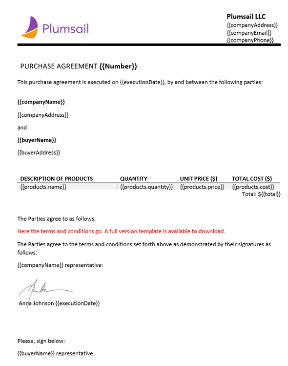
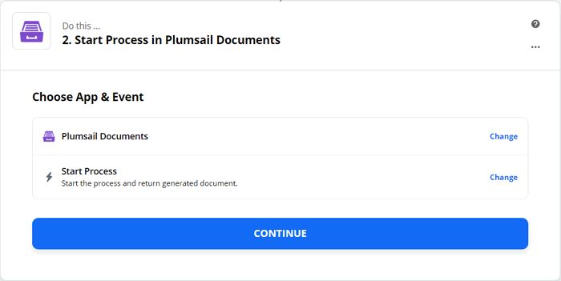
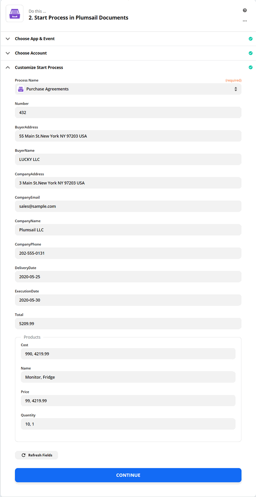

.. title:: How to generate PDF documents from Word templates and send for e-signature with SignNow in Zapier

.. meta::
   :description: Automate your document generation and e-signing with SignNow in Zapier

Create documents from template in Zapier and sign them using SignNow
#############################################################################

In this article, we will show you how to create documents from a template using `Processes <../../../user-guide/processes/index.html>`_ and sign them with the help of `SignNow <https://www.signnow.com/?utm_source=plumsail&utm_medium=cpa&utm_campaign=main&utm_content=ad1>`_.

**Processes** are a `Plumsail Documents <https://plumsail.com/documents/>`_ feature with an intuitive interface for creating documents from templates.

**SignNow** is an electronic signature cloud-based software, which allows to sign and manage documents on any device.

If you haven't tried it yet, you can `register a free signNow trial account <https://snseats.signnow.com/purchase/business_free_trial/loggedout?utm_source=plumsail&utm_medium=cpa&utm_campaign=signup&utm_content=ad1>`_. 

We'll connect these tools in `Zapier <https://zapier.com/apps/plumsail-documents/integrations>`_ to automize the documents exchange and signing.

.. contents::
    :local:
    :depth: 2

Configure the Process
---------------------

Before creating an automated connection of apps in Zapier, we need to set a Process, which will create a PDF purchase agreement from a DOCX template.

Create a new process
~~~~~~~~~~~~~~~~~~~~

Go to `the Processes section <https://auth.plumsail.com/account/Register?ReturnUrl=https://account.plumsail.com/documents/processes/reg>`_ in your Plumsail account. 

Click on the *Add process* button.

.. image:: ../../../_static/img/user-guide/processes/how-tos/add-process-button.png
    :alt: add process button

Set the Process name. As we're going to create a PDF purchase agreement from a DOCX template, select DOCX for the template type.

.. image:: ../../../_static/img/flow/how-tos/purchase-agreements-process.png
    :alt: create a new process

Configure a template
~~~~~~~~~~~~~~~~~~~~

Once you're done with the first step *Create Process*, press the *Create* button, and you’ll proceed to the next – *Configure Template*. 

There you'll find two substeps:

- Editor;
- and Settings.

In `Editor <../../../user-guide/processes/online-editor.html>`_, you can work out the template online, or upload the pre-made template and modify it in case of need. 

You can `download a DOCX template for a purchase agreement <../../../_static/files/flow/how-tos/CONTRACT_TEMPLATE.docx>`_ that we have already prepared. 

And then upload it to the process.

Templating syntax
*****************

When creating your own templates, mind the templating language. Plumsail Word DOCX templates use a different approach than most other templating solutions. It uses a minimal amount of syntax to make your work done.

In short, the templating engine thinks that everything between :code:`{{curly}}` brackets is variables where it will apply your specified data. 
Read `this article <../../../document-generation/docx/how-it-works.html>`_ to get familiar with the templating engine.

Test template
*************

To get a sight of the resulting documents, click the *Test template* button. You will see the dialog where you can insert source data in JSON format to test the template. This JSON data represents what the templating engine should paste into :code:`{{brackets}}` instead of object names and their properties. So, it must correspond to tokens from the template. 

.. image:: ../../../_static/img/flow/how-tos/test-template-sign-now.png
    :alt: test template

To test the contract template from our example, copy and paste the JSON data presented below.

.. note:: This is JSON for testing. You can pass data from an external system or web form to the process. See the `Start process section <#start-the-process>`_. 

JSON data
*********

.. code:: json

    {
        "Number": "432",
        "executionDate": "2020-05-25",
        "deliveryDate": "2020-05-30",
        "buyerName": "LUCKY LLC",
        "buyerAddress": "55 Main St.New York NY 97203 USA",
        "companyEmail": "sales@sample.com",
        "companyAddress": "3 Main St.New York NY 97203 USA",
        "companyPhone": "202-555-0131",
        "companyName": "Plumsail LLC",
        "products": [
              {
                "name": "Monitor",
                "price": 99,
                "quantity": 10,
                "cost": 990
              },
              {
                "name": "Fridge",
                "price": 4219.99,
                "quantity": 1,
                "cost": 4219.99
              }
        ],
        "total": 5209.99
    }

Once you've tested the template, press *Save&Next* to proceed further - to the **Settings** substep.

- Fill in the name of the result file.
- Select PDF format for the output file
- `Protect the result PDF <../configure-settings.html#add-watermark>`_ if you wish

.. image:: ../../../_static/img/flow/how-tos/configure-template-signNow.png
    :alt: Configure template

Delivery
~~~~~~~~

The next step is delivery. For demonstrating purpose, we’ll store the result file in `OneDrive <../../../user-guide/processes/deliveries/one-drive.html>`_. But there are `other options <../../../user-guide/processes/create-delivery.html>`_.

After you've connected to OneDrive from the Plumsail account, select the folder where to store the ready document. 

.. image:: ../../../_static/img/flow/how-tos/onedrive-signnow.png
    :alt: onedrive-delivery

You can configure as many deliveries as you need.

Start the Process
~~~~~~~~~~~~~~~~~
We will start our Process from Zapier. 

Create a Zap
------------
Zap is an automated connection between web services in Zapier. This is how our Zap looks:

Check out the Zap steps described below.

Zap trigger
~~~~~~~~~~~

After you’ve opened `My Zaps <https://zapier.com/app/zaps>`_, create a new one, and select a trigger. You can pick any, for example, trigger a Zap when an opportunity in your CRM is closed, or a web form is submitted, or some others. We will pick `Push by Zapier <https://zapier.com/apps/push>`_ just for demonstration purposes. This kind of trigger enables you to start Zaps manually by Zapier extension for Google Chrome.

Start process in Plumsail Documents
~~~~~~~~~~~~~~~~~~~~~~~~~~~~~~~~~~~

Once the trigger is set, search for Plumsail Documents and add an action *Start process*.

Click Continue. If this is your first Zap, at this point, you'll need to Sign in to your Plumsail Account from Zapier to establish a connection between the app and your account. If you already have a Plumsail account tied to the app, you can add another one at this step, and use it instead.

Customize Start Process
***********************

Choose the process you want to start by this Zap from the dropdown. 
You may see fields to complete - they have the same names as tokens from the template. Actually, these fields are created based on the tokens. 
You need to fill in them to populate the template. 

We used the same values as in testing the template. 

.. note:: Don't skip testing the Start process action. It's necessary to do to be able to use the output further in the Zap.

Upload document
~~~~~~~~~~~~~~~

This action is from the SignNow integration for Zapier. It will upload the agreement to the SignNow account. After that, we can send the document for signature. In the 'File' field put :code:`File (Exists but not shown)` – output of the 'Start process in Plumsail Documents' step.
Give a name to the document uploaded to SignNow and press *Continue*.

Invite to sign
~~~~~~~~~~~~~~
The last action is from the SignNow integration too. It sends the contract for signing.

Once the agreement has been signed, you will receive a notification e-mail with the signed document attached. 

.. image:: ../../../_static/img/flow/how-tos/notification_sn.png
    :alt: email notification cotract was signed