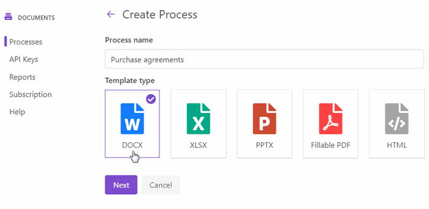
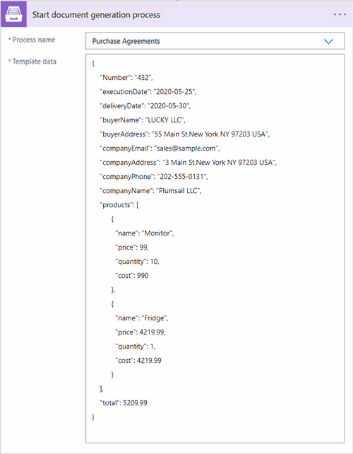

.. title:: Generate PDF agreements from a template and send them for e-signature with SignNow in Flows

.. meta::
   :description: Automate your document generation and signing with SignNow in Power Automate (Microsoft Flow), Azure Logic Apps, and PowerApps

How to create documents from a template in Power Automate and sign them using SignNow
#####################################################################################

In this article, we will show you how to create documents from a template using `Processes <../../../user-guide/processes/index.html>`_ and sign them with the help of `SignNow <https://www.signnow.com/>`_.

**Processes** are a `Plumsail Documents <https://plumsail.com/documents/>`_ feature with an intuitive interface for creating documents from templates.

**SignNow** is an electronic signature cloud-based software, which allows to sign and manage documents on any device.

We'll connect these tools in Power Automate (Flow) to automize the documents exchange and signing.

.. contents::
    :local:
    :depth: 2

Configure the Process
---------------------

Before creating the Flow, we need to set a Process, which will create a PDF purchase agreement from a DOCX template.

Create a new process
~~~~~~~~~~~~~~~~~~~~

Go to `the Processes section <https://account.plumsail.com/documents/processes>`_ in your Plumsail account. 

Click on the *Add process* button.

.. image:: ../../../_static/img/user-guide/processes/how-tos/add-process-button.png
    :alt: add process button

Set the Process name. 

Upload the template you're gonna use. In this example, we'll create a PDF purchase agreement from a DOCX template. And below is our template's screenshot. You can download it by `this link <../../../_static/files/flow/how-tos/CONTRACT_TEMPLATE.docx>`_.

.. image:: ../../../_static/img/flow/how-tos/agreement-template.png
    :alt: Agreement DOCX template

When creating your own templates, mind the templating language. Plumsail Word DOCX templates use a different approach than most other templating solutions. It uses a minimal amount of syntax to make your work done.

In short, the templating engine thinks that everything between curly :code:`{{ }}` brackets is variables where it will apply your specified data. 
Read `this article <../../../document-generation/docx/how-it-works.html>`_ to get familiar with the templating engine.

Configure a template
~~~~~~~~~~~~~~~~~~~~

Once you're done with the first step *Create Process*, press the *Submit* button, and you’ll proceed to the next – *Configure Template*:

- Fill in the name of the result file
- Select PDF format for the output file
- `Protect the result PDF <../../../user-guide/processes/create-process.html#add-watermark>`_ if you wish

.. image:: ../../../_static/img/flow/how-tos/configure-template-signNow.png
    :alt: Configure template

You can test a template as well, to see how it will look at the end. After clicking on the *Test template* button, you’ll need to ‘feed’ a template with your data in JSON format. In our case, it might be the following

JSON data
*********

.. code:: json

    {
        "Number": "432",
        "execution.date": "2020-05-25",
        "delivery.date": "2020-05-30",
        "buyer.name": "LUCKY LLC",
        "buyer.address": "55 Main St.New York NY 97203 USA",
        "company": {
           "email": "sales@sample.com",
           "address": "3 Main St.New York NY 97203 USA",
           "phone": "202-555-0131",
           "name": "Plumsail LLC"
        },
        "items": [
            {
                "product": {
                   "name": "Monitor",
                   "price": 99
                 },
                "quantity": 10,
                "cost": 990
                },
                {
                "product": {
                    "name": "Fridge",
                    "price": 4219.99
                },
                "quantity": 1,
                "cost": 4219.99
              }
        ],
        "total": 5209.99
    }

.. image:: ../../../_static/img/flow/how-tos/test-template-sign-now.png
    :alt: test template

Delivery
~~~~~~~~

The next step is delivery. For demonstrating purpose, we’ll store the result file in `OneDrive <../../../user-guide/processes/deliveries/one-drive.html>`_. But there are `other options <../../../user-guide/processes/create-delivery.html#list-of-available-deliveries>`_.

Select the folder where the ready document will be saved. Fill in the file's name. You don't need to put :code:`.extension`, it'll be done automatically based on the output file type you set on the *Configure template* step.

.. image:: ../../../_static/img/flow/how-tos/onedrive-signnow.png
    :alt: onedrive-delivery

You can configure as many deliveries as you need.

Start the Process
~~~~~~~~~~~~~~~~~
We will start our Process from Power Automate (Microsoft Flow). 

Create a Flow
-------------
This is how our Flow looks:

.. image:: ../../../_static/img/flow/how-tos/signnow-flow.png
    :alt: Create an agreement and sign with SignNow flow

Check out the Flow steps described below.

Flow trigger
~~~~~~~~~~~~

After you’ve opened `My Flows <https://emea.flow.microsoft.com/manage/flows>`_, create a new one, and select a trigger. You can pick any, for example, trigger a Flow when an opportunity in CRM is closed, or a new item is added to SharePoint list, or some others. We will pick *'Manually trigger a Flow'* just for demonstration purposes.

Start document generation process
~~~~~~~~~~~~~~~~~~~~~~~~~~~~~~~~~
This is the action from `Plumsail Documents connector <../../../getting-started/use-from-flow.html>`_. This action is suitable for starting the Process of generating documents from a template. You can find more information about this action by visiting `this page <../../../flow/actions/document-processing.html#start-document-generation-process>`_.

Mind, If you use the Plumsail documents action for the first time, you’ll be asked for *'Connection Name'* and *'Access Key'*. You can type any name for the connection. For example, *'Plumsail Documents'*.

Then `create an API key in your Plumsail Account page <../../../getting-started/sign-up.html>`_, copy and paste it to the *'Access Key'* field.

The **Start document generation process** action has two parameters:

.. image:: ../../../_static/img/user-guide/processes/how-tos/start-generation-docs-action.png
    :alt: start generation documents action

- *Process name*. Select the process you need from available ones. 
- *Template data*. Specify source data in JSON format as we did on `the step of testing the template <../../../flow/how-tos/documents/create-document-from-template-and-SignNow-processes.html#json-data>`_. 

Upload document
~~~~~~~~~~~~~~~

This action is from the SignNow connector for Power Automate. It will upload the agreement to the SignNow account. After that, we can send the document for signature. In the 'File' field put :code:`Result file` – Dynamic content output of the 'Start document generation process' step.

Invite to sign
~~~~~~~~~~~~~~
The last action is from the SignNow connector too. It sends the contract for signing. Just type in an e-mail address of a recipient and select :code:`Document ID` in Dynamic content.

Once the agreement has been signed, you will receive a notification e-mail with the signed document attached. 

.. image:: ../../../_static/img/flow/how-tos/notification_sn.png
    :alt: email notification cotract was signed

.. hint:: If you use an AdobeSign system for e-signs or just want to compare SignNow with an alternative variant, read our article `How to create a document from a template and sign it using AdobeSign <../../../flow/how-tos/documents/create-a-document-from-template-and-sign-Abobesign-processes.html>`_.