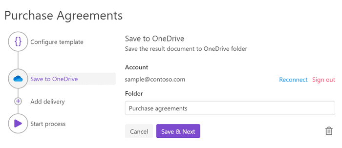
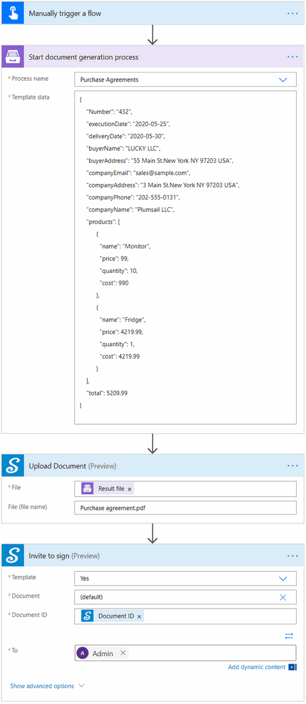

.. title:: How to generate PDF agreements from a template and send them for e-signature with SignNow in Power Automate (Microsoft Flow), Azure Logic Apps, and PowerApps

.. meta::
   :description: Automate your document generation and signing with SignNow in Power Automate (Microsoft Flow), Azure Logic Apps, and PowerApps

Create documents from template in Power Automate and sign them using SignNow
#####################################################################################

In this article, we will show you how to create documents from a template using `Processes <../../../user-guide/processes/index.html>`_ and sign them with the help of `SignNow <https://www.signnow.com/?utm_source=plumsail&utm_medium=cpa&utm_campaign=main&utm_content=ad1>`_.

**Processes** are a `Plumsail Documents <https://plumsail.com/documents/>`_ feature with an intuitive interface for creating documents from templates.

**SignNow** is an electronic signature cloud-based software, which allows to sign and manage documents on any device.

If you haven't tried it yet, you can `register a free signNow trial account <https://snseats.signnow.com/purchase/business_free_trial/loggedout?utm_source=plumsail&utm_medium=cpa&utm_campaign=signup&utm_content=ad1>`_. 

We'll connect these tools in Power Automate (Flow) to automize the documents exchange and signing.

.. contents::
    :local:
    :depth: 2

Configure the Process
---------------------

Before creating the Flow, we need to set a Process, which will create a PDF purchase agreement from a DOCX template.

Create a new process
~~~~~~~~~~~~~~~~~~~~

Go to `the Processes section <https://auth.plumsail.com/account/Register?ReturnUrl=https://account.plumsail.com/documents/processes/reg>`_ in your Plumsail account. 

Click on the *Add process* button.

.. image:: ../../../_static/img/user-guide/processes/how-tos/add-process-button.png
    :alt: add process button

Set the Process name. As we're going to create a PDF purchase agreement from a DOCX template, select DOCX for the template type.

.. image:: ../../../_static/img/flow/how-tos/purchase-agreements-process.png
    :alt: create a new process

Configure a template
~~~~~~~~~~~~~~~~~~~~

Once you're done with the first step *Create Process*, press the *Next* button, and you’ll jump to the next step – *Configure Template*. 

There you'll find two substeps:

- Editor;
- and Settings.

In `Editor <../../../user-guide/processes/online-editor.html>`_, you can work out the template online, or upload the pre-made template and modify it in case of need. 

You can `download a DOCX template for a purchase agreement <../../../_static/files/flow/how-tos/CONTRACT_TEMPLATE.docx>`_ that we have already prepared. 

.. image:: ../../../_static/img/flow/how-tos/agreement-template.png
    :alt: Agreement DOCX template

And then upload it to the process.

Templating syntax
*****************

When creating your own templates, mind the templating language. Plumsail Word DOCX templates use a different approach than most other templating solutions. It uses a minimal amount of syntax to make your work done.

In short, the templating engine thinks that everything between :code:`{{curly}}` brackets is variables where it will apply your specified data. 
Read `this article <../../../document-generation/docx/how-it-works.html>`_ to get familiar with the templating engine.

Test template
*************

After you've uploaded the template to the process, you will see the template preview. To get a sight of the resulting document, click the *Test template* button. You will see the dialog where you can insert your data in JSON format to test the template. This JSON data represents what the templating engine should paste into :code:`{{brackets}}` instead of object names and their properties. So, it must correspond to tokens from the template. 

.. image:: ../../../_static/img/flow/how-tos/test-template-sign-now.png
    :alt: test template

To test the contract template from our example, copy and paste the JSON data presented below.

.. note:: This is JSON for testing. You can pass data from an external system or web form to the process. See the `Start process section <#start-the-process>`_. 

JSON data
*********

.. code:: json

    {
        "Number": "432",
        "executionDate": "2020-05-25",
        "deliveryDate": "2020-05-30",
        "buyerName": "LUCKY LLC",
        "buyerAddress": "55 Main St.New York NY 97203 USA",
        "companyEmail": "sales@sample.com",
        "companyAddress": "3 Main St.New York NY 97203 USA",
        "companyPhone": "202-555-0131",
        "companyName": "Plumsail LLC",
        "products": [
              {
                "name": "Monitor",
                "price": 99,
                "quantity": 10,
                "cost": 990
              },
              {
                "name": "Fridge",
                "price": 4219.99,
                "quantity": 1,
                "cost": 4219.99
              }
        ],
        "total": 5209.99
    }

Once you've tested the template, press *Save&Next* to proceed further - to the **Settings** substep.

- Fill in the name of the result file.
- Select PDF format for the output file
- `Protect the result PDF <../configure-settings.html#add-watermark>`_ if you wish

Delivery
~~~~~~~~

The next step is delivery. For demonstrating purpose, we’ll store the result file in `OneDrive <../../../user-guide/processes/deliveries/one-drive.html>`_. But there are `other options <../../../user-guide/processes/create-delivery.html>`_.

Select the folder where the ready document will be saved. 

You can configure as many deliveries as you need.

Start the Process
~~~~~~~~~~~~~~~~~
We will start our Process from Power Automate (Microsoft Flow). 

Create a Flow
-------------
This is how our Flow looks:

Check out the Flow steps described below.

Flow trigger
~~~~~~~~~~~~

After you’ve opened `My Flows <https://emea.flow.microsoft.com/manage/flows>`_, create a new one, and select a trigger. You can pick any, for example, trigger a Flow when an opportunity in CRM is closed, or a new item is added to SharePoint list, or some others. We will pick *'Manually trigger a Flow'* just for demonstration purposes.

Start document generation process
~~~~~~~~~~~~~~~~~~~~~~~~~~~~~~~~~
This is the action from `Plumsail Documents connector <../../../getting-started/use-from-flow.html>`_. This action is suitable for starting the Process of generating documents from a template. You can find more information about this action by visiting `this page <../../../flow/actions/document-processing.html#start-document-generation-process>`_.

Mind, If you use the Plumsail documents action for the first time, you’ll be asked for *'Connection Name'* and *'Access Key'*. You can type any name for the connection. For example, *'Plumsail Documents'*.

Then `create an API key in your Plumsail Account page <https://account.plumsail.com/documents/api-keys>`_, copy and paste it to the *'Access Key'* field.

The **Start document generation process** action has two parameters:

.. image:: ../../../_static/img/user-guide/processes/how-tos/start-generation-docs-action.png
    :alt: start generation documents action

- *Process name*. Select the process you need from available ones. 
- *Template data*. Specify source data in JSON format as we did on `the step of testing the template <../../../flow/how-tos/documents/create-document-from-template-and-SignNow-processes.html#json-data>`_. 

.. image:: ../../../_static/img/flow/how-tos/template-data-signnow.png
    :alt: Template data

Upload document
~~~~~~~~~~~~~~~

This action is from the SignNow connector for Power Automate. It will upload the agreement to the SignNow account. After that, we can send the document for signature. In the 'File' field put :code:`Result file` – Dynamic content output of the 'Start document generation process' step.

.. image:: ../../../_static/img/flow/how-tos/upload_doc_sn.png
    :alt: Upload document action

Invite to sign
~~~~~~~~~~~~~~
The last action is from the SignNow connector too. It sends the contract for signing. Just type in an e-mail address of a recipient and select :code:`Document ID` in Dynamic content.

.. image:: ../../../_static/img/flow/how-tos/invite_to_sign.png
    :alt: invite_to_sign

Once the agreement has been signed, you will receive a notification e-mail with the signed document attached. 

.. hint:: If you use an Adobe Sign system for e-signs or just want to compare SignNow with an alternative variant, read our article `How to create a document from a template and sign it using Adobe Sign <./create-document-from-template-and-sign-abobesign.html>`_.