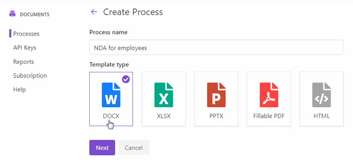

.. title:: Create PDF documents from SharePoint list and send them for e-signature with DocuSign

.. meta::
   :description: Generate non-disclosure agreements from the SharePoint list and electronically sign using DocuSign and Plumsail Documents

How to automatically generate documents from data in SharePoint list and send them for digital signature in DocuSign using Power Automate Flow
===============================================================================================================================================

From this article, you will learn how to create an eSign document from data in the SharePoint list. Imagine that you have a list of employees on the SharePoint site. 
When you hire a new employee, you need to create and sign a non-disclosure agreement (NDA) with him/her. We will show how you can do it without having to print documents. 

.. image:: ../../../_static/img/user-guide/processes/how-tos/employees-list-eversign.png
    :alt: SharePoint list with employees

A new item in the SharePoint list will trigger the document generation process that will merge the list data into an NDA template and send the resulting document to the employee for digital signature in `DocuSign <https://www.docusign.com/>`_.

To automate the process, we'll use the `Plumsail Documents <https://plumsail.com/documents/>`_ connector for `Power Automate <https://flow.microsoft.com/>`_. You'll also need a `DocuSign account <https://account.docusign.com/>`_. 

.. contents::
    :local:
    :depth: 2

Configure document generation process
~~~~~~~~~~~~~~~~~~~~~~~~~~~~~~~~~~~~~

To create a new document generation process in Plumsail Documents, go to `the Processes section <https://account.plumsail.com/documents/processes>`_ in your Plumsail account.

Click on the *Add process* button.

.. image:: ../../../_static/img/user-guide/processes/how-tos/add-process-button.png
    :alt: add process button

Fill in the process name field. 

Select **DOCX** for the template type. In this particular case, we tick the DOCX type because we'll create an NDA from the Word template. 
As you see, Plumsail Documents supports various template formats.

Click *Next* to proceed to the next step - **Configure template**.

Configure document template
---------------------------

The Configure template step includes two substeps:

- Editor;
- Settings.

In `Editor <../../../user-guide/processes/online-editor.html>`_, you can compose document templates online, or upload pre-made ones and modify them. 

`Download the NDA template <../../../_static/files/user-guide/processes/nda-docx-template.docx>`_ we've prepared for this case and upload it to the process.

.. image:: ../../../_static/img/user-guide/processes/how-tos/upload-template-esignature.png
    :alt: upload template file

Once you did it, you'll see the preview of the document template:

.. image:: ../../../_static/img/user-guide/processes/how-tos/docusign-nda-preview.png
    :alt: NDA template preview

Word DOCX templating syntax
***************************

You may notice :code:`{{tokens}}` in the document template. We highlighted them purple to attract your attention and describe how the templating syntax works. 

Everything in :code:`{{curly braces}}` is a variable that the templating engine will replace with specified data. 
In our example, :code:`{{employee}}` will turn into the real name, and :code:`{{date}}` token will turn into the agreement effective date. 

We used a value formatter for the date to get the result in a required format:

.. code:: text

    {{date}:format(MM/dd/yyyy)} 

You can find more information about formatters and other features in the `Word DOCX templates documentation <../../../document-generation/docx/index.html>`_.

Place signature tags into the document template
************************************************
 
Besides the Plumsail Documents tokens, you can insert special DocuSign tags to define the location of e-signatures, names, dates, and other signing information.
It will save your signers time searching the right place where to sign and manual dragging fields there. 

Such a tag identifies the field type and the signer number. It's enclosed in backslashes.

For example, \\s1\\ tag identifies the signature field for the first signer. \\n1\\ - his/her name, \\d1\\ - the date the first signer signed the document. 
We placed such anchor text (as tags are also called) at the end of the document and made it invisible by changing the font color to white:

This is how it will appear for signers. Names and dates will be auto-filled.

`More information on DocuSign signature and other related tags <../deliveries/docusign.html#use-signature-and-other-related-tags>`_ is in our documentation.

Customize output file
*********************

Let's move further - to the **Settings** substep.

Here you can customize the settings of the output file such as:

- **Mode**. It affects whether the resulting file will have a Plumsail watermark or not. In *Testing* mode, it will, but you won't pay for executions. In *Active*, it won't have the Plumsail watermark; each process run will spend one credit.
- **Output filename**. Use tokens from the document template to personalize the document name. They will work exactly the same way as in the template. 
- **Output type**. By default, it's the same as the template. We switched it to PDF. 
- Additionally, it's possible to `protect the resulting PDF file by a watermark or other security settings <../configure-settings.html#add-watermark>`_.

.. hint:: When you have a complex document template and you modify it a lot, it's a good idea to test the template to see the result. We won't go into detail here, as we have a really simple template. You can find `more information on how to test document templates in the documentation <../test-template.html>`_.

Send document to DocuSign for signing
-------------------------------------

When the Configure template step is completed, you'll move on and will be offered to add deliveries.

**Delivery** means the way where to send and save resulting documents. Select the DocuSign delivery to send non-disclosure agreements to new employees for digital signatures using DocuSign.

**Connect to your DocuSign account**. At this point, you can choose either Production or Sandbox mode. 
Sandbox suits for testing and evaluating the DocuSign eSignature solution.
Mind that Sandbox and Production environments mean different DocuSign accounts.

.. image:: ../../../_static/img/user-guide/processes/connect-docusign.png
    :alt: connect to DocuSign

After the connection between Plumsail and DocuSign accounts is established, you'll be able to customize the DocuSign delivery settings according to your needs.

**Fill in the email subject and message**. Here you can use tokens from the document template as well. 

**Add recipients**. It's possible to add as many as you need. Set their roles. In our example, we have two signers:

Expand **Advanced** to customize more settings. 

We enabled *Sequential signing* to set the strict order in which signers must sign the document:

To change the order, drag and drop recipients like this:

.. image:: ../../../_static/img/user-guide/processes/docusign-sequental.gif
    :alt: drag and drop recipients to change the sequence of signing

The DocuSign delivery is set. It's possible to add as many deliveries as you need. For instance, you can add a SharePoint delivery to store employees' NDA's in the SharePoint library.
Check out the `full list of deliveries and how to set them <../create-delivery.html#list-of-deliveries>`_.

Start process to create NDA and send to DocuSign
------------------------------------------------

There are several ways of launching the process. We'll start our process from Power Automate:

You can create the Flow from scratch or `utilize this Flow template for starting the document generation process on SharePoint item creation <https://emea.flow.microsoft.com/en-us/galleries/public/templates/e2d159a56b584314b45608be58ef2e3f/when-sharepoint-item-is-created-generate-documents-with-plumsail-documents/>`_. Red-outlined in the above picture.

Follow the steps below to configure the Flow.

Create and configure Power Automate Flow
~~~~~~~~~~~~~~~~~~~~~~~~~~~~~~~~~~~~~~~~~

The picture of the completed Flow:

.. image:: ../../../_static/img/user-guide/processes/how-tos/docusign-flow.png
    :alt: DocuSign completed flow

When new employee is added to SharePoint list
---------------------------------------------

The Flow trigger is an automated trigger from the SharePoint connector for Power Automate. It's called *When an item is created*.

You need to specify the SharePoint site address where the list is located. And the SharePoint list itself:

.. image:: ../../../_static/img/user-guide/processes/how-tos/when-item-created-eversign.png
    :alt: flow triggers on SharePoint item creation

Start process of generating agreements
--------------------------------------

The next step is an action from the Plumsail Documents connector for Power Automate. 
It's called *Start document generation process*. And it will start the process we have configured to generate NDAs and send them to employees for digital signatures.

If it's your first time using Plumsail Documents in Power Automate, you'll be asked to create a connection and provide its name and an Access key.

.. image:: /_static/img/getting-started/create-flow-connection.png
   :alt: Screen of Plumsail Documents

Type any name for the connection. For example, *Plumsail Documents*. `Create and copy an API key in the Plumsail account <https://account.plumsail.com/documents/api-keys>`_, paste it into the Access key field.

The *Start document generation process* has two fields to complete:
 
- *Process Name*. Select the process we have previously created from the dropdown.
- *Template Data*. Use the JSON format to fill it in. Use dynamic content from the trigger to specify objects. 

.. image:: /_static/img/user-guide/processes/how-tos/start-process-from-flow-eversign.png
   :alt: start document generation process

Save the Flow, and you'll never need to handle NDAs manually. This is an example of how the resulting document will look after signing:

.. image:: /_static/img/user-guide/processes/how-tos/signed-nda-docusign.png
   :alt: resulting document signed

Use result document in Flow
---------------------------

You can continue working with generated agreements further in the Flow. For demonstration purposes, we'll save our NDA's to the SharePoint library.

For that, add an action from the SharePoint connector - *Create file*. Select the SharePoint site and library folder where you'd like to save agreements. 

Do not forget to specify the :code:`.pdf` extension for the file name.

For the file content, select :code:`Result file` - output from *Start document generation process*.

.. image:: /_static/img/user-guide/processes/how-tos/sharepoint-save-in-flow.png
   :alt: save resulting document to sharepoint library

Conclusion
~~~~~~~~~~

We automated the whole process of generating and sending non-disclosure agreements to new employees for e-signing in DocuSign.
You can use a similar approach to generate and electronically sign any other documents such as contracts, invoices, applications. 

The source data for document templates can come not only from SharePoint lists. You can use your favorite apps to connect to Plumsail Documents, pull data, and populate templates.
See more examples in `the integrations section <https://plumsail.com/documents/integrations/>`_. 

Drop us a line to `support@plumsail.com <support@plumsail.com>`_ in case you encounter any difficulties or get any questions.

