.. title::  Create custom contracts, receipts, and other documents from Shopify

.. meta::
   :description: Try this Zapier integration for Shopify and Plumsail Documents to create personalized documents when a new order is placed in Shopify.

How to create personalized documents from Shopify 
==================================================

This article will show you a simple approach how to create any custom documents from `Shopify <https://www.shopify.com/>`_ data. 

We'll use the `Plumsail Documents <https://plumsail.com/documents/>`_ app for Zapier to automate generating and delivering personalized order confirmations when an order is placed in Shopify. 

.. contents::
  :local:
  :depth: 1

Set up document generation process in Plumsail Documents
~~~~~~~~~~~~~~~~~~~~~~~~~~~~~~~~~~~~~~~~~~~~~~~~~~~~~~~~~

Add a new process in your Plumsail account. If you haven't one yet, then `sign up for a one-month free trial <https://auth.plumsail.com/Account/Register?ReturnUrl=https%3A%2F%2Faccount.plumsail.com%2Fdocuments%2Fprocesses>`_. 

And then add a new document generation process. Select 'Start from template'.

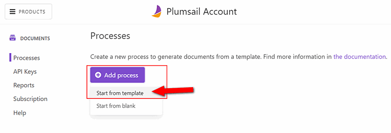

Choose the order confirmation template from the premade document templates. 

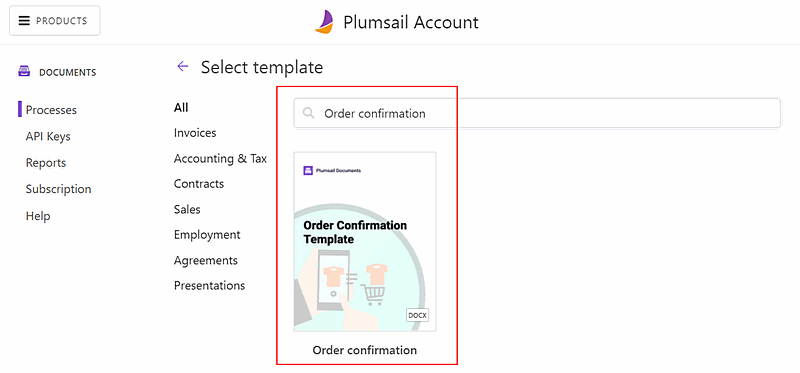

It's possible to modify premade document templates according to your needs. You can either edit them online or download and upload them back. 
Surely, you can create document templates from scratch, or transform your commonly used documents into templates by adding special placeholders.

The Plumsail Documents templating language is easy to understand and at the same time, it has many advanced features such as lists, tables, charts, QR and barcodes, and more.

By links below, learn how Plumsail Documents templating language works for various formats:

- `Word <https://plumsail.com/docs/documents/v1.x/document-generation/docx/index.html>`_
- `Excel <https://plumsail.com/docs/documents/v1.x/document-generation/xlsx/index.html>`_
- `PowerPoint <https://plumsail.com/docs/documents/v1.x/document-generation/pptx/index.html>`_
- `Fillable PDF <https://plumsail.com/docs/documents/v1.x/document-generation/fillable-pdf/index.html>`_

For demonstrating purpose, we leave a document template of an order confirmation as-is. 

On the Settings step: 

1. We enable Active mode to remove a Plumsail watermark from the resulting documents.
2. We set the output filename, inserted a token :code:`{{orderNumber}}`, so it will change dynamically for each client.
3. We configure to get the output document in PDF.

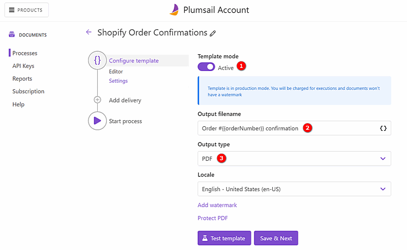

Add Email delivery
-------------------

As we want to send generated order confirmations to our clients by email once they place an order through Shopify, we add an email delivery to our document generation process.

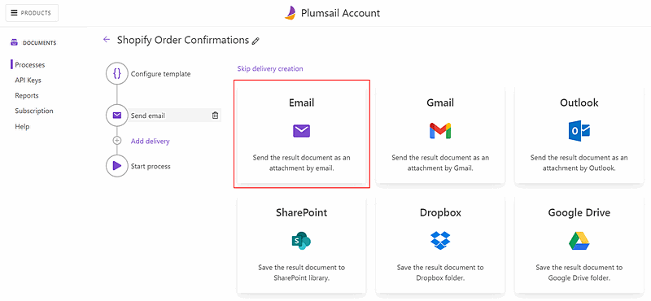

Once you've added an email delivery, you'll be able to configure it. Our configurations are shown in the screenshot below. See how we specify an email address with a token. 
So it will be defined dynamically each time based on data we'll pass from Shopify.

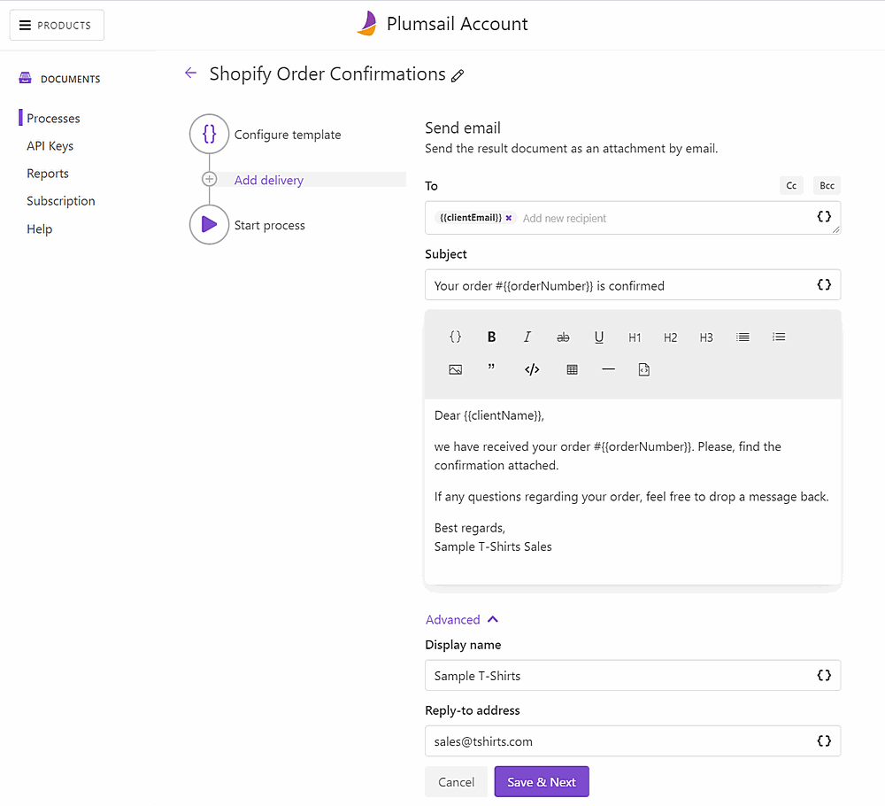

It's possible to add as many deliveries as you need. Or use particular email services such as Gmail or Outlook as a delivery. 

`See the full list of available deliveries <https://plumsail.com/docs/documents/v1.x/user-guide/processes/create-delivery.html>`_.

We proceed to the 'Start process' step. 

Connect Shopify to Plumsail Documents in Zapier
~~~~~~~~~~~~~~~~~~~~~~~~~~~~~~~~~~~~~~~~~~~~~~~~

We want to launch our document generation process each time a new order is placed through Shopify. 

Let's create a Zapier automated connection called Zap. Here is a picture of the complete zap:

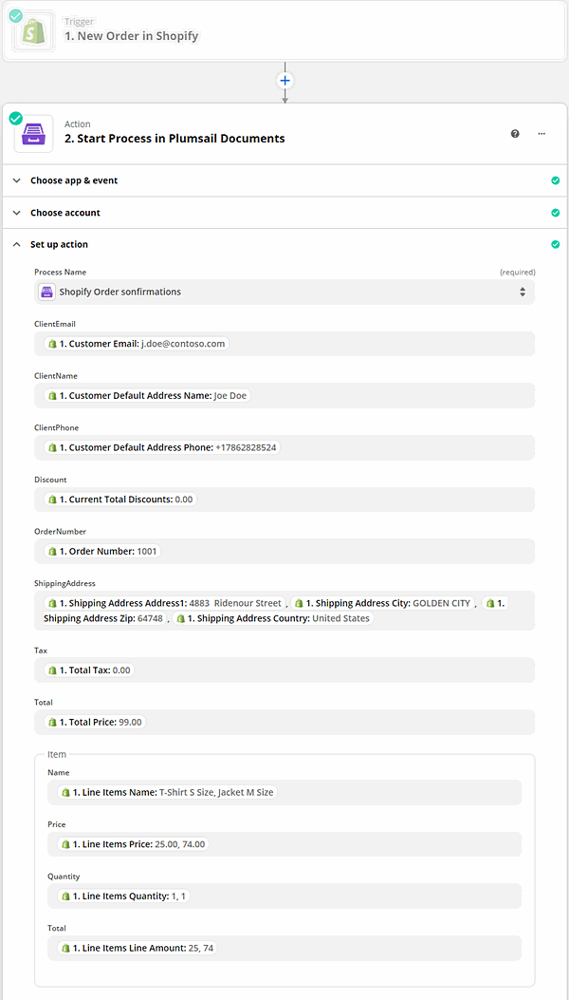

Here is a step-by-step explanation. 

Zap trigger - New order in Shopify
-----------------------------------

Add a new zap inside your Zapier account. Search for Shopify, select 'New order' as a trigger event.

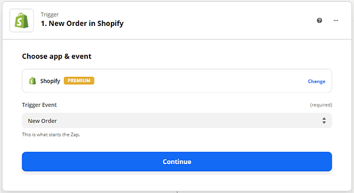

You'll be asked to connect to your Shopify shop from Zapier to be able to pull and pass Shopify data. 

Once you've connected, proceed to test the trigger. To succeed in testing the trigger, you need to have at least one order created in Shopify. 

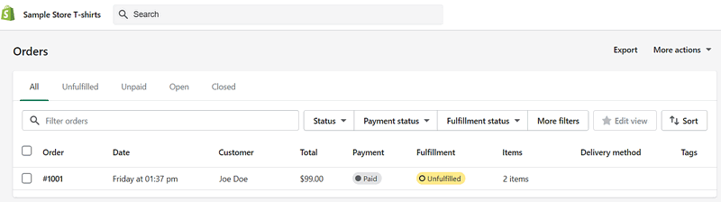

Testing was successful; we're moving further to add a zap action.

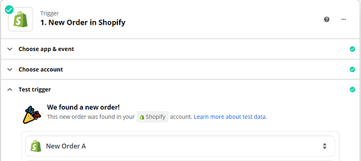

Zap action - Start process in Plumsail Documents
-------------------------------------------------

For an action, select the Plumsail Documents app and its 'Start process' action.

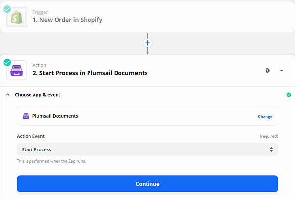

Sign in to your Plumsail account from Zapier to be able to configure the action.
 
On the 'Set up action' step, select the document generation process you'd like to launch.
Then fill in each token field with corresponding data from Shopify.
The Shopify trigger support line items. See how we apply Shopify line item data to Order items. 

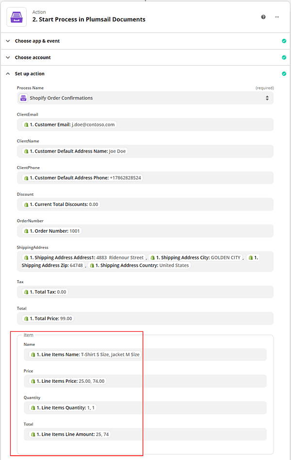

Our zap is ready. Turn it on. And each time a new order is placed in Shopify, customers will receive personalized order confirmations. 

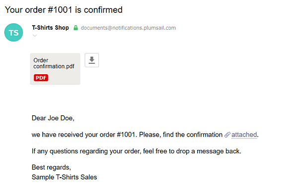

You can use the same approach to create other documents from Shopify such as personalized contracts, receipts, and more. 

If you have any questions regarding this automation, feel free to `contact us at support@plumsail.com <mailto:support@plumsail.com>`_.

If you're new to Plumsail Documents, `sign up for a free trial <https://auth.plumsail.com/Account/Register?ReturnUrl=https%3A%2F%2Faccount.plumsail.com%2Fdocuments%2Fprocesses>`_ to test this and `other automations <https://plumsail.com/documents/integrations/>`_. 

