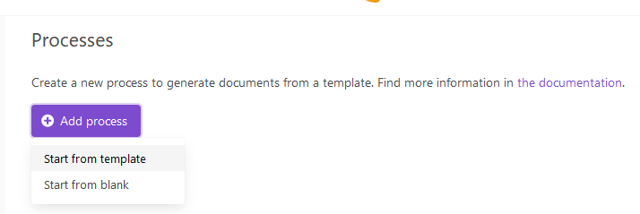
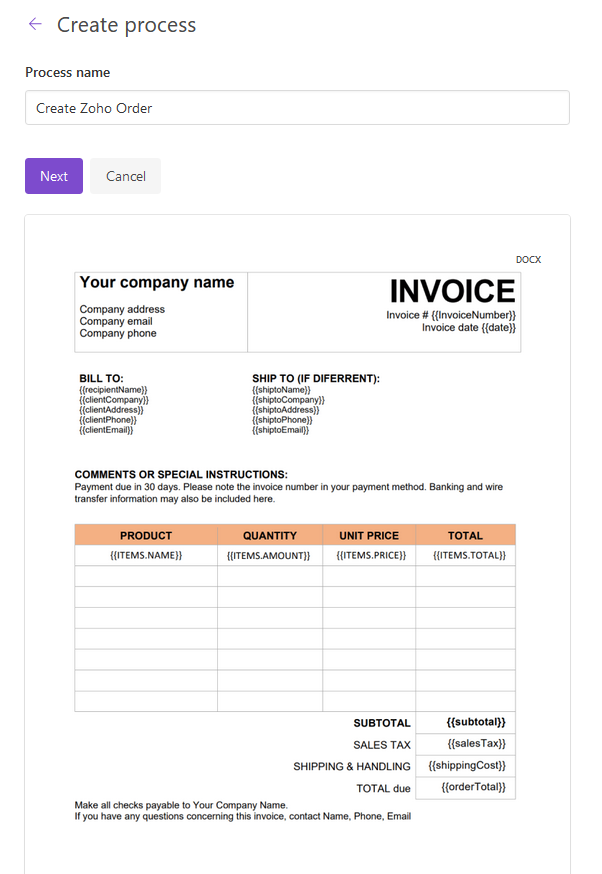
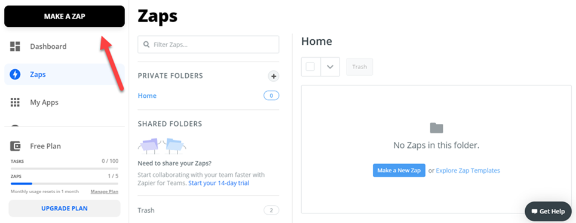
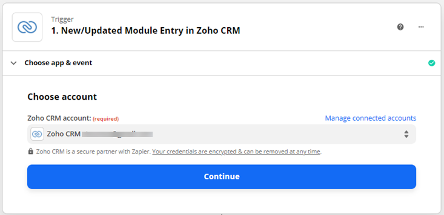
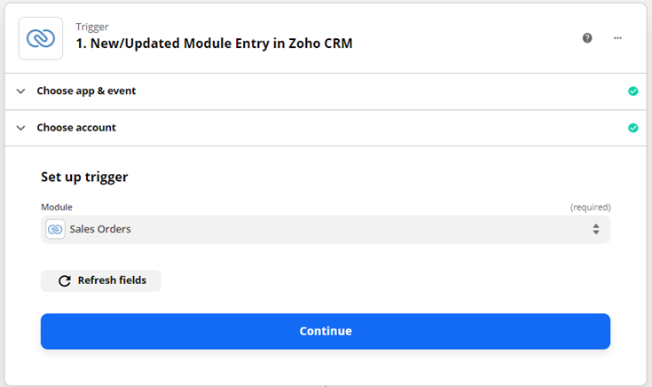

.. title:: Create documents from Zoho CRM 

.. meta::
   :description: Create documents from Zoho CRM .

Create documents from Zoho CRM
===============================

Let us say you want to create a deal from template based on Zoho deals and send them to your clients. In this article, we'll show how to do this.

We need to work with 3 platforms for this

- Create a deal in Zoho.
- Create a process in Plumsail Documents to generate a deal from DOCX template.
- Create a Zapier flow that starts this deal generation process when a new deal is placed in Zoho.

Creating a Zoho deal
-----------------------

`Zoho CRM <https://crm.zoho.com/>`_ is an online Sales CRM software that manages sales, marketing and support in one CRM platform.

This is how creating an invoice looks in the Zoho CRM interface

We fill the required fields and save the deal. After that, it could be found in the Deals section of the platform. You can change or add some details to it.

Once we create a deal we can go further and configure a Plumsail process.

Configure a Plumsail Process
------------------------------

`Sign in <https://account.plumsail.com/documents/processes>`_ to Plumsail account and go to Documents -> Processes.

Click **Add process**, name the process, select DOCX template type and click **Next**

.. image:: ../../../_static/img/user-guide/processes/how-tos/create-process-zoho1.png
    :alt: Create process zoho

In the next step, we need to configure a template. We can either compose the template from scratch or upload a pre-made one.

I prepared a contract template and uploaded it to the Editor. You can download my template `here <../../../_static/files/document-generation/demos/zoho-invoice-template.docx>`_ .

    
    
Click **Save & Next**. There are some settings in the next step

Now I need to select a delivery. I'll take DocuSign delivery:

.. image:: ../../../_static/img/user-guide/processes/how-tos/create-process-zoho3.png
    :alt: Create process zoho

Ok, the process is done and now it can be used in the Zapier flow. Let's move to the next step.

Create a Zapier flow
----------------------

`Zapier <https://zapier.com/>`_ connects with many services. Our Zap will be connected with two services: Zoho CRM and Plumsail Documents.

Let's make a new Zap.

Name this Zap, connect it with Zoho and select this trigger **New Module Entry**. The flow will start when a new deal is placed in the Zoho CRM.

.. image:: ../../../_static/img/user-guide/processes/how-tos/zapier-zoho-contract1.png
    :alt: Zapier flow

.. image:: ../../../_static/img/user-guide/processes/how-tos/zapier-zoho-contract2.png
    :alt: Zapier flow

Select your Zoho account in the next step

Set up the trigger, specify the entry.

In the next step you can test the trigger and select an available deal.

.. image:: ../../../_static/img/user-guide/processes/how-tos/zapier-zoho-contract5.png
    :alt: Zapier flow

Now I need to connect the flow with Plumsail Documents to transfer the deal's data to the DOCX template.

.. image:: ../../../_static/img/user-guide/processes/how-tos/zapier-zoho-contract7.png
    :alt: Zapier flow

Select you Documents account

We select the process created previously

And select values from the Zoho CRM trigger to fill the template fields

.. image:: ../../../_static/img/user-guide/processes/how-tos/zapier-zoho-contract10.png
    :alt: Zapier flow

Eventually we can turn the Zap on and it will shoot whenever a new deal is placed in the Zoho CRM.

.. image:: ../../../_static/img/user-guide/processes/how-tos/zapier-zoho-contract11.png
    :alt: Zapier flow

Conclusion
-----------

You can automate any document generation by combining Zapier, Zoho CRM, and Plumsail Documents. We checked a simple example in the article, but there are a lot more options and possibilities available with these products.
