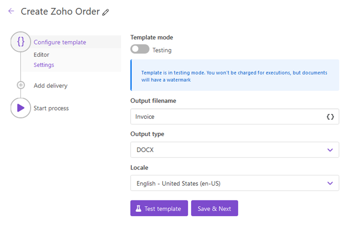
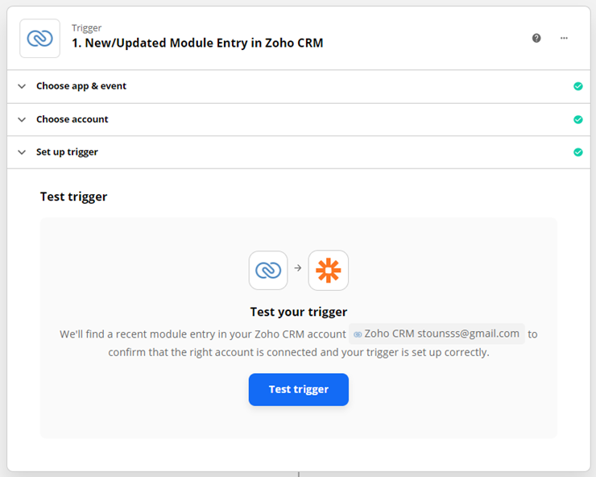
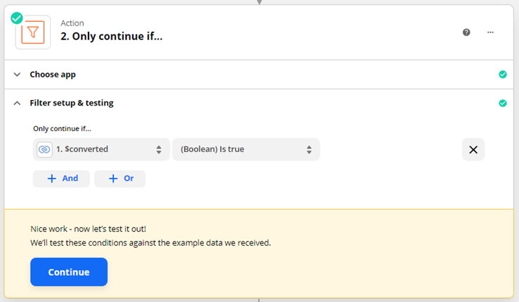
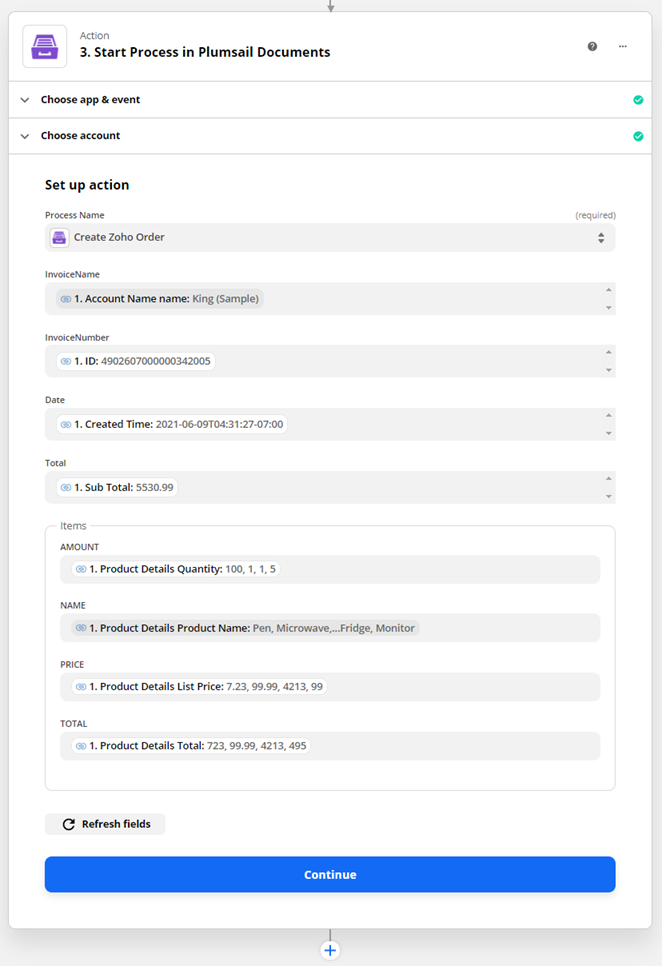

.. title:: Create documents from Zoho CRM 

.. meta::
   :description: Create documents from Zoho CRM .

Create documents from Zoho CRM
===============================

Let us say you want to create a sales order from template based on Zoho sales order and send it to your clients. In this article, we'll show how to do this.

We need to work with 3 platforms for this

- Create a sales order in Zoho.
- Create a process in Plumsail Documents to generate a sales order from DOCX template.
- Create a Zapier flow that starts the generation process when the sales order is converted into an invoice.

Creating a Zoho sales order
-----------------------

`Zoho CRM <https://crm.zoho.com/>`_ is an online Sales CRM software that manages sales, marketing and support in one CRM platform.

This is how creating a sales order looks in the Zoho CRM interface

Also I add products to the sales order

We fill the required fields and save the order. After that, it could be found in the Sales orders section of the platform. You can change or add some details to it.

Once we create a sales order we can go further and configure a Plumsail process.

Configure a Plumsail Process
------------------------------

`Sign in <https://account.plumsail.com/documents/processes>`_ to Plumsail account and go to Documents -> Processes.

.. image:: ../../../_static/img/user-guide/processes/how-tos/documents-interface.png
    :alt: Documents interface

Click **Add process**. You'll see 2 available options:

- Start from template
- Start from blank

There are some ready-to-use templates. I'll choose one of them that is a best fit for our needs. Also you can upload your own template.

name the process and click **Next**

.. image:: ../../../_static/img/user-guide/processes/how-tos/create-process-zoho2.png
    :alt: Create process zoho

In the next step you can either use the selected template, change it or upload you own template.

I simplified the selected template. You can download my template `here <../../../_static/files/document-generation/demos/zoho-invoice-template.docx>`_ .

.. image:: ../../../_static/img/user-guide/processes/how-tos/zoho-contract-template.png
    :alt: Create process zoho

    
    
Click **Save & Next**. There are some settings in the next step

Now I need to select a delivery. I'll take DocuSign delivery:

Ok, the process is done and now it can be used in the Zapier flow. Let's move to the next step.

Create a Zapier flow
----------------------

`Zapier <https://zapier.com/>`_ connects with many services. Our Zap will be connected with two services: Zoho CRM and Plumsail Documents.

Let's make a new Zap.

.. image:: ../../../_static/img/user-guide/processes/how-tos/zap-home-interface.png
    :alt: Zapier home interface

Name this Zap, connect it with Zoho and select this trigger **New/Updated Module Entry**. The flow will start when the sales order is converted into an invoice in Zoho CRM.

.. image:: ../../../_static/img/user-guide/processes/how-tos/zapier-zoho-contract1.png
    :alt: Zapier flow

.. image:: ../../../_static/img/user-guide/processes/how-tos/zapier-zoho-contract2.png
    :alt: Zapier flow

Select your Zoho account in the next step

.. image:: ../../../_static/img/user-guide/processes/how-tos/zapier-zoho-contract3.png
    :alt: Zapier flow

Set up the trigger, specify the entry.

.. image:: ../../../_static/img/user-guide/processes/how-tos/zapier-zoho-contract4.png
    :alt: Zapier flow

In the next step you can test the trigger and select an available sales order.

.. image:: ../../../_static/img/user-guide/processes/how-tos/zapier-zoho-contract6.png
    :alt: Zapier flow

The flow will start the generation process only if the order was converted to invoice in Zoho. Let's add the condition

Now I need to connect the flow with Plumsail Documents to transfer the invoice's data to the DOCX template.

.. image:: ../../../_static/img/user-guide/processes/how-tos/zapier-zoho-contract8.png
    :alt: Zapier flow

.. image:: ../../../_static/img/user-guide/processes/how-tos/zapier-zoho-contract9.png
    :alt: Zapier flow

Select you Documents account

We select the process created previously

And select values from the Zoho CRM trigger to fill the template fields

Eventually we can turn the Zap on and it will shoot whenever a sales order is converted to invoice in the Zoho CRM.

Conclusion
-----------

You can automate any document generation by combining Zapier, Zoho CRM, and Plumsail Documents. We checked a simple example in the article, but there are a lot more options and possibilities available with these products.
