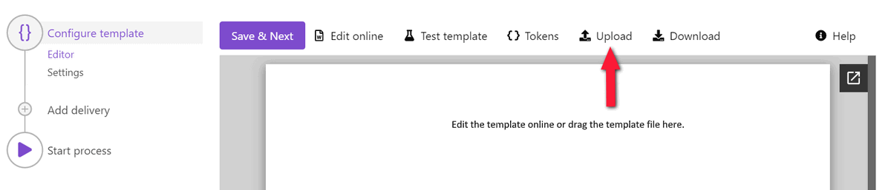
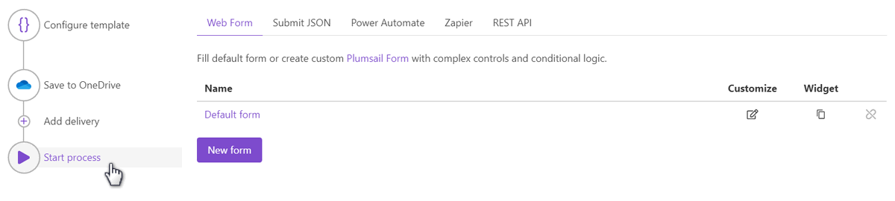

.. title:: Generate Word DOCX documents from a template using Zapier and Power Automate Flow

.. meta::
   :description: Use Plumsail Documents processes to generate customized documents from Word templates in a few simple steps.

How to create Word DOCX document from a template in Zapier, Power Automate (Microsoft Flow), Azure Logic Apps, and PowerApps
============================================================================================================================
Let’s suppose you want to automate the process of generating invoices in your company. This article will describe how to create a DOCX document from a template with the help of `Processes <../../../user-guide/processes/index.html>`_, a `Plumsail Documents <https://plumsail.com/documents/>`_ feature. 

The Processes are a user-friendly intuitive interface for creating documents from templates, converting them, and delivering to different systems for further management. 

With its help, we'll create an invoice from a template, and this is how the result document will look:

.. image:: ../../../_static/img/user-guide/processes/how-tos/invoice-result-document.png
    :alt: create docx from template

Let’s go through each step from the very beginning:

.. contents::
    :local:
    :depth: 2

Configure Process
~~~~~~~~~~~~~~~~~

First, register or login to your `Plumsail account`_. Then select *Documents* and go to the `Processes section <https://account.plumsail.com/documents/processes>`_. 

Create new process
--------------------

Click on the *Add Process* button.

.. image:: ../../../_static/img/user-guide/processes/how-tos/add-process-button.png
    :alt: add process button

Give a name to the Process to recognize it later. Select DOCX for a template type. 

.. image:: ../../../_static/img/user-guide/processes/how-tos/create-new-process.png
    :alt: create docx from template

Configure template
--------------------

Once you've created the Process, you'll proceed to its first step - **Configure template**.

It includes two substeps:

- Editor;
- Settings.

In `Editor <../../../user-guide/processes/online-editor.html>`_, you can compose the template from scratch or upload a pre-made one. It's also possible to modify the uploaded template online.

Feel free to `download an invoice DOCX template <../../../_static/files/user-guide/processes/template-invoice.docx>`_ we have already prepared. Then upload it to the process.

Templating syntax
*****************

When creating your own templates, mind the templating language. Plumsail Word DOCX templates use a different approach than most other templating solutions. It uses a minimum of syntax to make your work done.

To learn more about the templating engine, check out `the documentation article`_.

In short, the templating engine thinks that everything between such curly :code:`{{ }}` brackets is variables where it will apply your specified data. In our case the most basic example would be :code:`{{invoiceNumber}}` and :code:`{{date}}` tags. They let the engine know that we want to render the invoice number and its date.

But, of course, we can implement a more complex scenario. In our template, we refer to properties inside a collection of products. For that, we use nested tags with a dot operator:

- The :code:`{{product.name}}`, :code:`{{product.price}}` tags get the name, description, and price properties in the product's object.

The templating engine is smart enough to identify what content to duplicate. It will iterate through all objects in the array to render them and add rows automatically.

.. image:: ../../../_static/img/user-guide/processes/how-tos/table-render.png
    :alt: tables in DOCX templates

You can learn more about table rendering in `the tables section`_ of the documentation.

Test template
*************

To check how the document will look at the end, click on the *Test template* button. You will see the dialog where you can insert your data in JSON format. This JSON data represents what the templating engine should paste into :code:`{{brackets}}` instead of object names and their properties. So, it must correspond to tokens from the template. 

.. image:: ../../../_static/img/user-guide/processes/how-tos/test-template.png
    :alt: create docx from template

To test the template from our example, you can copy and paste the JSON data shown below.

.. note:: This is JSON for testing. You can pass data from an external system or web form to the process. See the `Start process section <#start-process>`_. 

.. code:: json

    {
      "invoiceNumber": "432",
      "companyEmail": "sales@sample.com",
      "companyAddress": "3 Main St.New York NY 97203 USA",
      "companyPhone": "202-555-0131",
      "date": "2018-05-21",
      "products": [
        {
          "name": "Monitor",
          "price": 99,
          "quantity": 10,
          "cost": 990
        },
        {
          "name": "Stepler",
          "price": 12.44,
          "quantity": 1000,
          "cost": 12440
        },
        {
          "name": "Fridge",
          "price": 4219.99,
          "quantity": 1,
          "cost": 4219.99
        },
        {
          "name": "Microwave",
          "price": 99.99,
          "quantity": 5,
          "cost": 499.95
        },
        {
          "name": "Pen",
          "price": 7.23,
          "quantity": 100,
          "cost": 723
        }
      ],
      "total": 18872.94
    }

Once you've tested the template, press *Save&Next* to proceed further - to the **Settings** substep.

Here you set the following parameters. Descriptions are under the picture.

.. image:: ../../../_static/img/user-guide/processes/how-tos/configure-template.png
   :alt: configure DOCX template

**Template mode**

It is *Testing* by default. It means you won't be charged for this process runs, but result documents will have a Plumsail watermark. Change it to *Active* to remove the watermark.

**Output filename**

Use tokens to make it personalized. They work the same way as in the template. For instance, we use the following tokens to define the output file name - :code:`{{invoiceNumber}}`. As a result, we'll receive an invoice marked with its number - *Invoice 432*.

**Output type**

By default, it is the same as your template's format. In this particular case, it's DOCX. And we kept it to create the DOCX Word document from a template.

**Test template**

Once you've customized all the settings, you can test the template to see the result as we did it before. 

When everything is done here, click on Save & Next to set up deliveries.

Delivery
--------
The next step is delivery. For demonstrating purpose, we’ll store the result file in `OneDrive <../../../user-guide/processes/deliveries/one-drive.html>`_. But there are `other options <../../../user-guide/processes/create-delivery.html>`_.

You need to connect to your OneDrive from the Plumsail account. After that, set the folder's name where to save the ready document. Here you can use tokens as well. 

.. image:: ../../../_static/img/user-guide/processes/how-tos/store-onedrive.png
    :alt: create docx from template

You can configure as many deliveries as you need.

Start Process
~~~~~~~~~~~~~

Now everything is ready, and you can start generating Word DOCX documents. The step **Start process** will show available options with a description for each.

You can start the process :

- `manually <../start-process-manually.html>`_ with your JSON data;
- `by Plumsail Web form <../start-process-web-form.html>`_ bound to the process;
- `using Power Automate (former Microsoft Flow) <../start-process-ms-flow.html>`_;
- `using Zapier <../start-process-zapier.html>`_
- `using REST API <../start-process-rest-api.html>`_;

.. hint:: Use `Power Automate Flow <../../../getting-started/use-from-flow.html>`_ and `Zapier <../../../getting-started/use-from-zapier.html>`_ to connect the process with other apps. It enables you to gather data from one app and pass on to the process to populate a DOCX template. Thus, you can populate the DOCX template from various web forms, CRM systems, SharePoint lists, and thousands of other web applications. 

.. note:: There is another - a little bit more complicated - way to create DOCX documents from a template. Check `the article <../../../flow/how-tos/documents/create-docx-from-template.html>`_.

.. _Plumsail account: https://account.plumsail.com/
.. _the documentation article: ../../../document-generation/docx/how-it-works.html
.. _the tables section: ../../../document-generation/docx/tables.html