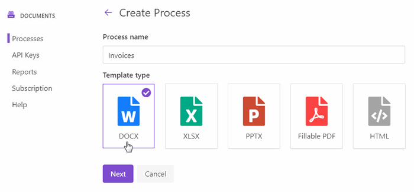
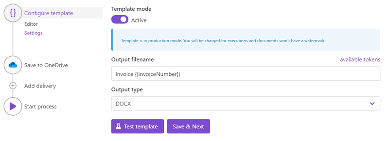

How to create DOCX document from a template in Power Automate (Microsoft Flow), Azure Logic Apps and PowerApps
==============================================================================================================
Let’s suppose you want to automate the process of generating invoices in your company. This article will describe how to create a DOCX document from a template with the help of `Processes <../../../user-guide/processes/index.html>`_, a `Plumsail Documents <https://plumsail.com/documents/>`_ feature. 

The Processes are a user-friendly intuitive interface for creating documents from templates, converting them and delivering to different systems for further management. 

With its help, we'll create an invoice from a template, and this is how the result document will look:

.. image:: ../../../_static/img/user-guide/processes/how-tos/invoice-result-document.png
    :alt: create docx from template

Let’s go through each step from the very beginning:

.. contents::
    :local:
    :depth: 2

Configuring the Process
-----------------------

First, register or login to your `Plumsail account`_. Then select *Documents* and go to the `Processes section <https://account.plumsail.com/documents/processes>`_. 

Create a new process
~~~~~~~~~~~~~~~~~~~~

Click on the *Add Process* button.

.. image:: ../../../_static/img/user-guide/processes/how-tos/add-process-button.png
    :alt: add process button

Give a name to the Process to recognize it later.

Upload the template you want to use. Here is the `link for downloading the template`_ we use in this example. 

When creating your own ones, mind the templating language. Plumsail Word DOCX templates use a different approach than most other templating solutions. It uses a minimal amount of syntax to make your work done.

To learn more about the templating engine, check out `the documentation article`_.

In short, the templating engine thinks that everything between such curly :code:`{{ }}` brackets is variables where it will apply your specified data. In our case the most basic example would be :code:`{{invoiceNumber}}` and :code:`{{date}}` tags. They let the engine know that we want to render the invoice number and its date.

But, of course, we can implement a more complex scenario. In our template, we refer to properties inside simple objects and collections, as well as properties in nested constructions. To select properties of our objects inside of the array (in JSON data), we use a dot operator:

The :code:`{{company.address}}`, :code:`{{company.email}}`, :code:`{{company.phone}}` tags let the engine know that we want to render properties of the company object.
The :code:`{{items.product.name}}`, :code:`{{items.product.price}}` tags get the name, description and price properties in each item's product object.
The templating engine is smart enough to identify what content to duplicate. It will iterate through all objects in the array to render them and add the rows automatically.

You can learn more about table rendering in `the tables section`_ of the documentation.

Configure a template
~~~~~~~~~~~~~~~~~~~~

Once you're done with the first step *Create Process*, press the *Submit* button, and you’ll proceed to the next – *Configure Template*:

- Fill in the name of the result file
- Select DOCX format for the output file 
- Test the template to see how it will look at the end by clicking the *Test template* button. 

Test the template
~~~~~~~~~~~~~~~~~

To test a template, you need to insert source data in JSON format into the window like in the picture below. This JSON data represents what will be pasted into :code:`{{ }}` brackets instead of object names and their properties. So, it must correspond to tokens from the template. 

.. image:: ../../../_static/img/user-guide/processes/how-tos/test-template.png
    :alt: create docx from template

To test the template from our example, you can copy and paste this JSON data:

.. code:: json

    {
        "invoiceNumber": "432",
        "company": {
            "email": "sales@sample.com",
            "address": "3 Main St.New York NY 97203 USA",
            "phone": "202-555-0131"
        },
        "date": "2018-05-21",
        "items": [
            {
                "product": {
                    "name": "Monitor",
                    "price": 99
                },
                "quantity": 10,
                "cost": 990
            },
            {
                "product": {
                    "name": "Stepler",
                    "price": 12.44
                },
                "quantity": 1000,
                "cost": 12440
            },
            {
                "product": {
                    "name": "Fridge",
                    "price": 4219.99
                },
                "quantity": 1,
                "cost": 4219.99
            },
            {
                "product": {
                    "name": "Microwave",
                    "price": 99.99
                },
                "quantity": 5,
                "cost": 499.95
            },
            {
                "product": {
                    "name": "Pen",
                    "price": 7.23
                },
                "quantity": 100,
                "cost": 723
            }
        ],
        "total": 18872.94
    }

Delivery
~~~~~~~~
The next step is delivery. For demonstrating purpose, we’ll store the result file in `OneDrive <../../../user-guide/processes/deliveries/one-drive.html>`_. But there are `other options <../../../user-guide/processes/create-delivery.html#list-of-available-deliveries>`_.

Select the folder where the ready document will be saved. Fill in the file's name. You don't need to put :code:`.extension`, it'll be done automatically based on the output file type you set on the *Configure template* step.

.. image:: ../../../_static/img/user-guide/processes/how-tos/store-onedrive.png
    :alt: create docx from template

You can configure as many deliveries as you need.

Start the Process
~~~~~~~~~~~~~~~~~

The last thing to do is to start the Process. We will start it using `Power Automate (Microsoft Flow) <https://flow.microsoft.com/>`_. You can check out `other options <../../user-guide/processes/start-process.html>`_ as well.

.. image:: ../../../_static/img/user-guide/processes/how-tos/microsoft-flow.png
    :alt: create docx from template

Creating the Flow
-----------------

We'll create a Flow that will start the document generation process and will send the ready document for approval. As everything is prepared in the Plumsail account, the Flow itself has just a couple of steps and looks like in the picture below:

Start the Process from Flow
~~~~~~~~~~~~~~~~~~~~~~~~~~~

**Flow trigger** 

You can actually pick any trigger. We are using "*Manually trigger a flow*" trigger here to simplify the Flow.

**Start document generation process**

This is the action from `Plumsail Documents connector`_. This action is suitable for starting the Process of generating documents from a template. You can find more information about this action by visiting `this page`_.

Using the action for the first time, you’ll be asked for *''Connection Name''* and *''Access Key''*. 

.. image:: ../../../_static/img/getting-started/create-flow-connection.png
    :alt: create flow connection

You can type any name for the connection. For example, *''Plumsail Documents''*. 

Then `create an API key in your Plumsail Account page <https://plumsail.com/docs/documents/v1.x/getting-started/sign-up.html>`_, copy and paste it to *''Access Key''* field.

The action has two parameters:

.. image:: ../../../_static/img/user-guide/processes/how-tos/start-generation-docs-action.png
    :alt: start generation documents action

- *Process name*. Select the process you need from available ones. 
- *Template data*. Specify source data in JSON format as we did on `the step of testing the template <../../../user-guide/processes/examples/create-docx-from-template-processes.html#test-the-template>`_. 

Use the generated document in Flow
~~~~~~~~~~~~~~~~~~~~~~~~~~~~~~~~~~

On this step, we’ll see how to use the result file from the *Start document generation process* action right in the Flow. 

Let’s send the ready document for approval with the *Approvals* connector - action *Create an approval*.

Add the output of the previous step as an attachment. 

This is just one example out of many others. 

Our Flow is ready. Run it any time you need to generate DOCX documents from a template.

.. note:: There is another - a little bit more complicated - way to create DOCX documents from a template. Check `the article <../../../flow/how-tos/documents/create-docx-from-template.html>`_.

.. _Plumsail account: https://account.plumsail.com/
.. _link for downloading the template: ../../../_static/files/document-generation/demos/invoice-template.docx
.. _the documentation article: ../../../document-generation/docx/how-it-works.html
.. _the tables section: ../../document-generation/docx/tables.html>
.. _Plumsail Documents connector: ../docs/documents/v1.x/getting-started/use-from-flow.html
.. _this page: https://plumsail.com/docs/documents/v1.x/flow/actions/document-processing.html#start-document-generation-process
