.. title:: How to use JotForm to populate Excel and PDF document templates in Power Automate (Microsoft Flow) and Azure Logic Apps

.. meta::
   :description: An example of how to auto create Excel order requests from JotForm entries and convert to PDF in Power Automate and Azure Logic Apps

Create Excel and PDF documents from JotForm in Power Automate
==============================================================

This article shows how to create PDF documents from an XLSX template on a `JotForm <https://www.jotform.com/>`_ submission with the help of `Processes <../../../user-guide/processes/index.html>`_ in Power Automate (MS Flow).
It may help you to automate the generation of different documents like applications, requests, orders, etc. in your company. 

**Processes** are a `Plumsail Documents <https://plumsail.com/documents/>`_ feature with an intuitive interface for creating documents from templates.

**JotForm** is an online form builder that allows you to create powerful forms for your website.

In this example, we will collect data from JotForm, apply the data to our Excel template, and generate a new PDF document with the help of Processes in Power Automate (Microsoft Flow).

.. contents::
    :local:
    :depth: 2

Create a Form
-------------

We have already prepared a form for generating a loan calculation.
We will use data from its submission to apply to our template.
If you haven’t before created any forms on JotForm, you can learn how to do it `here <https://www.jotform.com/help/>`_.

Below is a screenshot of our form:

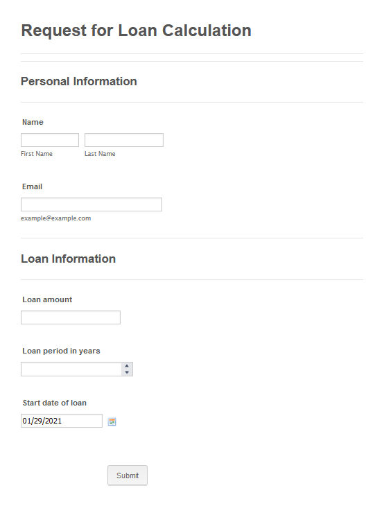

Configure the Process
---------------------

Now we need to create and configure the Process which will generate a loan calculation in PDF format based on data from the form’s submission. 

Create a new Process
~~~~~~~~~~~~~~~~~~~~

Go to the `Processes section <https://account.plumsail.com/documents/processes>`_ in your Plumsail account.

Click on the *Add process* button.

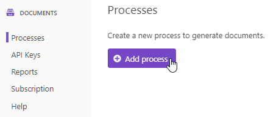

Set the Process name.
As we’re going to generate the PDF calculation from an Excel template, select XLSX for the template type.

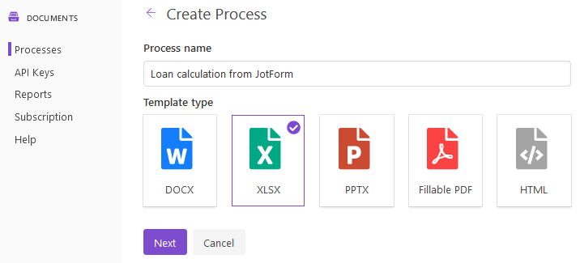

Configure a template
~~~~~~~~~~~~~~~~~~~~

Once you’re done with the first step *Create Process*, press the *Next* button, and you’ll proceed to the next step – *Configure Template*.

It includes two substeps:

- Editor,
- Settings.

In `Editor <../../../user-guide/processes/online-editor.html>`_, you can compose the template from scratch or upload a pre-made one.
It’s also possible to modify the uploaded template online.

Feel free to `download the loan calculation template <../../../_static/files/flow/how-tos/jotform-loan-template.xlsx>`_ that we have already prepared:

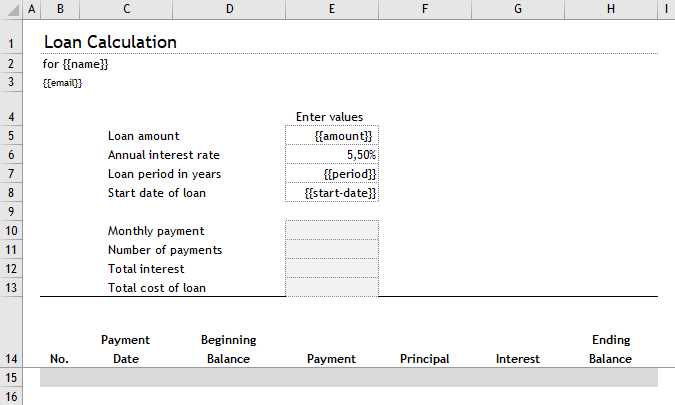

Then upload it to the process.

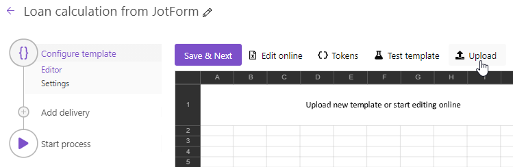

Templating syntax
*****************
When creating your own templates, mind the templating language.
Plumsail Excel XLSX templates use a different approach than most other templating solutions.
It uses a minimal amount of syntax to make your work done.

In short, the templating engine thinks that everything between curly :code:`{{ }}` brackets is variables where it will apply your specified data. 
Read `this article <../../../document-generation/xlsx/how-it-works.html>`_ to get familiar with the templating engine.

Test template
*************

To check how the document will look at the end, click on the *Test template* button. 

You will see the dialog where you can fill in the auto-generated testing form. 
Form fields are created based on tokens from your document template.
You can `adjust the look of the testing form by changing token types <../custom-testing-form.html>`_.

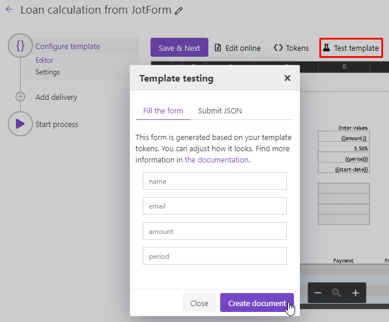

It’s testing.
We’re going to apply the data from the webform to our template.

Once you’ve tested the template, press *Save & Next* to proceed further—to the **Settings** substep.

Here, please:

- switch to an active mode to remove Plumsail watermarks from resulting documents,
- fill in the name of the result file,
- select PDF format for the output file,
- `protect the result PDF <../configure-settings.html#add-watermark>`_ if you wish.

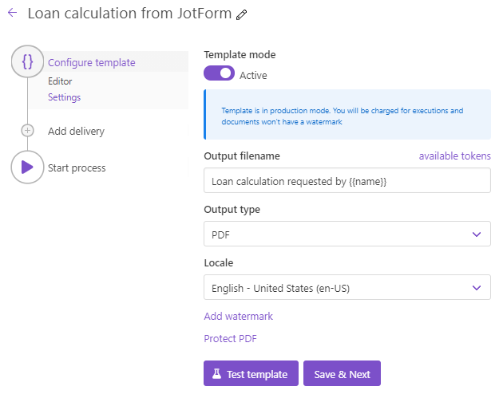

Once you’ve customized all the settings, you can test the template to see the result as we did it before. 

When everything is done here, click on *Save & Next* to set up deliveries.

Delivery
~~~~~~~~

The next step is delivery.
For demonstrating purposes, we’ll store the result file in `OneDrive <../../../user-guide/processes/deliveries/one-drive.html>`_.
But there are `other options <../../../user-guide/processes/create-delivery.html#list-of-available-deliveries>`_.

Just set the folder’s name where the ready document will be saved.

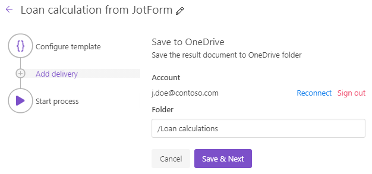

You can configure as many deliveries as you need.

Start the Process
~~~~~~~~~~~~~~~~~

We will start our Process from Power Automate (Microsoft Flow). 

Create a Flow
-------------

This is how our Flow looks:

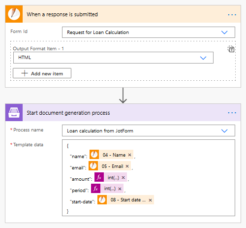

Check out the Flow steps described below.

Form is submitted
~~~~~~~~~~~~~~~~~

We need to start the Flow every time somebody submits a request for the loan calculation.
For that, search for  *JotForm* in Power Automate and add *When a response is submitted* as a trigger.

If this is your first Flow with JotForm, on this step, sign in to your JotForm Account from MS Flow to use your forms inside Flows.

Then, you’ll need to pick the form you want to track in the dropdown.

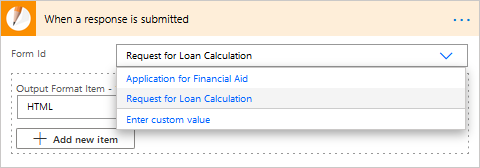

Start document generation process
~~~~~~~~~~~~~~~~~~~~~~~~~~~~~~~~~

This is the action from the `Plumsail Documents connector <../../../getting-started/use-from-flow.html>`_.
This action is suitable for starting the Process of generating documents from a template.
You can find more information about this action by visiting `this page <../../../flow/actions/document-processing.html#start-document-generation-process>`_.

Using the action for the first time, you’ll be asked for a *Connection Name* and *API Key*. 

.. image:: ../../../_static/img/getting-started/create-flow-connection.png
    :alt: Create Documents connection

You can type any name for the connection.
For example, *Plumsail Documents*. 

Then `create an API key in your Plumsail Account page <https://plumsail.com/docs/documents/v1.x/getting-started/sign-up.html>`_, copy and paste it to the *API Key* field.

The action has two parameters:

.. image:: ../../../_static/img/user-guide/processes/how-tos/start-generation-docs-action.png
    :alt: Action fields

Select the process you need from available ones and specify source data in JSON format:

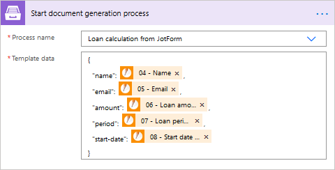

This object contains information from our form.
We selected the dynamic content from the output of the *When a new response is submitted* trigger:

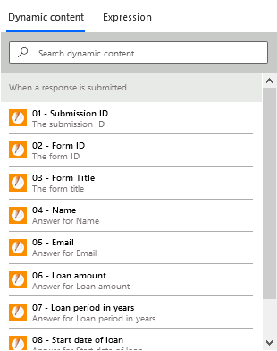

Use the ready document in Flow
~~~~~~~~~~~~~~~~~~~~~~~~~~~~~~

You can stop on the step **Start document generation process**. 

The steps described above are enough for generating PDFs from an XSLX template based on the JotForm submission.
Your result file will be saved to OneDrive in this case.
See how it will look:

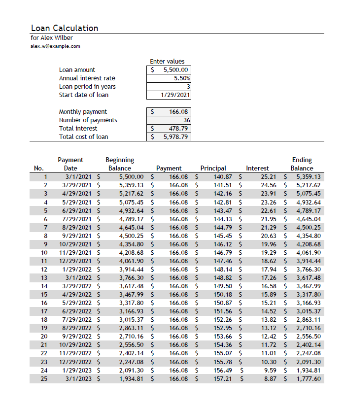

But if you need advanced logic, it’s possible to work with the result file right in the Flow. 

Here is an example of how you can send the ready document for approval. 

Add an action *Create an approval* from the *Approvals* connector.
Select the output of the previous step for an attachment.

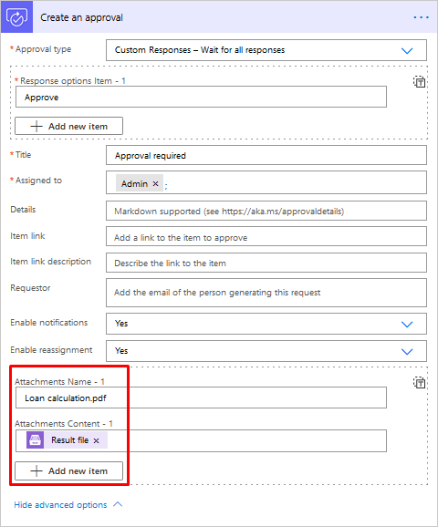

Sign up for Plumsail Documents
------------------------------

As you can see, it’s simple to automize the generation of documents on JotForm submission.
If you’re new to Plumsail Documents, `register an account <https://auth.plumsail.com/Account/Register?ReturnUrl=https://account.plumsail.com/documents/processes/reg>`_ and follow the steps described in the article to set the process for the automatic creation of PDFs from JotForm.

.. hint::
  You can generate PDFs from webforms even without Power Automate (Microsoft Flow).
  Check the article `How to generate PDF documents from a DOCX template on Plumsail Forms submission <../../../user-guide/processes/examples/create-word-and-pdf-documents-from-plumsail-forms.html>`_.