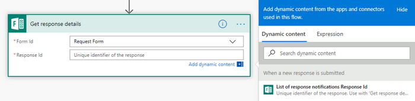
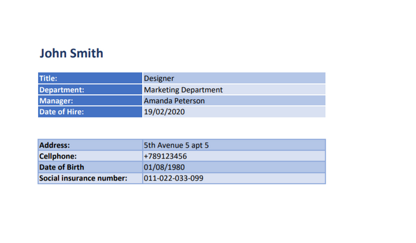

How to create Excel and PDF documents from Microsoft Forms in Power Automate and Azure Logic Apps
=================================================================================================

This article shows how to create PDF documents from an XLSX template on a `Microsoft Form <https://forms.office.com/>`_ submission with the help of `Processes <../../../user-guide/processes/index.html>`_ in Power Automate (MS Flow). It may help you to automate the generation of different documents like applications, requests, orders, etc., in your company. 

**Processes** are a `Plumsail Documents <https://plumsail.com/documents/>`_ feature with an intuitive interface for creating documents from templates.

**Microsoft Forms** are an online form builder with themes and question branching that allows you to create surveys, quizzes, polls and collects other information.

In this example, we will collect data from a Microsoft Form, apply the data to our Excel template, and generate a new PDF document with the help of Processes in Power Automate (Microsoft Flow).

.. contents::
    :local:
    :depth: 2

Create a Form
-------------

We have already created a Microsoft Form for a short employee information sheet. We will use data from its submission. If you haven't created MS Forms before, follow `this link <https://support.office.com/en-gb/article/create-a-form-with-microsoft-forms-4ffb64cc-7d5d-402f-b82e-b1d49418fd9d>`_ to learn how to do it.

It's possible to use the form from this example. After you've logged into your Microsoft Forms account, click on `this link <https://forms.office.com/Pages/ShareFormPage.aspx?id=sw17qLgWx0qMVHqdDlcIbmR30TR_6NdLl37R-A7gviRUREdDS0RUQ0pWNVZTSFJOWEJZN1c0UTJZRy4u&sharetoken=myrEdz9F27iuAWGKqSd6>`_ to duplicate the form. After duplicating you'll be able to use the form as your own. 

Below is a screenshot of our form:

.. include:: ../examples/xlsx-employee-info-process-part.rst

Start the Process
~~~~~~~~~~~~~~~~~
We will start our Process from Power Automate (Microsoft Flow). 

Create a Flow
-------------
This is how our Flow looks:

Check out the Flow steps described below.

Form is submitted
~~~~~~~~~~~~~~~~~

We need to start the Flow every time somebody submits our form. For that, search for *Microsoft Forms* in Power Automate and set *Microsoft Forms - When a response is submitted* as a trigger.

If this is your first Flow with Microsoft Forms, on this step, sign in to your Microsoft Forms Account from MS Flow to use your forms inside Flows.

Then, you'll need to pick the form you want to track in the dropdown.

Get response details
~~~~~~~~~~~~~~~~~~~~
As we want to get the submitted data, we need to add *Microsoft Forms - Get response details* action. On this action, we select the same **Form Id** that we used in the trigger. Then, we click in the **Response Id** text box and pick **List of response notifications - Response Id** in the Dynamic content menu on the right:

Start document generation process
~~~~~~~~~~~~~~~~~~~~~~~~~~~~~~~~~
This is the action from `Plumsail Documents connector <../../../getting-started/use-from-flow.html>`_. This action is suitable for starting the Process of generating documents from a template. You can find more information about this action by visiting `this page <../../../flow/actions/document-processing.html#start-document-generation-process>`_.

Using the action for the first time, you’ll be asked for *''Connection Name''* and *''Access Key''*. 

.. image:: ../../../_static/img/getting-started/create-flow-connection.png
    :alt: create flow connection

You can type any name for the connection. For example, *''Plumsail Documents''*. 

Then `create an API key in your Plumsail Account page <https://plumsail.com/docs/documents/v1.x/getting-started/sign-up.html>`_, copy and paste it to *''Access Key''* field.

The action has two parameters:

.. image:: ../../../_static/img/user-guide/processes/how-tos/start-generation-docs-action.png
    :alt: start generation documents action

- *Process name*. Select the process you need from available ones. 
- *Template data*. Specify source data in JSON format:

This object contains information from our form. We selected the dynamic content from the output of *Microsoft Forms - Get response details* action:

Use the ready document in Flow
~~~~~~~~~~~~~~~~~~~~~~~~~~~~~~

You can stop on the step **Start document generation process**. 

Steps described above are enough for generating PDFs from an XSLX template based on the Microsoft Form submission. Your result file will be saved to OneDrive in this case. See how it will look:

But if you need an advanced logic, it's possible to work with the result file right in the Flow. 

Here is an example of how you can send the ready document for approval. 

Add an action *Create an approval* from the *Approvals* connector. Select an output of the previous step for an attachment.

.. image:: ../../../_static/img/user-guide/processes/how-tos/create-an-approval.png
    :alt: send pdf for approval

Sign up for Plumsail Documents
------------------------------

As you can see, it's simple to automize the generation of documents on Microsoft Forms submission. If you're new to Plumsail Documents, `register an account <https://auth.plumsail.com/Account/Register?ReturnUrl=https://account.plumsail.com/documents/processes/reg>`_ and follow the steps described in the article to set the process for automatic creation of PDFs from Microsoft Forms.

.. hint:: You can generate PDFs from Web Forms even without Power Automate (Microsoft Flow). Check the article `How to generate PDF documents from a DOCX template on Plumsail Forms submission <../../../user-guide/processes/examples/auto-populate-pdf-from-plumsail-forms.html>`_.