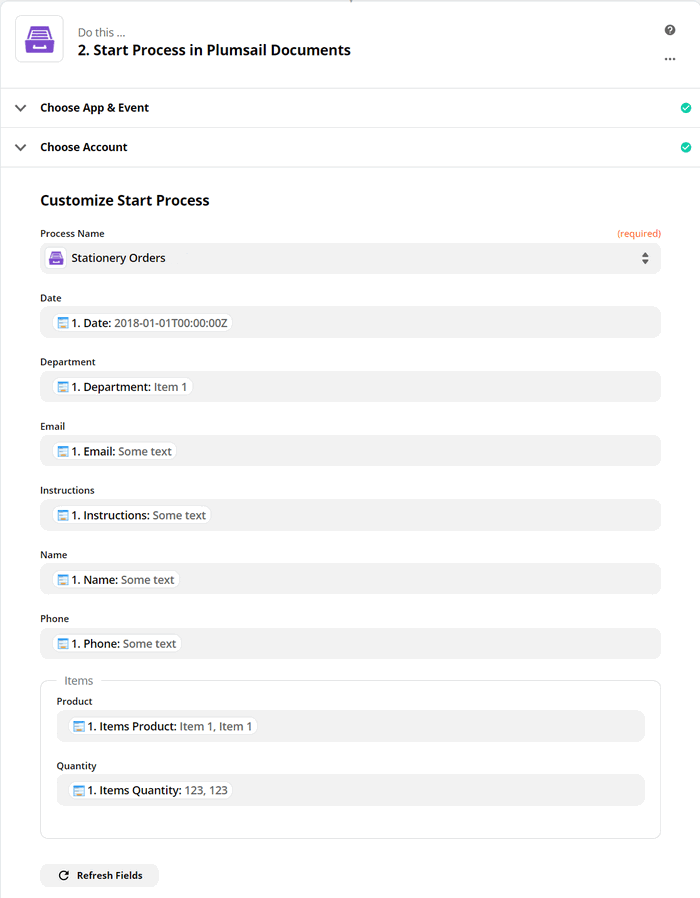

How to create Excel and PDF documents from Plumsail Forms in Zapier
===================================================================

This article describes how to create PDF documents from an XLSX template on `Plumsail Forms <https://plumsail.com/forms/>`_ submission with the help of `Processes <../../../user-guide/processes/index.html>`_ in Zapier. It may help you to automize the generation of documents like applications, requests, orders, etc., in your company.

**Processes** are a `Plumsail Documents <https://plumsail.com/documents/>`_ feature with an intuitive interface for creating documents from templates.

With **Plumsail Forms**, you can design elegant, responsive, and highly customizable forms for SharePoint Modern UI or any web page. In our example, we will collect data from a Web Form, apply it to our template and generate a new PDF document with the help of Processes.

.. contents::
    :local:
    :depth: 2

Create a Form
-------------

We have already designed a form for a stationery and office supplies request. Here is our result form:

.. image:: ../../../_static/img/flow/how-tos/stationery-order-plumsail-form.png
    :alt: Plumsail Form image

You see, that the form includes information:

-	an ordering employee – here we use mostly **text boxes**, for the department - a **dropdown**
-	the order content – we use a **DataTable** for adding multiple lines to the order
-	under the table with order items, we place a **multiline textbox** for special instructions 
-	and, finally, a **submit button**

You can use our ready form template for a stationery order request as well. `Download the file <../../../_static/files/flow/how-tos/Stationery-Order-Form.xfds>`_ and import it to the Plumsail Forms designer. 

To create such a form yourself, follow `this link <https://plumsail.com/docs/forms/design.html>`_ to learn more about how to design Plumsail Web Forms. 

**Understanding Internal Names of Form's fields**

It’s crucial to understand the **Internal Names** of Form's fields. They must correspond to tokens in a template. You can set internal names for Form’s fields in its general propeties:

.. image:: ../../../_static/img/flow/how-tos/name-of-PlumsailForms-field.png
    :alt: setting of the form's fields

Our data table’s name is **items**. And its columns have their names as well - **Product** and **Quantity**. 

In our XLSX template, we'll put such tokens :code:`{{items.Product}}` and :code:`{{items.Quatity}}`. The templating engine will iterate through all objects in the array to render them and add the rows automatically. 

.. include:: ../examples/stationary-order-process-part.rst

Start the Process
~~~~~~~~~~~~~~~~~
We will start our Process from Zapier.

Create a Zap
-------------

Zap is an automated connection between web services in Zapier. This is how our Zap looks:

Below is a step-by-step description.

New submission in Plumsail Forms
~~~~~~~~~~~~~~~~~~~~~~~~~~~~~~~~

We need to start the Zap every time somebody submits our stationery request form. For that, search for  *Plumsail Forms* in Zapier and add *New submission in Plumsail Forms* as a trigger.

If this is your first Zap with Plumsail Forms, on this step, sign in to your Plumsail Account from Zapier to use your forms inside Zaps.

Then, you'll need to pick the form you want to track in the dropdown.

The last thing to do with the trigger - **Find data**. Press "Test trigger" to find data. It will allow you to use the trigger output on the next step.

Start process in Plumsail Documents
~~~~~~~~~~~~~~~~~~~~~~~~~~~~~~~~~~~

Once the trigger is set, search for Plumsail Documents and add an action *Start process*.

.. image:: ../../../_static/img/user-guide/processes/how-tos/start-process-zapier.png
    :alt: start process from Zapier action

Click Continue. If this is your first Zap, at this point, you'll need to Sign in to your Plumsail Account from Zapier to establish a connection between the app and your account. If you already have a Plumsail account tied to the app, you can add another one at this step, and use it instead.

Customize Start Process
***********************

Choose the process you want to start by this Zap from the dropdown. 
Then, you need to specify the data in JSON. This data will be applied to the template to personalize documents.

.. important:: Properties from the JSON object should correspond to tokens used in your template. Learn more about templates `here <../user-guide/processes/create-template.html>`_.

Use the output from the trigger to specify values:

Our Zap is ready. See how the resulting file looks:

.. image:: ../../../_static/img/flow/how-tos/result-file-cognito-xlsx.png
    :alt: Final document

Sign up for Plumsail Documents
-------------------------------

As you can see, it's simple to automize the generation of documents on Plumsail Forms submission. If you're new to Plumsail Documents, `register an account <https://auth.plumsail.com/Account/Register>`_ and follow the steps described in the article to set the process for automatic creation of PDFs from Plumsail Forms.

.. hint:: Check out one more example of automating processing PDF with Plumsail Forms - `Auto-populate a fillable PDF on Plumsail Forms submission <../../../user-guide/processes/examples/auto-populate-pdf-from-plumsail-forms.html>`_. 