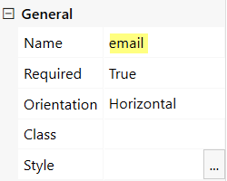
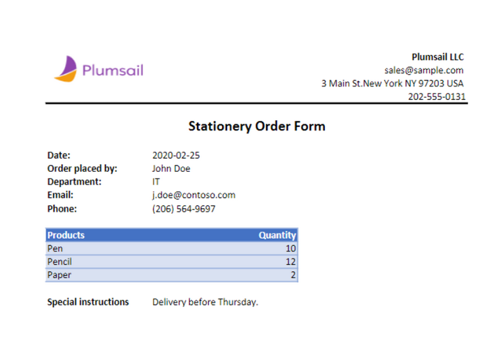
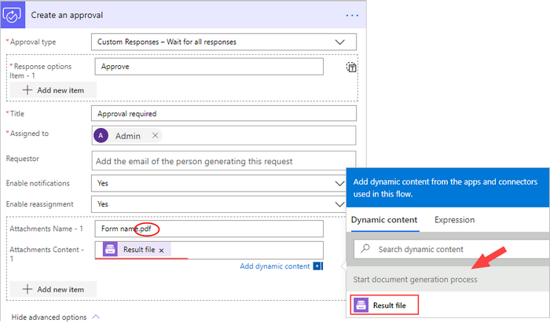

.. title:: How to create Excel and PDF documents from Plumsail Web Forms in Power Automate (Microsoft Flow) and Azure Logic Apps

.. meta::
   :description: Try this ready-to-use example of Plumsail Web Forms populating Excel and PDF documents in Power Automate Flow.

Create Excel and PDF documents from Plumsail Forms in Power Automate
======================================================================

This article describes how to create PDF documents from an XLSX template on `Plumsail Forms <https://plumsail.com/forms/>`_ submission with the help of `Processes <../../../user-guide/processes/index.html>`_ in Power Automate (MS Flow). It may help you to automize the generation of documents like applications, requests, orders, etc., in your company.

**Processes** are a `Plumsail Documents <https://plumsail.com/documents/>`_ feature with an intuitive interface for creating documents from templates.

With **Plumsail Forms**, you can design elegant, responsive, and highly customizable forms for SharePoint Modern UI or any web page. In our example, we will collect data from a Web Form, apply it to our template and generate a new PDF document with the help of Processes.

.. contents::
    :local:
    :depth: 2

Create a Form
-------------

We have already designed a form for a stationery and office supplies request. Here is our result form:

.. image:: ../../../_static/img/flow/how-tos/stationery-order-plumsail-form.png
    :alt: Plumsail Form image

You see, that the form includes information:

-	an ordering employee – here we use mostly **text boxes**, for the department - a **dropdown**
-	the order content – we use a **DataTable** for adding multiple lines to the order
-	under the table with order items, we place a **multiline textbox** for special instructions 
-	and, finally, a **submit button**

You can use our ready form template for a stationery order request as well. `Download the file <../../../_static/files/flow/how-tos/Stationery-Order-Form.xfds>`_ and import it to the Plumsail Forms designer. 

To create such a form yourself, follow `this link <https://plumsail.com/docs/forms/design.html>`_ to learn more about how to design Plumsail Web Forms. 

**Understanding Internal Names of Form's fields**

It’s crucial to understand the **Internal Names** of Form's fields. They must correspond to tokens in a template. You can set internal names for Form’s fields in its general propeties:

Our data table’s name is **items**. And its columns have their names as well - **Product** and **Quantity**. 

In our XLSX template, we'll put such tokens :code:`{{items.Product}}` and :code:`{{items.Quatity}}`. The templating engine will iterate through all objects in the array to render them and add the rows automatically. 

.. include:: ../examples/stationary-order-process-part.rst

Start the Process
~~~~~~~~~~~~~~~~~
We will start our Process from Power Automate (Microsoft Flow).

Create a Flow
-------------

This is how our Flow looks:

Below is a step-by-step description.

Form is submitted
~~~~~~~~~~~~~~~~~

We need to start the Flow every time somebody submits our stationery request form. For that, search for  *Plumsail Forms* in Power Automate and add *Plumsail Forms - Form is submitted* as a trigger.

If this is your first Flow with Plumsail Forms, on this step, sign in to your Plumsail Account from MS Flow to use your forms inside Flows.

You'll need to add the form ID to track it. 

Find and copy it in **General** settings in Forms Designer.

Current time
~~~~~~~~~~~~

It's a simple action to get the current date. We'll use its output in the next step.

Start document generation process
~~~~~~~~~~~~~~~~~~~~~~~~~~~~~~~~~

This is the action from `Plumsail Documents connector <../../../getting-started/use-from-flow.html>`_. This action is suitable for starting the Process of generating documents from a template. You can find more information about this action by visiting `this page <../../../flow/actions/document-processing.html#start-document-generation-process>`_.

Using the action for the first time, you’ll be asked for *''Connection Name''* and *''Access Key''*. 

.. image:: ../../../_static/img/getting-started/create-flow-connection.png
    :alt: create flow connection

You can type any name for the connection. For example, *''Plumsail Documents''*. 

Then `create an API key in your Plumsail Account page <https://plumsail.com/docs/documents/v1.x/getting-started/sign-up.html>`_, copy and paste it to *''Access Key''* field.

The action has two parameters:

.. image:: ../../../_static/img/user-guide/processes/how-tos/start-generation-docs-action.png
    :alt: start generation documents action

- *Process name*. Select the process you need from available ones. 
- *Template data*. Specify source data in JSON format:

.. image:: ../../../_static/img/flow/how-tos/JSON-data-Plumsail-Forms.png
    :alt: dynamic content of Plumsail form is submitted

This object contains information from our form. We selected the dynamic content from the output of *Plumsail Forms - Form is submitted* and *Current time* action.

.. image:: ../../../_static/img/flow/how-tos/dynamic-content-excel-plumsail.png
    :alt: dynamic content of Plumsail Form is submitted

Use the ready document in Flow
~~~~~~~~~~~~~~~~~~~~~~~~~~~~~~

You can stop on the step **Start document generation process**. 

Steps described above are enough for generating PDFs from an XSLX template based on the Plumsail Form submission. Your result file will be saved to OneDrive in this case. See how it will look:

But if you need an advanced logic, it's possible to work with the result file right in the Flow. 

Here is an example of how you can send the ready document for approval. 

Add an action *Create an approval* from the *Approvals* connector. Select an output of the previous step for an attachment.

Sign up for Plumsail Documents
-------------------------------

As you can see, it's simple to automize the generation of documents on Plumsail Forms submission. If you're new to Plumsail Documents, `register an account <https://auth.plumsail.com/Account/Register?ReturnUrl=https://account.plumsail.com/documents/processes/reg>`_ and follow the steps described in the article to set the process for automatic creation of PDFs from Plumsail Forms.

.. hint:: Check out one more example of creating PDF documents from templates on Plumsail Forms submission - `How to generate PDF documents from a DOCX template on Plumsail Forms submission <../../../user-guide/processes/examples/auto-populate-pdf-from-plumsail-forms.html>`_. 