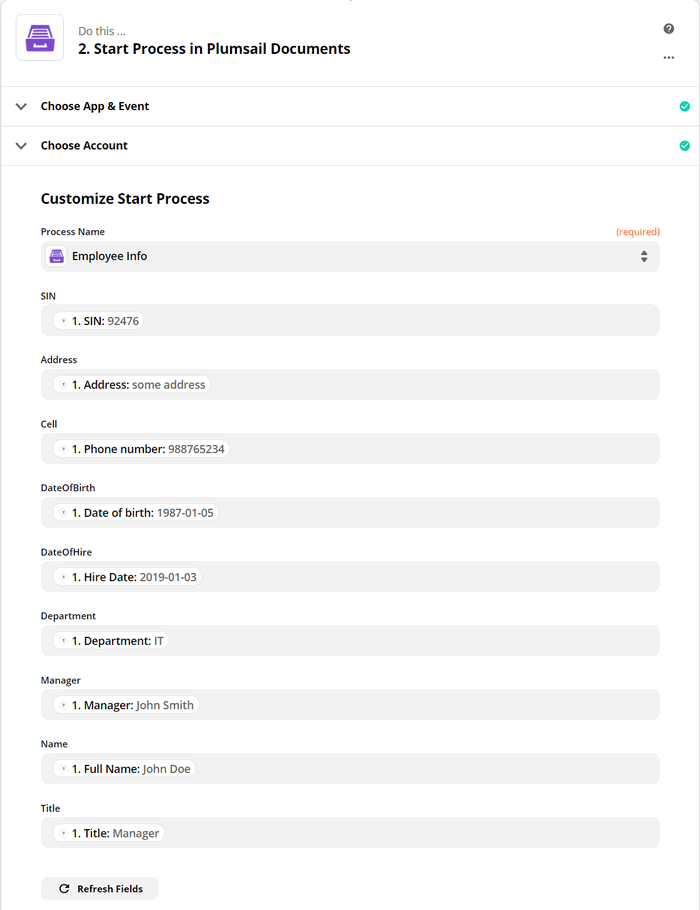

.. title::  How to create customized Excel and PDF documents from Typeform in Zapier

.. meta::
   :description: Try this Zapier integration for Typeform and Plumsail Documents to populate Excel templates from web forms and then convert to PDF.

How to create Excel and PDF documents from Typeform in Zapier
=============================================================

This article demonstrates how to create PDF documents from an XLSX template on a `Typeform <https://www.typeform.com/>`_ submission with the help of `Processes <../../../user-guide/processes/index.html>`_ in Zapier. It may help you to automize the generation of different documents like applications, requests, orders, etc., in your company. 

**Processes** are a `Plumsail Documents <https://plumsail.com/documents/>`_ feature with an intuitive interface for creating documents from templates.

**Typeform** is an online form builder that allows you to create modern responsive forms for your website.

Let’s see how to connect them in `Zapier <https://zapier.com/apps/plumsail-documents/integrations>`_ to automatically collect data from a Typeform, apply the data to our Excel template, and generate a new PDF document.

.. contents::
    :local:
    :depth: 2

Create a Form
-------------

We've already created a Typeform with a short employee questionnaire. We will use data from its submission. If you haven't created Typeforms before, follow `this link <https://www.typeform.com/help/my-1st-typeform/>`_ to learn how to do it.

Below is a screenshot of our form:

.. image:: ../../../_static/img/flow/how-tos/type-xlsx-pdf-form.png
    :alt: Typeform image

.. include:: ../examples/xlsx-employee-info-process-part.rst

Start the Process
~~~~~~~~~~~~~~~~~
We will start our Process from Zapier. 

Create a Zap
-------------

Zap is an automated connection between web services in Zapier. 
You can create it from scratch following the steps explained below.

Or you can utilize the zap template. Click **Use this zap**, and then just customize the steps as it's described further in this article.

|Widget|

.. |Widget| raw:: html

    

This is how our Zap looks:

.. image:: ../../../_static/img/flow/how-tos/zap-excel-cognito.png
    :alt: xlsx to pdf from Cognito Forms Zap

New entry in Typeform
~~~~~~~~~~~~~~~~~~~~~

We need to start the Zap everytime somebody submits our Typeform. For that, search for  *Typeform* in Zapier and add *New entry* as a trigger.

If this is your first Zap with Typeform, on this step, sign in to your Typeform Account from Zapier to use your forms inside Zaps.

Then, you'll need to pick the form you want to track in the dropdown.

The last thing to do with the trigger - **Find data**. Press "Test trigger" to find data. It will allow you to use the trigger output on the next step.

.. image:: ../../../_static/img/flow/how-tos/test-typeform-zap.png
    :alt: Test Typeform trigger to find data

Start process in Plumsail Documents
~~~~~~~~~~~~~~~~~~~~~~~~~~~~~~~~~~~

Once the trigger is set, search for Plumsail Documents and add an action *Start process*.

.. image:: ../../../_static/img/user-guide/processes/how-tos/start-process-zapier.png
    :alt: start process from Zapier action

Click Continue. If this is your first Zap, at this point, you'll need to Sign in to your Plumsail Account from Zapier to establish a connection between the app and your account. If you already have a Plumsail account tied to the app, you can add another one at this step, and use it instead.

Customize Start Process
***********************

Choose the process you want to start by this Zap from the dropdown. You will see fields to complete - they have the same names as tokens from the template. 

To complete them, use the output from the Typeform trigger.

Our Zap is ready. See how the resulting file looks:

.. image:: ../../../_static/img/flow/how-tos/resultfile-employee-info.png
    :alt: Final document

Sign up for Plumsail Documents
------------------------------

As you can see, it's simple to automize the generation of documents on Typeforms submission. If you're new to Plumsail Documents, `register an account <https://auth.plumsail.com/Account/Register?ReturnUrl=https://account.plumsail.com/documents/processes/reg>`_ and follow the steps described in the article to set the process for automatic creation of PDFs from Typeforms. A 30-day trial is free.

.. hint:: See how to `create PDF documents from a DOCX template on a Typeform entry in Zapier <../../../user-guide/processes/examples/create-word-and-pdf-documents-from-typeform-zapier.html>`_.