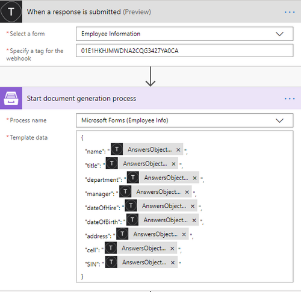

.. title::  How to create customized Excel and PDF documents from Typeform in Power Automate (Microsoft Flow) and Azure Logic Apps

.. meta::
   :description: A ready-to-use example of Typeform populating Excel and PDF documents in Power Automate Flow and Azure Logic Apps.

Create Excel and PDF documents from Typeform in Power Automate
================================================================

This article demonstrates how to create PDF documents from an XLSX template on a `Typeform <https://www.typeform.com/>`_ submission with the help of `Processes <../../../user-guide/processes/index.html>`_ in Power Automate (MS Flow). It may help you to automize the generation of different documents like applications, requests, orders, etc., in your company. 

**Processes** are a `Plumsail Documents <https://plumsail.com/documents/>`_ feature with an intuitive interface for creating documents from templates.

**Typeform** is an online form builder that allows you to create modern responsive forms for your website.

Let’s see how to connect them in Power Automate (Microsoft Flow) to automatically collect data from a Typeform, apply the data to our Excel template, and generate a new PDF document.

.. contents::
    :local:
    :depth: 2

Create a Form
-------------

We've already created a Typeform with a short employee questionnaire. We will use data from its submission. If you haven't created Typeforms before, follow `this link <https://www.typeform.com/help/my-1st-typeform/>`_ to learn how to do it.

Below is a screenshot of our form:

.. include:: ./xlsx-employee-info-process-part.rst

Start the Process
~~~~~~~~~~~~~~~~~
We will start our Process from Power Automate (Microsoft Flow). 

Create a Flow
-------------
This is how our Flow looks:

Check out the Flow steps described below.

Form is submitted
~~~~~~~~~~~~~~~~~

We need to start the Flow everytime somebody submits our Typeform. For that, search for *Typeform* in Power Automate and set *Typeform - When a response is submitted* as a trigger.

If this is your first Flow with Typeform, on this step, sign in to your Typeform Account from MS Flow to use your forms inside Flows.

Then, you'll need to pick the form you want to track in the dropdown.

Start document generation process
~~~~~~~~~~~~~~~~~~~~~~~~~~~~~~~~~
This is the action from `Plumsail Documents connector <../../../getting-started/use-from-flow.html>`_. This action is suitable for starting the Process of generating documents from a template. You can find more information about this action by visiting `this page <../../../flow/actions/document-processing.html#start-document-generation-process>`_.

Using the action for the first time, you’ll be asked for *''Connection Name''* and *''Access Key''*. 

.. image:: ../../../_static/img/getting-started/create-flow-connection.png
    :alt: create flow connection

You can type any name for the connection. For example, *''Plumsail Documents''*. 

Then `create an API key in your Plumsail Account page <https://plumsail.com/docs/documents/v1.x/getting-started/sign-up.html>`_, copy and paste it to *''Access Key''* field.

The action has two parameters:

.. image:: ../../../_static/img/user-guide/processes/how-tos/start-generation-docs-action.png
    :alt: start generation documents action

- *Process name*. Select the process you need from available ones. 
- *Template data*. Specify source data in JSON format:

This object contains information from our form. We selected the dynamic content from the output of *Typeform - When a response is submitted* action:

Use the ready document in Flow
~~~~~~~~~~~~~~~~~~~~~~~~~~~~~~

You can stop on the step **Start document generation process**. 

Steps described above are enough for generating PDFs from an XSLX template based on the Typeform submission. Your result file will be saved to OneDrive in this case. See how it will look:

.. image:: ../../../_static/img/flow/how-tos/resultfile-employee-info.png
    :alt: Final document

But if you need an advanced logic, it's possible to work with the result file right in the Flow. 

Here is an example of how you can send the ready document for approval. 

Add an action *Create an approval* from the *Approvals* connector. Select an output of the previous step for an attachment.

.. image:: ../../../_static/img/user-guide/processes/how-tos/create-an-approval.png
    :alt: send pdf for approval

Sign up for Plumsail Documents
------------------------------

As you can see, it's simple to automize the generation of documents on Typeforms submission. If you're new to Plumsail Documents, `register an account <https://auth.plumsail.com/Account/Register?ReturnUrl=https://account.plumsail.com/documents/processes/reg>`_ and follow the steps described in the article to set the process for automatic creation of PDFs from Typeforms. A 30-day trial is free.

.. hint:: You can generate PDFs from Web Forms even without Power Automate (Microsoft Flow). Check the article `How to generate PDF documents from a DOCX template on Plumsail Forms submission <../../../user-guide/processes/examples/create-word-and-pdf-documents-from-plumsail-forms.html>`_.