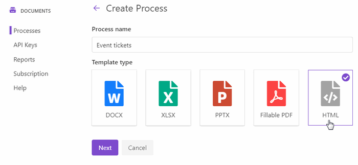
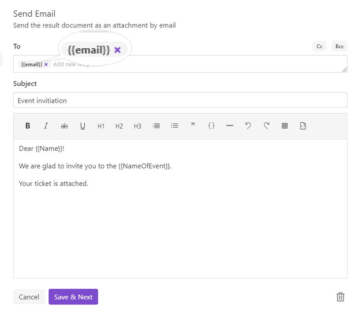
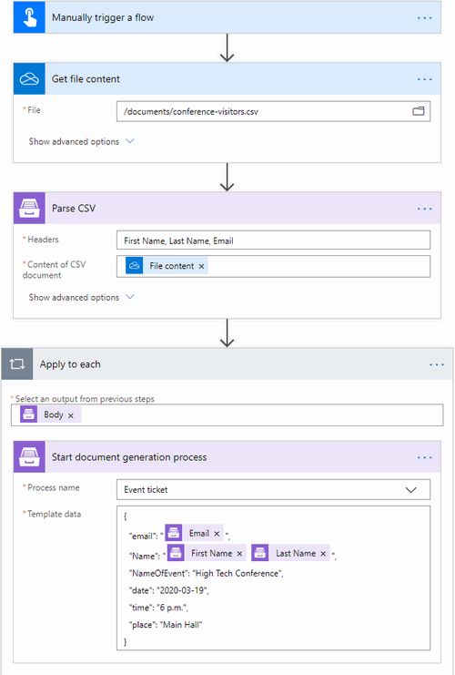
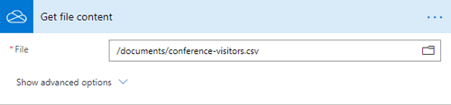
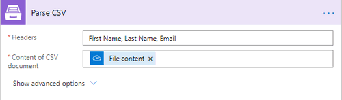
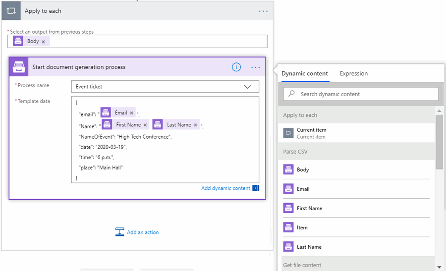

How to batch generate PDF documents from an HTML template based on CSV records in Power Automate 
=================================================================================================

This article describes how to batch create PDF documents from an HTML template based on CSV rows data. Let’s imagine you have a CSV file with employees' information. You need to generate personal invitations to the conference for every employee and send them by email. 

We’ll show you how to automize this case using **Processes** and **Parse CSV** action by `Plumsail Documents <https://plumsail.com/documents/>`_ in Power Automate (Microsoft Flow). 

`Processes <../../../user-guide/processes/index.html>`_ are an intuitive interface for creating documents from templates.

`Parse CSV <../../../flow/actions/document-processing.html#parse-csv>`_ is an action for MS Flow which parses a CSV file into an array of objects with properties.

.. contents::
    :local:
    :depth: 2

Configure the Process
---------------------
First, we will configure the Process and after that will create a Flow.

Create a new Process
~~~~~~~~~~~~~~~~~~~~

Go to `the Processes section <https://account.plumsail.com/documents/processes>`_ in your Plumsail account.

Click on the *Add process* button.

.. image:: ../../../_static/img/user-guide/processes/how-tos/add-process-button.png
    :alt: add process button

Set the Process name. 

Upload the template you will use. In this example, we are generating personal invitations for employees. And below is our template for it. You can download it by `this link <../../../_static/files/flow/how-tos/event-ticket-template.html>`_.

Our HTML template is very simple. We have the only :code:`{{name}}` token, which will be placed by employees' names. To get familiar with the template syntax, read `this description <../../../document-generation/html/index.html>`_. 

Configure a template
~~~~~~~~~~~~~~~~~~~~

Once you're done with the first step *Create Process*, press the *Submit* button, and you’ll proceed to the next – *Configure Template*:

- Fill in the name of the result file
- Select PDF format for the output file

.. image:: ../../../_static/img/flow/how-tos/configure-template-invitations.png
    :alt: Configure template

You can test a template as well, to see how it will look at the end. After clicking on the *Test template* button, you’ll need to ‘feed’ a template with your data in JSON format. In our case, it might be:

.. code:: json

    {
      "name": "Xue Li"
    }

It’s just testing. We’re going to apply the data from the CSV file to make invitations personalized.

Delivery
~~~~~~~~

The next step is delivery. We select Email delivery to send event invitations to our employees. 

Enter addresses to the email field. Define the message's subject and body. That's it.

You can configure as many deliveries as you need. Check out `other options <../../../user-guide/processes/create-delivery.html#list-of-available-deliveries>`_ as well.

Start the Process
~~~~~~~~~~~~~~~~~
We will start our Process from Microsoft Flow.

Create a Flow
-------------

This is how our Flow looks:

Flow trigger
~~~~~~~~~~~~

You can pick any trigger. For example, you can start this Flow on event creation in the Office 365 Outlook calendar. We use **Manually trigger a flow** here for simplicity.

Get file content
~~~~~~~~~~~~~~~~

We store our CSV file sample in OneDrive. To read its content, we assign the action **Get file content** from the OneDrive connector. This action gets content of the file in the OneDrive folder. You just need to specify the path to it. 

It’s possible to assign Get file content action from other connectors. It depends on where you store the source file. 

For you to try the same case as in the article, our sample CSV is available for download by `this link <../../../_static/files/flow/how-tos/employees.csv>`_. 

Parse CSV
~~~~~~~~~

This is an action from `Plumsail Documents connector <../../../getting-started/use-from-flow.html>`_. It parses a CSV file into an array of objects with properties in Power Automate (Microsoft Flow).

Using the action for the first time, you’ll be asked for *''Connection Name''* and *''Access Key''*. 

.. image:: ../../../_static/img/getting-started/create-flow-connection.png
    :alt: create flow connection

You can type any name for the connection. For example, *''Plumsail Documents''*. 

Then `create an API key in your Plumsail Account page <https://plumsail.com/docs/documents/v1.x/getting-started/sign-up.html>`_, copy and paste it to *''Access Key''* field.

**Parse CSV** action has two mandatory parameters:

-	*Headers*. List all the headers you will use, separate them by commas.
-	*Content of CSV document*. Select an output from the previous step **File content** in Dynamic content.

You can find more detailed information about **Parse CSV** action `here <../../../flow/actions/document-processing.html#parse-csv>`_.

Start document generation process
~~~~~~~~~~~~~~~~~~~~~~~~~~~~~~~~~

Before adding this action, set **Apply to each** control. It will help to generate as many tickets as many rows a CSV file has. 

**Start document generation process** is action from Plumsail documents connector for Power Automate as well. It will start the process which we have already created and configured on `the step Configure the Process <../../../user-guide/processes/examples/create-html-and-pdf-from-template-from-csv.html#configure-the-process>`_.

The action has two parameters:

- *Process name*. Select the process you need from available ones. 
- *Template data*. Use the output of **Parse CSV** to specify JSON data.

Our Flow is ready. It will apply data from CSV rows to the HTML template to batch generate personal invitations in PDF and send them by email. 

Each employee will receive an invitation with their full name:

It's one example of many others. You can use the same logic for your own scenarios.

Sign up for Plumsail Documents
-------------------------------

To start optimizing processes, `register a Plumsail account <https://auth.plumsail.com/Account/Register>`_ and follow the steps described in the article to batch generate event invitations from HTML templates based on CSV rows data.
