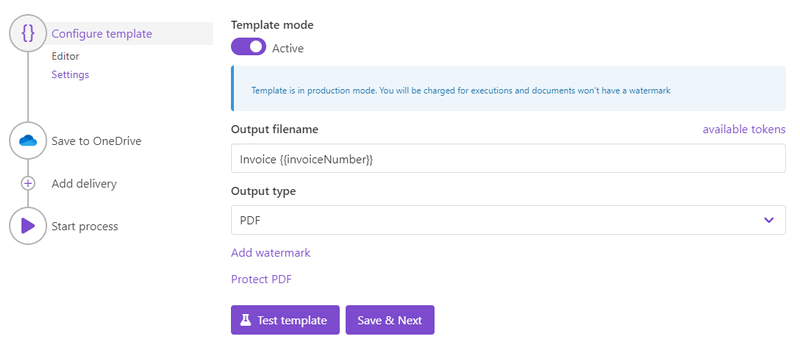
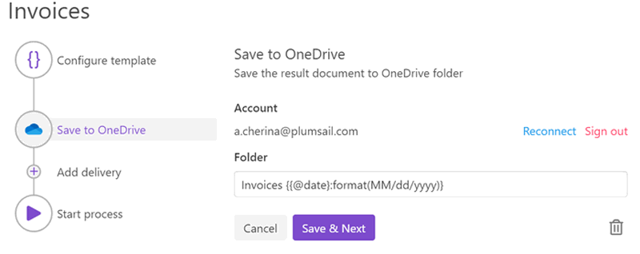

.. title::  Generate PDF documents from Word DOCX templates automatically in Zapier, Power Automate (Microsoft Flow), and Azure Logic Apps

.. meta::
   :description: It will ensure automation of your document generation and save tons of time. Check out how to create PDF documents from a DOCX template in Flows and Zaps. 

Create PDF documents from DOCX template in Zapier, Power Automate (Microsoft Flow), and Azure Logic Apps
========================================================================================================

This article demonstrates how to generate PDF documents from a DOCX template with the help of `Plumsail Documents <https://plumsail.com/documents/>`_ processes. We will use a DOCX document as a template. And with the help of `Processes <../index.html>`_, we will receive the result file in PDF format. 

The Processes are a user-friendly intuitive interface for creating documents from templates, converting them, and delivering to different systems for further management. 

In this article, we will generate a PDF invoice based on some data. This is how our final PDF file looks:

.. image:: ../../../_static/img/user-guide/processes/how-tos/invoice-result-document.png
    :alt: create PDF from DOCX template

Here is a step-by-step description on how to create such a process of generating PDFs from a DOCX template.

.. contents::
    :local:
    :depth: 2

Configure Process
-----------------

First, register or login to your `Plumsail account <https://account.plumsail.com/>`_. Then select *Documents* and go to the `Processes section <https://account.plumsail.com/documents/processes>`_. 

Create new process
~~~~~~~~~~~~~~~~~~~~

Click on the *Add Process* button.

.. image:: ../../../_static/img/user-guide/processes/how-tos/add-process-button.png
    :alt: add process button

Give a name to the Process to recognize it later.

.. image:: ../../../_static/img/user-guide/processes/how-tos/create-new-process.png
    :alt: create PDF from DOCX template

Upload the template you want to use. Here is `the link for downloading the template <../../../_static/files/user-guide/processes/template-invoice.docx>`_ we use in this example.

When creating your own ones, mind the templating language. Plumsail Word DOCX templates use a different approach than most other templating solutions. It uses a minimal amount of syntax to make your work done.

To learn more about the templating engine, check out `the documentation article <../../../document-generation/docx/how-it-works.html>`_.

In short, the templating engine thinks that everything between such curly :code:`{{ }}` brackets is variables where it will apply your specified data. In our case the most basic example would be :code:`{{invoiceNumber}}` and :code:`{{date}}` tags. They let the engine know that we want to render the invoice number and its date.

But, of course, we can implement a more complex scenario. In our template, we refer to properties inside simple objects and collections, as well as properties in nested constructions. To select properties of our objects inside of the array (in JSON data), we use a dot operator:

- The :code:`{{company.address}}`, :code:`{{company.email}}`, :code:`{{company.phone}}` tags let the engine know that we want to render properties of the company object.
- The :code:`{{product.name}}`, :code:`{{product.quantity}}`, :code:`{{product.price}}`, and :code:`{{product.cost}}` tags get the name, description, and price properties in each product object.

The templating engine is smart enough to identify what content to duplicate. It will iterate through all objects in the array to render them and add the rows automatically.

You can learn more about table rendering in `the tables section <../../../document-generation/docx/tables.html>`_ of the documentation.

Configure template
~~~~~~~~~~~~~~~~~~

Once you've created the Process and submitted the template, you'll proceed to the next step - **Configure template**, which has two substeps:

- Editor;
- Settings.

In `Editor <../../../user-guide/processes/online-editor.html>`_, you can work on the template, make necessary modifications, and instantly check how they affect the result. 

For that, click on the *Test template* button, you will see the dialog where you can insert some data in JSON format. This data represents what the templating engine should paste into :code:`{{brackets}}` instead of object names and their properties. So, this data need to correspond to tokens from the template.

.. image:: ../../../_static/img/user-guide/processes/how-tos/test-template.png
    :alt: create docx from template

To test the invoice template from this example, copy and paste the JSON data presented below.

.. note:: This is JSON for testing. You can pass data from an external system or web form to the process. See the `Start process section <#start-process>`_. 

.. code:: json

    {
      "invoiceNumber": "432",
      "company": {
        "email": "sales@sample.com",
        "address": "3 Main St.New York NY 97203 USA",
        "phone": "202-555-0131"
      },
      "date": "2018-05-21",
      "product": [
        {
          "name": "Monitor",
          "price": 99,
          "quantity": 10,
          "cost": 990
        },
        {
          "name": "Stepler",
          "price": 12.44,
          "quantity": 1000,
          "cost": 12440
        },
        {
          "name": "Fridge",
          "price": 4219.99,
          "quantity": 1,
          "cost": 4219.99
        },
        {
          "name": "Microwave",
          "price": 99.99,
          "quantity": 5,
          "cost": 499.95
        },
        {
          "name": "Pen",
          "price": 7.23,
          "quantity": 100,
          "cost": 723
        }
      ],
      "total": 18872.94
    }

Once the template is ready, and you're satisfied with the result, press *Save&Next* to proceed further - to the **Settings** substep.

There you can set the parameters as described below the picture.

**Template mode**

It is *Testing* by default. It means you won't be charged for this process runs, but result documents will have a Plumsail watermark. Change it to *Active* to remove the watermark.

**Output filename**

Use tokens to make it personalized. They work the same way as in the template. For instance, we use the following tokens to define the output file name - :code:`{{invoiceNumber}}`. As a result, we'll receive an invoice marked with its number - *Invoice 432*.

**Output type**

By default, it is the same as your template's format. In this particular case, it's DOCX. We're changing it to PDF to create PDF documents from a DOCX template.

.. hint:: You can `protect your final PDF document with a watermark, by setting a password, or disabling some actions <../configure-settings.html#add-watermark>`_. 

**Test template**

You can test the template from the Settings as well - to check how the customized settings will appear in the resulting document. The procedure is the same as we've already described above.

Delivery
~~~~~~~~

The next step is delivery. For demonstrating purpose, we’ll store the result file in `OneDrive <../../../user-guide/processes/deliveries/one-drive.html>`_. But there are `other options <../../../user-guide/processes/create-delivery.html>`_.

You need to connect to your OneDrive from the Plumsail account. After that, set the folder's name where to save the ready document. Here you can use tokens as well. 

You can configure as many deliveries as you need.

Start Process
-------------

Now everything is ready, and you can start generating PDF documents from a DOCX template. The step **Start process** will show available options with a description for each.

.. image:: ../../../_static/img/user-guide/processes/how-tos/start-docx-process.png
    :alt: start process to create PDF from Word template

You can start the process :

- `manually <../start-process-manually.html>`_ with your JSON data;
- `by Plumsail Web form <../start-process-web-form.html>`_ bound to the process;
- `using Power Automate (former Microsoft Flow) <../start-process-ms-flow.html>`_;
- `using Zapier <../start-process-zapier.html>`_
- `using REST API <../start-process-rest-api.html>`_;

Use `Power Automate Flow <../../../getting-started/use-from-flow.html>`_ and `Zapier <../../../getting-started/use-from-zapier.html>`_ to connect the process with other apps. It enables you to gather data from one app and pass on to the process to populate a DOCX template. Thus, you can populate the DOCX template from various web forms, CRM systems, SharePoint lists, and thousands of other web applications. 

.. hint:: You can `create a fillable PDF <https://plumsail.com/docs/documents/v1.x/document-generation/fillable-pdf/index.html>`_ and use it as a template to create PDF documents with the help of Plumsail Processes. It supports this type of templates as well.

.. note:: There is another - a little bit more complicated - way to create PDF documents from a DOCX template. Check `the article <https://plumsail.com/docs/documents/v1.x/flow/how-tos/documents/create-pdf-from-docx-template.html>`_.