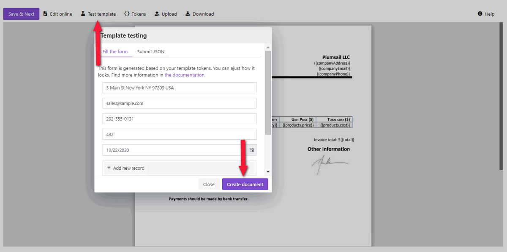
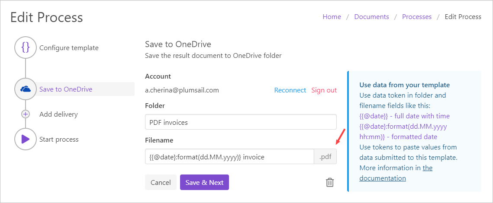
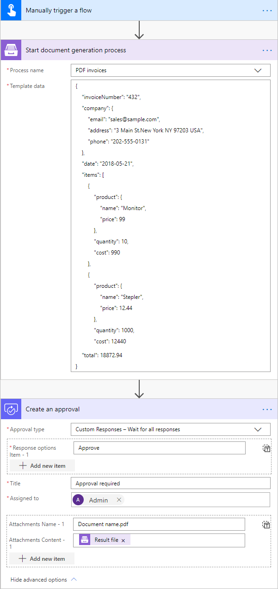

Create PDF from DOCX template in Power Automate (Microsoft Flow) and Azure Logic Apps
====================================================================

This article demonstrates how to generate PDF document from a DOCX template with the help of `Plumsail Processes <https://plumsail.com/docs/documents/v1.x/user-guide/processes/index.html>`_ and `Power Automate (Microsoft Flow) <https://flow.microsoft.com>`_. 

We will use a DOCX document as a template. And with the help of `Plumsail Documents <https://plumsail.com/documents/>`_ feature - Processes - we will receive the result file in PDF format. In this article, we will generate PDF invoice based on some data. This is how our final PDF file looks:

.. image:: ../../../_static/img/flow/how-tos/html-and-pdf-result.png
   :alt: Result PDF file

Here is a step-by-step description on how to create such a process of generating PDF's from a DOCX template.

Configuring the Process
-----------------------

1. First, register or login to your `Plumsail account <https://account.plumsail.com/>`_. Then select *Documents* and go to the *Processes* section. 

2. Click on the *Add Process* button.

.. image:: ../../../_static/img/user-guide/processes/how-tos/add-process-button.png
    :alt: add process button

3. Give a name to the Process to recognize it later.

4. Upload the template you want to use. Here is `the link for downloading the template <https://plumsail.com/docs/documents/v1.x/_static/files/document-generation/demos/invoice-template.docx>`_ we use in this example.

.. image:: ../../../_static/img/user-guide/processes/how-tos/create-new-process-pdf.png
   :alt: Сreate PDF from DOCX template

Read `this article <../../../document-generation/docx/how-it-works.html>`_  to understand how the templating engine works.

5. Once you've created the Process and submited the template, you'll proceed to the next step - *Configure template*.

- Fill in the name of the result file;

- Select PDF format for the output file;

- Protect your PDF the way you wish:

-`Add watermark <https://plumsail.com/docs/documents/v1.x/user-guide/processes/create-process.html#add-watermark>`_

-`Disable printing, editing, extracting data, annotations
or Set password <https://plumsail.com/docs/documents/v1.x/user-guide/processes/create-process.html#protect-pdf>`_

- Test the template to see how it will look at the end by clicking the *Test template* button.

.. image:: ../../../_static/img/user-guide/processes/how-tos/configure-template-pdf.png
    :alt: create PDF from DOCX template

For that, you can copy and paste our sample JSON data:

.. code:: json

    {
        "invoiceNumber": "432",
        "company": {
            "email": "sales@sample.com",
            "address": "3 Main St.New York NY 97203 USA",
            "phone": "202-555-0131"
        },
        "date": "2018-05-21",
        "items": [
            {
                "product": {
                    "name": "Monitor",
                    "price": 99
                },
                "quantity": 10,
                "cost": 990
            },
            {
                "product": {
                    "name": "Stepler",
                    "price": 12.44
                },
                "quantity": 1000,
                "cost": 12440
            },
            {
                "product": {
                    "name": "Fridge",
                    "price": 4219.99
                },
                "quantity": 1,
                "cost": 4219.99
            },
            {
                "product": {
                    "name": "Microwave",
                    "price": 99.99
                },
                "quantity": 5,
                "cost": 499.95
            },
            {
                "product": {
                    "name": "Pen",
                    "price": 7.23
                },
                "quantity": 100,
                "cost": 723
            }
        ],
        "total": 18872.94
    }

6. The next step is delivery. For demonstrating purpose, we’ll store the result file in `OneDrive <https://plumsail.com/docs/documents/v1.x/user-guide/processes/deliveries/one-drive.html>`_. But there are other options:

- `Sending by e-mail <https://plumsail.com/docs/documents/v1.x/user-guide/processes/deliveries/send-email.html>`_

- `Saving to DropBox <https://plumsail.com/docs/documents/v1.x/user-guide/processes/deliveries/dropbox.html>`_

And others are coming soon. 

Select the folder where the ready document will be saved. And fill in its name. Don't forget to put the extension type :code:`.pdf`.

You can configure as many deliveries as you need.

7. The last thing to do is to start the Process. We will start it using Power Automate (Microsoft Flow). You can check out `other options <https://plumsail.com/docs/documents/v1.x/user-guide/processes/start-process.html>`_.

Creating the Flow
-----------------

Now we need to create the Power Automate Flow that will start our process of creating PDF documents from a DOCX template and apply data to this template. This is how the complete flow looks:

Here is the step-by-step description.

**Flow trigger**

You can actually pick any trigger. We use "Manually trigger a flow" trigger here to simplify the Flow.

**Start document generation process**

This is the action from `Plumsail Documents connector <https://plumsail.com/docs/documents/v1.x/flow/actions/document-processing.html?%20connector#start-document-generation-process>`_. This action is suitable for starting the Process of generating documents from a template.

Using the action for the first time, you’ll be asked for *''Connection Name''* and *''Access Key''*. 

.. image:: ../../../_static/img/getting-started/create-flow-connection.png
    :alt: create flow connection

You can type any name for the connection. For example, *''Plumsail Documents''*. 

Then `create an API key in your Plumsail Account page <https://plumsail.com/docs/documents/v1.x/getting-started/sign-up.html>`_, copy and paste it to *''Access Key''* field.

There are two parameters:

.. image:: ../../../_static/img/user-guide/processes/how-tos/start-generation-docs-action.png
    :alt: start generation documents action

- *Process name*. Select the one process you need among available. 
- *Template data*. Specify your data in JSON format as we did on the step of testing the template. 

That's it! Run the Flow any time you need to generate PDF documents from a DOCX template.

.. note:: There is another - a little bit more complicated - way to create PDF documents from a DOCX template. Check `the article <https://plumsail.com/docs/documents/v1.x/flow/how-tos/documents/create-pdf-from-docx-template.html>`_.

.. hint:: You can `create a fillable PDF <https://plumsail.com/docs/documents/v1.x/document-generation/fillable-pdf/index.html>`_ and use it as a template to create PDF documents with the help of Plumsail Processes. It supports this type of templates as well.