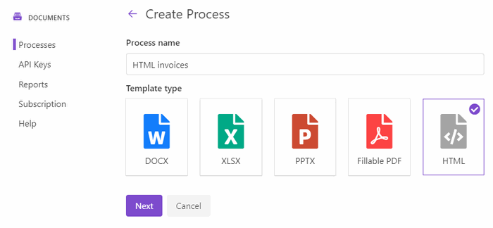
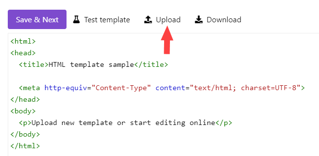
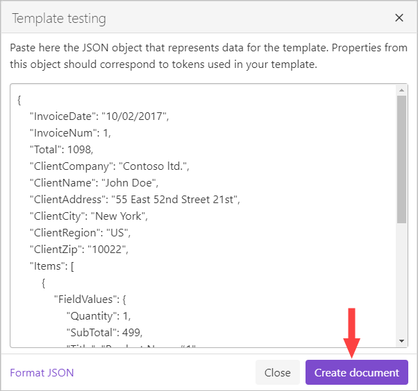
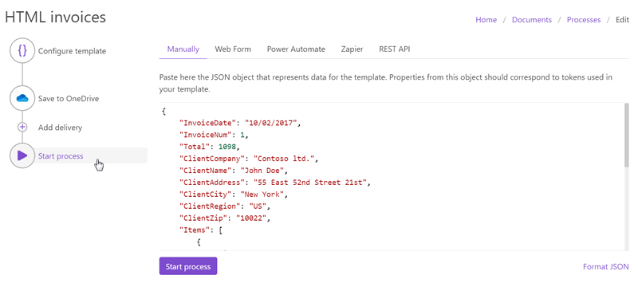

.. title::  Generate PDF documents from HTML templates automatically in Zapier, Power Automate (Microsoft Flow), and Azure Logic Apps

.. meta::
   :description: Check out how to populate HTML templates and convert the result to PDF using Plumsail Documents in Power Automate and Zapier.

Create PDF document from HTML template in Zapier, Power Automate (Microsoft Flow), and Azure Logic Apps
=======================================================================================================

This article demonstrates how to generate PDF documents from an HTML template with the help of `Plumsail Documents processes <https://plumsail.com/docs/documents/v1.x/user-guide/processes/index.html>`_.

The Processes are a user-friendly intuitive interface for creating documents from templates, converting them, and delivering to different systems for further management.

In this article, we will generate a PDF invoice based on some data. This is how our final PDF file will look:

.. image:: ../../../_static/img/flow/how-tos/html-and-pdf-result.png
   :alt: Result PDF file

Here is a step-by-step description of creating a process of generating PDF documents from an HTML template.

.. contents::
    :local:
    :depth: 2

Configure Process
-----------------

First, register or login to your `Plumsail account <https://account.plumsail.com/>`_. Then select *Documents* and go to the `Processes section <https://account.plumsail.com/documents/processes>`_. 

Create a new process
~~~~~~~~~~~~~~~~~~~~

Click on the *Add Process* button.

.. image:: ../../../_static/img/user-guide/processes/how-tos/add-process-button.png
    :alt: add process button

Give a name to the Process to recognize it later. As we're going to generate PDF invoices from an HTML template, select **HTML** for the template type.

Configure template
~~~~~~~~~~~~~~~~~~

Once you've created the process, you’ll jump to its first step – *Configure Template*.

It includes two substeps:

- Editor;
- Settings.

In `Editor <../../../user-guide/processes/online-editor.html>`_, you can compose the template from scratch or upload a pre-made one. It's also possible to modify the uploaded template online.

Feel free to `download an HTML template for invoices <../../../_static/files/flow/how-tos/html-template.html>`_. We have prepared it beforehand. 

Then upload it to the process.

Templating syntax
*****************

You may see that the template has placeholders like :code:`{{Total}}` and :code:`{{Quantity}}`. There is also :code:`#{{each}}` iterator for rendering invoice items. Please read `template syntax description <../../../document-generation/html/index.html>`_ for more information.

Test template
*************
You can test the template to see how it will look at the end by clicking the *Test template* button.

After you click on the *Test template* button, you will see the dialog where you can insert your data in JSON format. This JSON data represents what will be pasted into :code:`{{ }}` brackets instead of object names and their properties. So, it must correspond to tokens from the template. 

To test the template from our example, you can copy and paste the JSON data shown below.

.. note:: This is JSON for testing. You can pass data from an external system or web form to the process. See the `Start process section <#start-process>`_. 

.. code:: json

    {
        "InvoiceDate": "10/02/2017",
        "InvoiceNum": 1,
        "Total": 1098,
        "ClientCompany": "Contoso ltd.",
        "ClientName": "John Doe",
        "ClientAddress": "55 East 52nd Street 21st",
        "ClientCity": "New York",
        "ClientRegion": "US",
        "ClientZip": "10022",
        "Items": [
            {
                "FieldValues": {
                    "Quantity": 1,
                    "SubTotal": 499,
                    "Title": "Product Name #1",
                    "UnitPrice": "499"
                }
            },
            {
                "FieldValues": {
                    "Quantity": 1,
                    "SubTotal": 599,
                    "Title": "Product Name #2",
                    "UnitPrice": 599
                }
            }
        ]
    }

Delivery
~~~~~~~~

The next step is delivery. For demonstrating purpose, we’ll store the result file in `OneDrive <../../../user-guide/processes/deliveries/one-drive.html>`_. But there are `other options <../../../user-guide/processes/create-delivery.html#list-of-available-deliveries>`_.

You need to connect to your OneDrive from the Plumsail account. After that, set the folder's name where to save the ready document. Here you can use tokens as well. 

.. image:: ../../../_static/img/user-guide/processes/how-tos/store-onedrive.png
    :alt: create docx from template

You can configure as many deliveries as you need.

Start the Process
-----------------

Now everything is ready, and you can start generating PDF documents from an HTML template. The step **Start process** will show available options with a description for each.

You can start the process :

- `manually <../start-process-manually.html>`_ with your JSON data;
- `by Plumsail Web form <../start-process-web-form.html>`_ bound to the process;
- `using Power Automate (former Microsoft Flow) <../start-process-ms-flow.html>`_;
- `using Zapier <../start-process-zapier.html>`_
- `using REST API <../start-process-rest-api.html>`_;

Use `Power Automate Flow <../../../getting-started/use-from-flow.html>`_ and `Zapier <../../../getting-started/use-from-zapier.html>`_ to connect the process with other apps. It enables you to gather data from one app and pass on to the process to populate a DOCX template. Thus, you can populate the DOCX template from various web forms, CRM systems, SharePoint lists, and thousands of other web applications. 

.. hint:: With Plumsail Processes, you can easily `create PDF documents from a DOCX template <../../../user-guide/processes/examples/create-pdf-from-docx-template-processes.html>`_ as well.

.. note:: There is another - a little bit more complicated - way to create PDF documents from the HTML template. Check `the article <https://plumsail.com/docs/documents/v1.x/flow/how-tos/documents/create-pdf-from-html-template.html>`_.