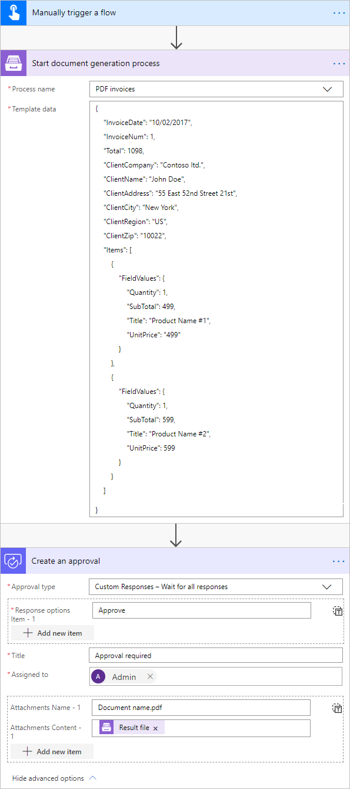
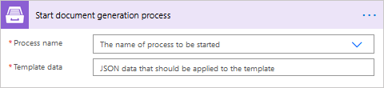

Create PDF document from HTML template in Microsoft Flow and Azure Logic Apps
=========================================================================

This article demonstrates how to generate PDF documents from an HTML template with the help of `Processes <https://plumsail.com/docs/documents/v1.x/user-guide/processes/index.html>`_, a `Plumsail Documents <https://plumsail.com/documents/>`_ feature, and `Microsoft Flow <https://flow.microsoft.com>`_.

The Processes are a user-friendly intuitive interface for creating documents from templates, converting them and delivering to different systems for further management.

In this article, we will generate PDF invoice based on some data. This is how our final PDF file will look:

.. image:: ../../../_static/img/flow/how-tos/html-and-pdf-result.png
   :alt: Result PDF file

Here is a step-by-step description of creating a process of generating PDF documents from an HTML template.

.. contents::
    :local:
    :depth: 2

Configuring the Process
-----------------------

First, register or login to your `Plumsail account <https://account.plumsail.com/>`_. Then select *Documents* and go to the `Processes section <https://account.plumsail.com/documents/processes>`_. 

Create a new process
~~~~~~~~~~~~~~~~~~~~

Click on the *Add Process* button.

.. image:: ../../../_static/img/user-guide/processes/how-tos/add-process-button.png
    :alt: add process button

Give a name to the Process to recognize it later.

.. image:: ../../../_static/img/user-guide/processes/how-tos/create-new-process-pdf.png
    :alt: create PDF from HTML template

Upload the template you want to use. Here is `the link for downloading the template <../../../_static/files/flow/how-tos/html-template.html>`_ we are using in our case.

If you open this template you may see that there are placeholders like :code:`{{Total}}` and :code:`{{Quantity}}`. There is also :code:`#{{each}}` iterator for rendering invoice items. Please read `template syntax description <../../../document-generation/html/index.html>`_ for more information.

Configure a template
~~~~~~~~~~~~~~~~~~~~

Once you've created the Process and submited the template, you'll proceed to the next step - *Configure template*.

- Fill in the name of the result file;

- Select PDF format for the output file;

- Protect your PDF the way you wish:

`Add watermark <https://plumsail.com/docs/documents/v1.x/user-guide/processes/create-process.html#add-watermark>`_

`Disable printing, editing, extracting data, annotations
or Set password <https://plumsail.com/docs/documents/v1.x/user-guide/processes/create-process.html#protect-pdf>`_

- Test the template to see how it will look at the end by clicking the *Test template* button.

Test the template
~~~~~~~~~~~~~~~~~

To test a template, you need to insert source data in JSON format into the window like in the picture below. This JSON data represents what will be pasted into :code:`{{ }}` brackets instead of object names and their properties. So, it must correspond to tokens from the template.

To test the template from our example, you can copy and paste this JSON data:

.. code:: json

    {
        "InvoiceDate": "10/02/2017",
        "InvoiceNum": 1,
        "Total": 1098,
        "ClientCompany": "Contoso ltd.",
        "ClientName": "John Doe",
        "ClientAddress": "55 East 52nd Street 21st",
        "ClientCity": "New York",
        "ClientRegion": "US",
        "ClientZip": "10022",
        "Items": [
            {
                "FieldValues": {
                    "Quantity": 1,
                    "SubTotal": 499,
                    "Title": "Product Name #1",
                    "UnitPrice": "499"
                }
            },
            {
                "FieldValues": {
                    "Quantity": 1,
                    "SubTotal": 599,
                    "Title": "Product Name #2",
                    "UnitPrice": 599
                }
            }
        ]
    }

Delivery
~~~~~~~~

The next step is delivery. For demonstrating purpose, we’ll store the result file in `OneDrive <https://plumsail.com/docs/documents/v1.x/user-guide/processes/deliveries/one-drive.html>`_. But there are `other options <../../../user-guide/processes/create-delivery.html#list-of-available-deliveries>`_.

Select the folder where the ready document will be saved. And fill in its name. You don't need to put :code:`.extension`, it'll be done automatically based on the output file type you set on the *Configure template* step.

.. image:: ../../../_static/img/user-guide/processes/how-tos/deliver-pdf-onedrive.png
    :alt: create PDF from HTML template

You can configure as many deliveries as you need.

Start the Process
~~~~~~~~~~~~~~~~~

The last thing to do is to start the Process. We will start it using `Microsoft Flow <https://flow.microsoft.com/>`_. You can check out `other options <https://plumsail.com/docs/documents/v1.x/user-guide/processes/start-process.html>`_ as well.

.. image:: ../../../_static/img/user-guide/processes/how-tos/microsoft-flow.png
    :alt: create pdf from html template

Creating the Flow
-----------------
We'll create a Flow that will start the document generation process and will send the ready document for approval. This is how the complete flow looks:

Here is the step-by-step description.

Start the Process from Flow
~~~~~~~~~~~~~~~~~~~~~~~~~~~

**Flow trigger**

You can actually pick any trigger. We use "*Manually trigger a flow*" trigger here to simplify the Flow.

**Start document generation process**

This is the action from `Plumsail Documents connector <https://plumsail.com/docs/documents/v1.x/flow/actions/document-processing.html?%20connector#start-document-generation-process>`_. This action is suitable for starting the Process of generating documents from a template.

Using the action for the first time, you’ll be asked for *''Connection Name''* and *''Access Key''*. 

.. image:: ../../../_static/img/getting-started/create-flow-connection.png
    :alt: create flow connection

You can type any name for the connection. For example, *''Plumsail Documents''*. 

Then `create an API key in your Plumsail Account page <https://plumsail.com/docs/documents/v1.x/getting-started/sign-up.html>`_, copy and paste it to *''Access Key''* field.

The action has two parameters:

- *Process name*. Select the one process you need among available. 
- *Template data*. Specify your data in JSON format as we did on `the step of testing the template <../../../user-guide/processes/examples/create-pdf-from-html-template-processes.html#test-the-template>`_. 

Use the generated document in Flow
~~~~~~~~~~~~~~~~~~~~~~~~~~~~~~~~~~

On this step, we’ll see how to use the result file from the *Start document generation process* action right in the Flow. 

Let’s send the ready document for approval with the *Approvals* connector - action *Create an approval*.

Add the output of the previous step as an attachment.

.. image:: ../../../_static/img/user-guide/processes/how-tos/create-an-approval.png
    :alt: send pdf for approval

This is just one example out of many others. 

Our Flow is ready. Run the Flow any time you need to generate PDF documents from the HTML template.

.. note:: There is another - a little bit more complicated - way to create PDF documents from the HTML template. Check `the article <https://plumsail.com/docs/documents/v1.x/flow/how-tos/documents/create-pdf-from-html-template.html>`_.

.. hint:: With Plumsail Processes, you can easily `create PDF documents from a DOCX template <../../../user-guide/processes/examples/create-pdf-from-docx-template-processes.html>`_ as well.