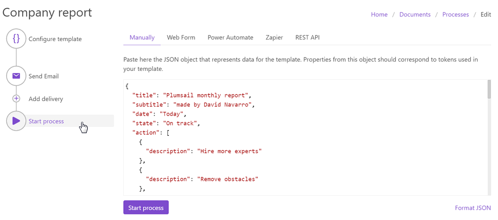

How to create PPTX and PDF documents from a template in Zapier, Power Automate Flow, Azure Logic Apps and PowerApps
===================================================================================================================

Let us say you need to create company report presentations every month. This article shows how to automate this process and generate PowerPoint presentations from PPTX templates automatically with the help of `Plumsail Documents processes <../index.html>`_.

**Processes** are a handy interface for creating documents from templates, converting, and delivering them in a few simple steps.

With its help, we’ll create a company report with tables and charts from a PPTX template. Below is the picture of the resulting presentation - the title slide and one of the body ones. You can `download this file <../../../_static/files/document-generation/demos/pptx-report-result.pptx>`_ to see the ready report. 

.. list-table::
    :header-rows: 1

    *   - Title slide
        - Slide with a chart
    *   - .. image:: ../../../_static/img/user-guide/processes/how-tos/title-slide.png 
                :alt: company report title slide
        - .. image:: ../../../_static/img/user-guide/processes/how-tos/chart-slide.png
                :alt: chart in company report    

.. contents::
    :local:
    :depth: 2

Configure Process
~~~~~~~~~~~~~~~~~

First, register or login to your `Plumsail account <https://account.plumsail.com/documents/processes>`_ to start configuring the process. 

Create Process
--------------

Click on the **Add Process** button.

.. image:: ../../../_static/img/user-guide/processes/how-tos/add-process-button.png
    :alt: add process button

Give a name to the Process to recognize it later.

.. image:: ../../../_static/img/user-guide/processes/how-tos/create-pptx-process.png
   :alt: Сreate PPTX from template

Upload the template you want to use. Here is `the link for downloading the template <../../../_static/files/document-generation/demos/pptx-report-template.pptx>`_ we use in this example.

When creating your own ones, mind the templating language. Plumsail PowerPoint PPTX templates use a different approach than most other templating solutions. It uses a minimal amount of syntax to make your work done.

To learn more about the templating engine, check out `the documentation article <../../../document-generation/pptx/how-it-works.html>`_.

In short, the templating engine thinks that everything between such curly :code:`{{ }}` brackets is variables where it will apply your specified data. In our case the most basic example would be :code:`{{title}}` and :code:`{{subtitle}}` tags. They let the engine know that we want to render the report title and its subtitle. 

We also included more complex visual content like tables and charts into our template. But there is nothing too difficult here as well. Please, see how to handle `tables <../../../document-generation/pptx/tables.html>`_ and `charts <../../../document-generation/pptx/charts.html>`_ in PPTX templates.

Configure template
------------------

Once you've created the Process and submitted the template, you'll proceed to the next step - **Configure template**.

Here you set the following parameters. 

**Template mode**

It is *Testing* by default. It means you won't be charged for this process runs, but result documents will have a Plumsail watermark. Change it to *Active* to remove the watermark.

**Output filename**

Use tokens to make it personalized. They work the same way as in the template. For instance, we use the following tokens to define the output file name - :code:`{{title}}` and :code:`{{@date}}:format(MM.yyyy)}`. As a result, we'll receive a report with the name - *Plumsail Monthly Report 04.2020*.

**Output type**

By default, it is the same as your template's format. In this particular case, it's PPTX. And we kept it to create the PPTX PowerPoint presentation from a template.

**Test template**

You can test the template to see how it will look at the end by clicking the *Test template* button.

.. image:: ../../../_static/img/user-guide/processes/how-tos/test-pptx-template.png
   :alt: test PPTX template

After you click on the *Test template* button, you will see the dialog where you can insert your data in JSON format. This JSON data represents what will be pasted into :code:`{{ }}` brackets instead of object names and their properties. So, it must correspond to tokens from the template.

.. image:: ../../../_static/img/user-guide/processes/how-tos/json-pptx-template.png
   :alt: json data PPTX template

To test the template from our example, you can copy and paste this JSON data:

.. code:: json

    {
	    "title": "Plumsail monthly report",
	    "subtitle": "made by David Navarro",
	    "date": "30/04/2020",
	    "state": "On track",
	    "action": [
		    {
			    "description": "Hire more experts"
		    },
		    {      
			    "description": "Remove obstacles"
		    },
		    {
			    "description": "Marketing"
		    },
		    {
			    "description": "Profit!!!"
		    }
	    ],
	    "sales": [
		    {
			    "country": "USA",
			    "lead": "John Doe",
			    "churn": 450,
			    "new": 1500
		    },
		    {
			    "country": "Australia",
			    "lead": "Jacky Coala",
			    "churn": 0,
			    "new": 3060
		    },
		    {
			    "country": "Japan",
			    "lead": "Naruto",
			    "churn": 260,
			    "new": 820
		    }
	    ],
	    "history": [
		    {
			    "period": "2018/Q1",
			    "total": 5030
		    },
		    {
			    "period": "2018/Q2",
			    "total": 5050
		    },
		    {
			    "period": "2018/Q3",
			    "total": 6120
		    },
		    {
			    "period": "2018/Q4",
			    "total": 6650
		    },
		    {
			    "period": "2019/Q1",
			    "total": 7660
		    }
	    ]
    }

Once you've tested the template, press *Save&Next* to proceed further.

Delivery
--------

The next step is delivery. For demonstrating purpose, we’ll store the result file in `OneDrive <../../../user-guide/processes/deliveries/one-drive.html>`_. But there are `other options <../../../user-guide/processes/create-delivery.html#list-of-available-deliveries>`_.

You need to connect to your OneDrive from the Plumsail account. After that, set the folder's name where to save the ready document. Here you can use tokens as well. 

.. image:: ../../../_static/img/user-guide/processes/how-tos/one-drive-pptx.png
    :alt: Create PowerPoint presentation from pptx template

You can configure as many deliveries as you need.

Start Process
~~~~~~~~~~~~~

Now everything is ready, and you can start generating PowerPoint presentations. The step **Start process** will show available options with a description for each.

You can start the process :

- `manually <../start-process-manually.html>`_ with your JSON data;
- `by Plumsail Web form <../start-process-web-form.html>`_ embedding it to the process;
- `using Power Automate (former Microsoft Flow) <../start-process-ms-flow.html>`_;
- `using REST API <../start-process-rest-api.html>`_;

`Power Automate Flow <https://flow.microsoft.com/>`_ and `Zapier <https://zapier.com/>`_ allow you to connect the process with other apps. It enables you to gather data from one app and pass on to the process to populate a PowerPoint template. Thus, you can populate the PPTX template from various web forms, CRM systems, SharePoint lists, and thousands of other web applications. 

.. note:: There is a separate action in the Plumsail Documents connector for Microsoft Power Automate - `Create PPTX document from template <../../../flow/actions/document-processing.html#create-pptx-document-from-template>`_. 