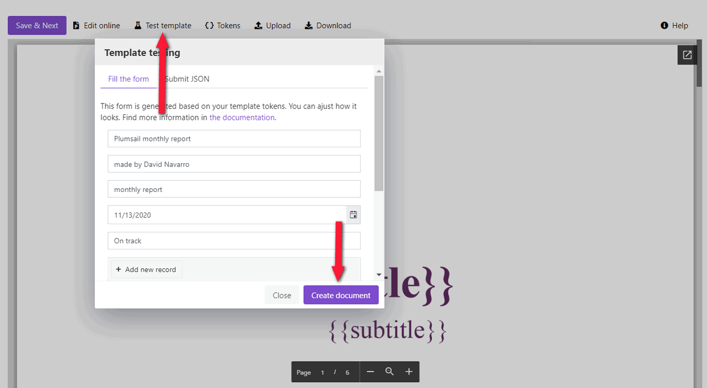

.. title:: How to create PowerPoint PPTX presentations from template in Zapier, Power Automate Flow, Azure Logic Apps and PowerApps

.. meta::
   :description: Streamline generation of presentation reports and create PPTX automatically from your web services and CRM systems using Plumsail Documents in Power Automate and Zapier.

Automatically generate PowerPoint PPTX presentations from template
=========================================================================

Let us say you need to create company report presentations every month. This article shows how to automate creating PowerPoint presentations from PPTX templates using the `Plumsail Documents <https://plumsail.com/documents/>`_ generation tool.
We call it Processes. And with its help, we’ll create a company report with tables and charts from a PPTX template. 

Below are the pictures of slides from a template and the resulting presentation - title and body slides.
You can download complete files from the links above the screenshots to compare them.

.. list-table::
    :header-rows: 1

    *   - Template
        - Result
    *   - `Download template document <../../../_static/files/document-generation/demos/pptx-report-template.pptx>`_           
            .. image:: ../../../_static/img/user-guide/processes/how-tos/template-title-slide.png 
                :alt: template title slide

            .. image:: ../../../_static/img/user-guide/processes/how-tos/template-chart-slide.png 
                :alt: template chart slide
        - `Download result document <../../../_static/files/document-generation/demos/pptx-report-result.pptx>`_
            .. image:: ../../../_static/img/user-guide/processes/how-tos/title-slide.png 
                :alt: company report title slide
            
            .. image:: ../../../_static/img/user-guide/processes/how-tos/chart-slide.png
                :alt: chart in company report    

.. contents::
    :local:
    :depth: 2

Configure Process
~~~~~~~~~~~~~~~~~

First, register or log in to your `Plumsail account <https://auth.plumsail.com/account/Register?ReturnUrl=https://account.plumsail.com/documents/processes/reg>`_ to start configuring the process. 

Create Process
--------------

Add a new process. It’s possible to create a new process from scratch or start from one of the pre-made templates.
You can browse the template library and search for a company report template. Otherwise, create from blank. 

Give a name to the Process to recognize it later. Select **PPTX** for a template type.

Configure template
------------------

Once you've created the process, you’ll jump to its first step – *Configure Template*.

It includes two substeps:

- Editor;
- Settings.

In Editor, you can compose the template from scratch or upload a pre-made one. It's also possible to modify the uploaded template online.

Feel free `to download the company report template <../../../_static/files/document-generation/demos/pptx-report-template.pptx>`_ if you haven't downloaded it yet as we gave the link above in the table showing the template and the result.

Then upload it to the process.

.. image:: ../../../_static/img/user-guide/processes/how-tos/upload-template.png
    :alt: upload template file

Templating syntax
*****************
When you create your own templates, mind the templating language. Plumsail PowerPoint PPTX templates use a different approach than most other templating solutions. It uses a minimum of syntax to make your work done.

To learn more about the templating engine, check out `the documentation article <../../../document-generation/pptx/how-it-works.html>`_.

In short, the templating engine thinks that everything between such curly :code:`{{ }}` brackets is variables where it will apply your specified data. In our case the most basic example would be :code:`{{title}}` and :code:`{{subtitle}}` tags. They let the engine know that we want to render the report title and its subtitle. 

We also included more complex visual content like tables and charts into our template. But there is nothing too difficult here as well. Please, see how to handle `tables <../../../document-generation/pptx/tables.html>`_ and `charts <../../../document-generation/pptx/charts.html>`_ in PPTX templates.

Test template
*************

You can test the template to see how it will look at the end by clicking the *Test template* button.

After you click on the *Test template* button, you will see the dialog where you can fill in the auto-generated testing form. 
Form fields are created based on tokens from your document template. You can `adjust the look of the testing form by changing token types <../custom-testing-form.html>`_.

		
Once you've tested the template, press *Save&Next* to proceed further - to the **Settings** substep.

Here you set the following parameters. 

.. image:: ../../../_static/img/user-guide/processes/how-tos/test-pptx-template.png
   :alt: test PPTX template

**Template mode**

It is *Testing* by default. It means you won't be charged for this process runs, but result documents will have a Plumsail watermark. Change it to *Active* to remove the watermark.

**Output filename**

Use tokens to make it personalized. They work the same way as in the template. For instance, we use the following tokens to define the output file name - :code:`{{title}}` and :code:`{{@date}}:format(MM.yyyy)}`. As a result, we'll receive a report with the name - *Plumsail Monthly Report 04.2020*.

**Output type**

By default, it is the same as your template's format. In this particular case, it's PPTX. And we kept it to create the PPTX PowerPoint presentation from a template.

**Test template**

Once you've customized all the settings, you can test the template to see the result as we did it before. 

When everything is done here, click on Save & Next to set up deliveries.

Delivery
--------

The next step is delivery. For demonstrating purpose, we’ll store the result file in `OneDrive <../../../user-guide/processes/deliveries/one-drive.html>`_. But there are `other options <../../../user-guide/processes/create-delivery.html#list-of-available-deliveries>`_.

You need to connect to your OneDrive from the Plumsail account. After that, set the folder's name where to save the ready document. Here you can use tokens as well. 

.. image:: ../../../_static/img/user-guide/processes/how-tos/one-drive-pptx.png
    :alt: Create PowerPoint presentation from pptx template

You can configure as many deliveries as you need.

Start Process
~~~~~~~~~~~~~

Now everything is ready, and you can start generating PowerPoint presentations. The step **Start process** will show available options with a description for each.

.. image:: ../../../_static/img/user-guide/processes/how-tos/start-docx-process.png
    :alt: start process to create Word from template

You can start the process :

- `from web form <../start-process-web-form.html>`_;
- `submitting JSON <../start-process-manually.html>`_ corresponding to template tokens;
- `using Power Automate (former Microsoft Flow) <../start-process-ms-flow.html>`_;
- `using Zapier <../start-process-zapier.html>`_;
- `using REST API <../start-process-rest-api.html>`_;

.. hint:: Use `Power Automate Flow <../../../getting-started/use-from-flow.html>`_ and `Zapier <../../../getting-started/use-from-zapier.html>`_ to connect the process with other apps. It enables you to gather data from one app and pass on to the process to populate a PowerPoint template. Thus, you can populate the PPTX template from various web forms, CRM systems, SharePoint lists, and thousands of other web applications. 

.. note:: There is a separate action in the Plumsail Documents connector for Microsoft Power Automate - `Create PPTX document from template <../../../flow/actions/document-processing.html#create-pptx-document-from-template>`_. Use it if you don't need all power of processes and just want to generate a document from a template.