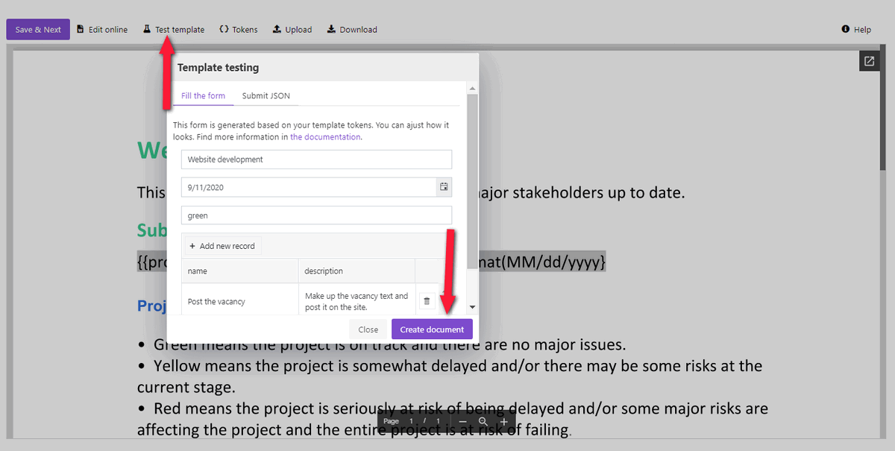

.. title:: Zapier automation to create weekly reports from Trello and send them by e-mail

.. meta::
   :description: Automatically create reports from Trello and send them by e-mail.

Zapier automation to create weekly reports from Trello and send them by e-mail 
==============================================================================

Collaboration on projects in `Trello <https://trello.com/>`_ is easy yet powerful – you have everything you need on one board.
To-do, In-Progress, Done, Checklists - Trello even offers stickers, so you can share your emotions with teammates. 
To get more from this tool, learn how you can use Zapier integration for `Plumsail Documents <https://plumsail.com/documents/>`_ and Trello to generate reports and send them by email. 

Before we start, make sure you have accounts of all involved systems:

- Plumsail Documents (if you haven’t a Plumsail account yet, `register for a 30-day free period <https://auth.plumsail.com/Account/Register?ReturnUrl=https://account.plumsail.com/documents/processes/reg>`_)
-	Trello account
- Zapier account

.. contents::
    :local:
    :depth: 2

Use case description
~~~~~~~~~~~~~~~~~~~~

The case is the most ordinary. You have to provide weekly reports on a project to your supervisors. Instead of preparing weekly reports manually, you can do it by just one click. This is our case.

We will create a weekly report in DOCX and PDF format. You can do the same with Excel and PowerPoint templates if you prefer those formats of reports. 
You have already seen the result, and here is how our report template looks:

`Download the report template by this link <../../../_static/files/user-guide/processes/weekly-report-template.docx>`_ to try the case out.

Configure report generation process
~~~~~~~~~~~~~~~~~~~~~~~~~~~~~~~~~~~

To set up the process which will generate weekly reports from Trello boards and send them by e-mail automatically, go to `the Processes section <https://auth.plumsail.com/account/Register?ReturnUrl=https://account.plumsail.com/documents/processes/reg>`_ in your Plumsail account and click on the *Add process* button:

.. image:: ../../../_static/img/user-guide/processes/how-tos/add-process-button.png
    :alt: add process button

Make up the process name and select a template type. In our case, it's **DOCX**:

Configure template
------------------

Click *Next* and you'll proceed to the **Configure template** step. It includes 2 substeps:

- Editor;
- Settings.

In `Editor <../../../user-guide/processes/online-editor.html>`_, you can compose templates from scratch or upload pre-made ones. It's also possible to modify the uploaded template online.

We have already prepared `the report template <../../../_static/files/user-guide/processes/weekly-report-template.docx>`_. Upload it to the process:

.. image:: ../../../_static/img/user-guide/processes/how-tos/upload-template.png
    :alt: upload template file

And let's try to quickly get how the templating language works. You saw :code:`{{tokens}}` in the template:

They identify places that should be replaced by specified data. 
It's the main simple rule. There are many features in the Plumsail Documents templating engine you will find useful for sure. 

For example, in the template, we used a value formatter to reduce date to the required format:

.. code::

    {{date }:format(MM/dd/yyyy)}

You can find more information on `Value formatters in the Word DOCX templates documentation <../../../document-generation/common-docx-xlsx/formatters.html>`_.

Also, we have a bullet list in the template. 
One point will turn into as many as data passed to the process will have. 
In our case, it will be a collection of completed tasks. Please, see that we used a dot operator to compose tokens related to completed tasks. 
Such nested tokens will let your process know that you want to display properties from :code:`completedTasks` object. 

You can consult the documentation to learn `how bullet lists work in the Plumsail Documents templates <../../../document-generation/docx/lists.html>`_.

Test template
*************

Once we have the template in our process, we can test it to see how the resulting file will look. 
For that, click on the *Test template*. You will see the dialog where you can fill in the auto-generated testing form. 
Form fields are created based on tokens from your document template. You can `adjust the look of the testing form by changing token types <../custom-testing-form.html>`_.

The resulting document will appear in a new tab. If you're satisfied with its look, then press *Save&Next*. 

Now it's time to customize the template's settings.

**Template mode**. It is *Testing* by default. The process runs in testing mode are free, but result documents have a Plumsail watermark. Change it to *Active* to remove the watermark.

**Output filename**. Use tokens to make it personalized. They work the same way as in the template. 

**Output type**. By default, it is the same as your template's format. In this particular case, it's DOCX. We're changing it to PDF to send weekly reports from Trello in PDF.

.. hint:: You can `protect your final PDF document with a watermark, by setting a password, or disabling some actions <../configure-settings.html#add-watermark>`_. 

**Test template**. You can test the template from the Settings as well - to check how the customized settings will appear in the resulting document. The procedure is the same as we've done in the Editor substep.

Delivery
--------

The next step is delivery. In this example, we'll set an email delivery to send reports to the manager. You can add as many deliveries as you need - please, check out the `full list of available deliveries <../../../user-guide/processes/create-delivery.html>`_.

We filled in the subject and email body. 

Additionally, it's possible to expand Advanced settings to customize *Display name* and *Reply-to*. The default display name is *Plumsail Documents Delivery*. The default reply-to is the currently logged-in user's email.

Start process
-------------

We'll start our process from Zapier.

Create Zapier automation
~~~~~~~~~~~~~~~~~~~~~~~~

Zap is an automated connection between web services in Zapier. This is how our Zap looks:

Check out the Zap steps described below.

Zap trigger
-----------

After you’ve opened `My Zaps <https://zapier.com/app/zaps>`_, create a new one, and select a trigger. We picked `Push by Zapier <https://zapier.com/apps/push>`_ to literally create weekly reports in one click. This kind of trigger enables you to start Zaps manually by Zapier extension for Google Chrome.

Find list on a board in Trello
------------------------------

Once we pushed the button, it means we want to scan the particular list on the Trello board to pull information about completed tasks. 
For that, we set an action from the Trello integration - **Find list on a board in Trello**.

If it's your first zap with Trello, you'll need to sign in your Trello account from Zapier.

To adjust the action to our needs, we select the board with the project we want to create reports on, and type in the list name - **Done**:

The last thing to do in this action is to find sample data to be able to use Trello outputs in the next step.

Start process in Plumsail Documents
-----------------------------------

Now add a *Start process* action from the `Plumsail Documents integration <https://zapier.com/apps/plumsail-documents/integrations>`_.

.. image:: ../../../_static/img/user-guide/processes/how-tos/start-process-zapier.png
    :alt: Start process in Plumsail Documents

Click Continue. If this is your first Zap, at this point, you'll need to sign in to your Plumsail Account from Zapier to establish a connection between the app and your account. If you already have a Plumsail account tied to the app, you can add another one at this step, and use it instead.

Customize Start Process
***********************

Choose the process you want to start by this Zap from the dropdown. 

Once you did it, you'll see fields with template tokens name. You need to complete them using outputs from previous steps.

- We used output from the Push trigger - date.
- We completed the rest fields using outputs from the Trello action.

Actually, our Zapier automation is ready. Just turn it on! 

Use this approach to create daily, weekly, monthly reports on project status or plans. 

.. hint:: Check out the way `how to create company reports with charts and diagrams in PowerPoint format <./create-pptx-from-template-processes.html>`_. 