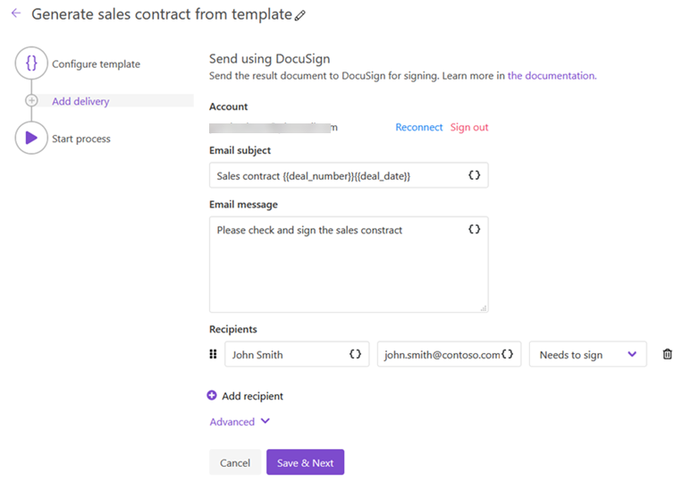
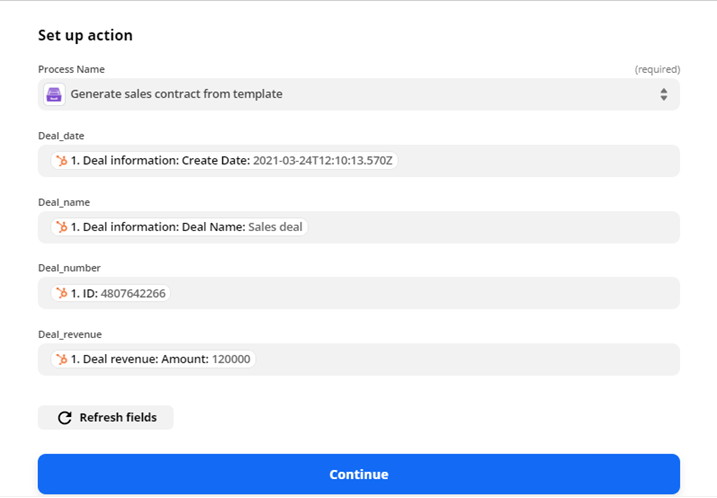

.. title:: Create sales contracts from HubSpot CRM using Zapier

.. meta::
   :description: Use Plumsail Documents processes to create sales contracts from HubSpot CRM using Zapier

How to create sales contracts from HubSpot CRM using Zapier and Plumsail Processes
====================================================================================

Let's say there is this scenario: You want to create a sales contract each time a new deal is placed in HubSpot.

We need to work with 3 platforms for this

- Create a deal in HubSpot.
- Create a process in Plumsail Processes to generate a sales contract from DOCX template.
- Create a Zapier flow that starts this Plumsail process contract generation when a new deal is placed in HubSpot.

Let's check all 3 steps.

Creatng a HubSpot deal
-----------------------

`HubSpot <https://hubspot.com/>`_ is a CRM system that provides a full platform to work with sales, marketing, and customer support areas.

This is how creating a deal looks in the HubSpot interface

We fill the required fields and save the deal. After that, it could be found in the Deals section of the platform. You can change or add some details to it, change the state or close it.

Once we create a deal we can go further and configure a Plumsail process.

Configure a Plumsail Process
------------------------------

`Sign in <https://account.plumsail.com/documents/processes>`_ to Plumsail account and go to Documents -> Processes.

.. image:: ../../../_static/img/user-guide/processes/how-tos/documents-interface.png
    :alt: Documents interface

Click **Add process**, name the process, select DOCX template type and click **Next**

In the next step, we need to configure a template. We can either compose the template from scratch or upload a pre-made one.

.. note:: You can upload your template using **Upload** button or just drag and drop a file to the editor's window.

I prepared a sales contract template and uploaded it to the Editor. You can download my template `here <../../_static/files/document-generation/demos/hubspot-invoice-template.docx>`_ .

    
    
Click **Save & Next**. There are some settings in the next step

Now I need to select a delivery. I'd like to save the created contract in a SharePoint folder.

Ok, the process is done and now it can be used in the Zapier flow. Let's move to the next step.

Create a Zapier flow
----------------------

`Zapier <https://zapier.com/>`_ connects with many services. Our Zap will be connected with two services: HubSpot and Plumsail Documents.

Let's make a new Zap.

.. image:: ../../../_static/img/user-guide/processes/how-tos/zap-home-interface.png
    :alt: Zapier home interface

Name this Zap, connect it with HubSpot and select this trigger **New deal**. The flow will start when a new deal is placed in the HubSpot CRM.

Select your HubSpot account in the next step

Set up the trigger, specify the fields you want to retrive from the HubSpot deal. I use the default ones.

In the next step you can test the trigger and select an available deal.

Now I need to connect the flow with Plumsail Documents to transfer the deal's data to the DOCX template.

Select you Documents account

We select the process created previously

And select values from the HubSpot trigger to fill the template fields

Eventually we can turn the Zap on and it will shoot whenever a new deal is placed in the HubSpot CRM.

Conclusion
-----------

You can automate any document generation by combining Zapier, HubSpot, and Plumsail Documents. We checked a simple example in the article, but there are a lot more options and possibilities available with these products.
