.. title:: Automatically populate sales proposals from Wufoo

.. meta::
   :description: Connect Wufoo to Plumsail Documents in Zapier to capture leads and send personal sales proposals before they get cold.

Automatically create sales proposals from Wufoo forms and send by email using Zapier
====================================================================================

In this article, we’ll review how to create personalized sales proposals from online web forms. It's a useful approach to capture and handle leads right away before they go cold. 
We’ll use the mix of `Wufoo forms <https://www.wufoo.com/>`_ and `Plumsail Documents <https://plumsail.com/documents/>`_ in `Zapier <https://zapier.com/>`_.

**Brief description of use case**: There is a lead capture Wufoo form on your site. 
The goal is to create personalized sales proposals and email directly to potential customers having completed the form. 
We’ll use Wufoo form submission data to populate a sales proposal template, then will send the resulting document by email. 

Before we start, let’s revise **involved apps and required accounts**:

- Plumsail Documents (if you haven’t a Plumsail account yet, `register for a 30-day free period <https://auth.plumsail.com/Account/Register?ReturnUrl=https://account.plumsail.com/documents/processes/reg>`_)
-	Wufoo forms account
- Zapier account

Please, make sure you have all the accounts to follow the steps described below.

.. contents::
    :local:
    :depth: 2

Wufoo form overview
~~~~~~~~~~~~~~~~~~~

You can create a Wufoo form from scratch. But there is a `gallery of form templates <https://www.wufoo.com/gallery/templates/>`_ you can use as they are or modify according to your needs.

We picked up a `sales lead form <https://www.wufoo.com/gallery/templates/lead-generation/sales-lead-form/>`_ from the gallery and customized it a bit:

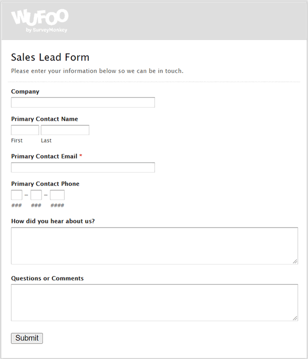

Create new process in Plumsail Documents
~~~~~~~~~~~~~~~~~~~~~~~~~~~~~~~~~~~~~~~~

To start with, let’s create and configure the process which will trigger on Wufoo form entries. 
It will populate a sales proposal template and will deliver the ready document attached to the personalized email to our customer. 
It all will happen automatically.

Go to `the Processes section <https://auth.plumsail.com/account/Register?ReturnUrl=https://account.plumsail.com/documents/processes/reg>`_ in your Plumsail account and click on the *Add process* button:

.. image:: ../../../_static/img/user-guide/processes/how-tos/add-process-button.png
    :alt: add process button

Give a name to the process. Select a template type. We'll pick **DOCX** as we're going to create sales proposals from a Word template and then convert to PDF.

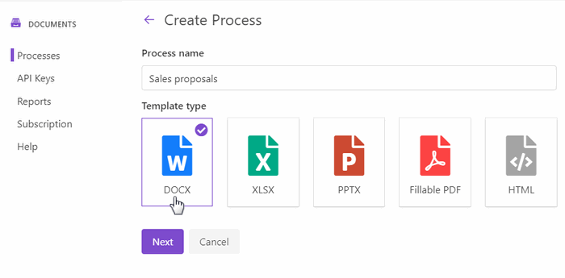

Configure template
------------------

Continue by clicking *Next*. You're on the **Configure template** step now.
It consists of two substeps:

- Editor;
- Settings.

In `Editor <../../../user-guide/processes/online-editor.html>`_, you can compose templates from scratch or upload a pre-made ones. It's also possible to modify the uploaded template online.

We have already prepared a sales proposal template in a DOCX format. It's not a sophisticated one, just to demonstrate the case of how you could automate the process. Here is the picture of our sales proposal template:

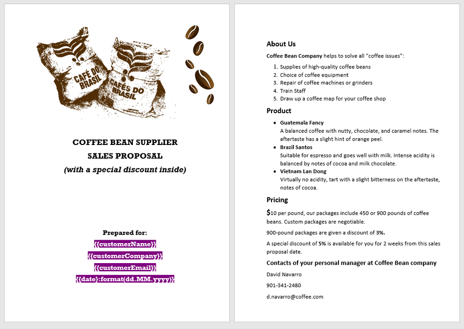

Feel free to `download this sales proposal template <../../../_static/files/user-guide/processes/coffee-sales-proposal-template.docx>`_ to test the same case. Then upload the sales proposal template to the process:

.. image:: ../../../_static/img/user-guide/processes/how-tos/upload-template.png
    :alt: upload template file

Templating syntax
*****************

You can see from the picture that the template has tokens enclosed in :code:`{{curly brackets}}`. We highlighted them purple to attract your attention. These tokens will be replaced by Wufoo form entry data.

Before you create a template for your sales proposals, consult `how the Word DOCX templates work <../../../document-generation/docx/index.html>`_. 
You already know that everything in :code:`{{double curly brackets}}` is variables where the templating engine applies your source data. You may find useful other features of Plumsail Documents templates like the support of tables, lists, charts, and many more.

Test template
*************

You can instantly check how the resulting file will look.

For that, click on the *Test template*. 
You will see the dialog where you can fill in the auto-generated testing form. 
Form fields are created based on tokens from your document template. You can `adjust the look of the testing form by changing token types <../custom-testing-form.html>`_.

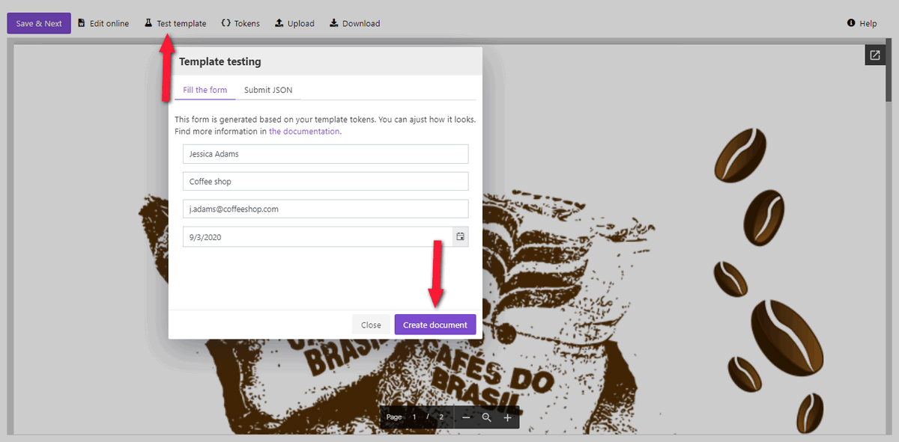

After you clicked on the Generate document button, you'll be redirected to the new tab showing the document preview. 

If you're satisfied with it, click on the *Save&Next*. Now you're on the **Settings** substep. 

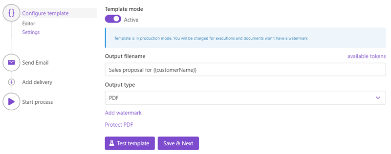

Here you customize the following parameters:

**Template mode**. It is *Testing* by default. It means you won't be charged for this process runs, but result documents will have a Plumsail watermark. Change it to *Active* to remove the watermark.

**Output filename**. Use tokens to make it personalized. They work the same way as in the template. 

**Output type**. By default, it is the same as your template's format. In this particular case, it's DOCX. We're changing it to PDF to send the resulting sales proposal in PDF.

.. hint:: You can `protect your final PDF document with a watermark, by setting a password, or disabling some actions <../configure-settings.html#add-watermark>`_. 

**Test template**. You can test the template from the Settings as well - to check how the customized settings will appear in the final sales proposal. The procedure is the same as we did before.

Delivery
--------

The next step is delivery. We need to send our sales proposals to customers by email. Select an email delivery and customize it according to your needs.

That's how we did it:

- We used token :code:`{{customerEmail}}` to the specify the recipient email. It will adjust automatically each time someone submits out Wufoo form. 
- We also used some tokens from our template in the email body to make the message more personalized.
- And we expanded *Advanced* settings to customize *Display name* and *Reply-to address*.

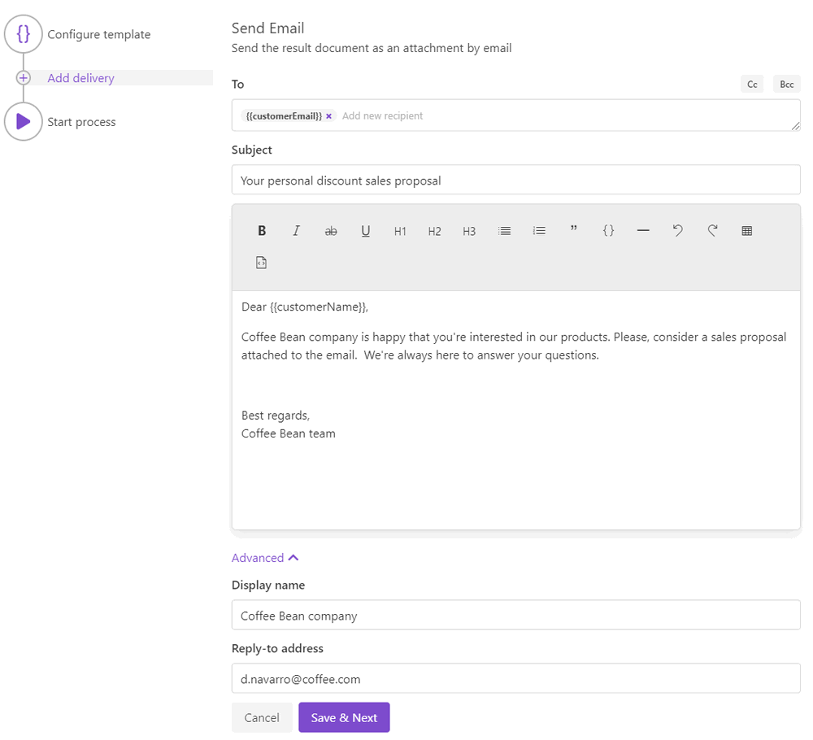

You can add as many deliveries as you need. Check out the `full list of available deliveries <../create-delivery.html>`_.

Start process
-------------

We'll start our process from Zapier.

Create Zap
~~~~~~~~~~

Zap is an automated connection between apps in Zapier.
Every Zap has a trigger - an event that makes this Zap launch. And after the trigger, an action or a series of actions to perform. 

In our case, the zap has just two steps - trigger and action. This is how it looks:

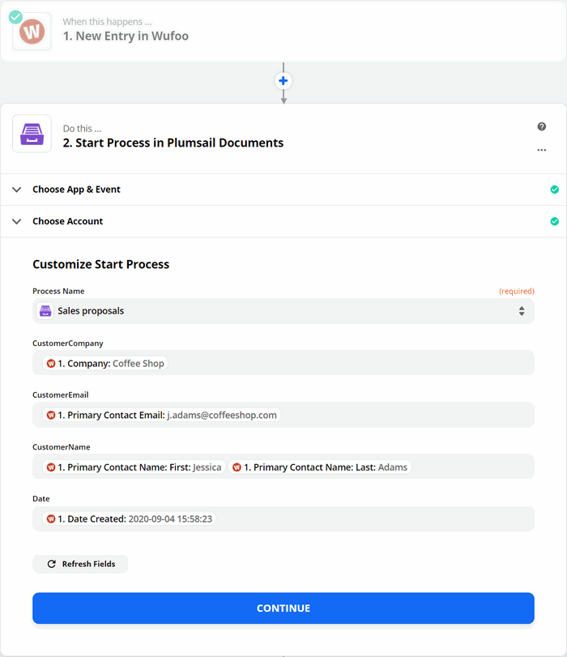

New entry in Wufoo
------------------

The zap triggers on new Wufoo form entries. Please, search for Wufoo, then select an action - New entry.

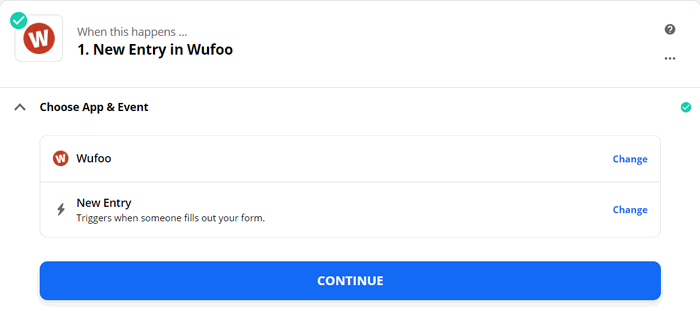

On the next step, you'll need to connect to your Wufoo account from Zapier.
And then, you'll be able to select the form you'd like to track:

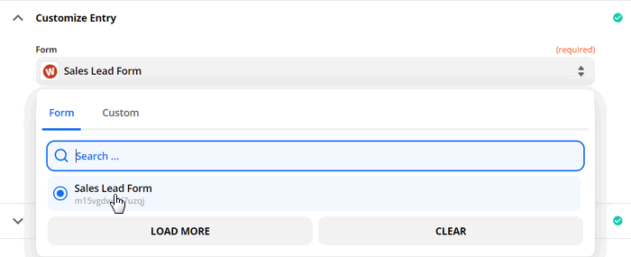

After that, test the trigger to find data. To succeed, you need to have at least one entry done.

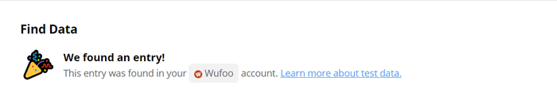

It's needed for using the trigger output in the next step.

Start process in Plumsail Documents
-----------------------------------

To add an action, search for Plumsail Documents. Assign the *Start process* action. 

.. image:: ../../../_static/img/user-guide/processes/how-tos/start-process-zapier.png
    :alt: start process in plumsail documents

Click Continue. If this is your first Zap, at this point, you'll need to sign in to your Plumsail Account from Zapier to establish a connection between the app and your account. If you already have a Plumsail account tied to the app, you can add another one at this step, and use it instead.

Customize Start Process
***********************

Choose the process you want to start by this Zap from the dropdown. 

You may see fields to complete - they have the same names as tokens from the template. Actually, these fields are created based on tokens. 

To fill in them, use the output from the Wufoo trigger:

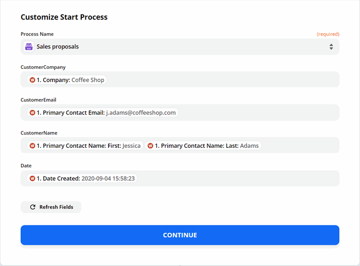

Our zap is ready! Just turn it on. 

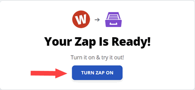

From that moment, every time your potential customer completes the Wufoo form on your site, they'll receive an email with a personal sales proposal attached. 

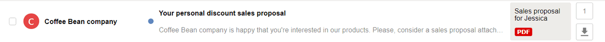

.. hint:: Check out other `Forms integrations examples <../../../how-tos/index-form-integrations.html>`_ to find out more ways of making your work easy.

