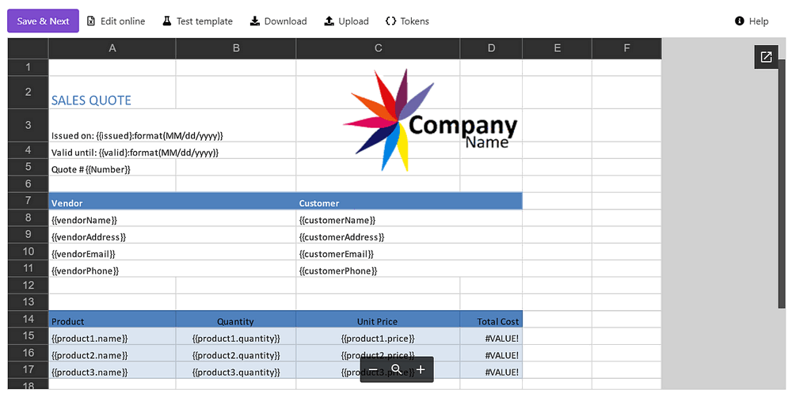

Generate sales quotes from JotForm in Zapier
============================================

.. title:: How to create Excel and PDF documents from JotForm using Zapier

.. meta::
   :description: Automatically apply JotForm submission data to fill in sales quotes and other sales documents

From this article, you will learn how to generate PDF documents from an Excel template on `Jotform <https://www.jotform.com/>`_ submission using the `Zapier integration platform <https://zapier.com/apps/plumsail-documents/integrations>`_. 
With the help of `Plumsail Documents <https://plumsail.com/documents/>`_, we'll create a sales quote from a template, which will be populated with JotForm submission data. 

This is how the resulting document will look:

We'll go through each step in detail so you can easily follow them and receive the same result. 

.. contents::
    :local:
    :depth: 2

Prepare sales quote form in JotForm
~~~~~~~~~~~~~~~~~~~~~~~~~~~~~~~~~~~

Let's start with the overview of the web form that will populate an Excel sales quote template. We have already prepared such a form in Jotform. Here it is:

We logically divided the form into two pages - the first contains vendor and customer information, the second - product details.

You can use the exact same form - in your JotForm account, click on the *Create Form* button, select *Import Form* -> *From a web page* -> insert this URL :code:`https://form.jotform.com/202735593745362`. 
Or `learn how to create JotForms <https://www.jotform.com/help/2-how-to-create-your-first-web-form>`_ and create your web form from scratch.

Create a new process in Plumsail Documents
~~~~~~~~~~~~~~~~~~~~~~~~~~~~~~~~~~~~~~~~~~

Now let's move to create the document generation process in Plumsail Documents. You can create a new process from `the Processes section <https://auth.plumsail.com/account/Register?ReturnUrl=https://account.plumsail.com/documents/processes/reg>`_ of your Plumsail account.

Click on the *Add process* button, and you'll see the creation starting page. In this step, you need to make up the process name and select the template type.
In our case, it'll be XLSX:

Prepare the sales quote XLSX template
-------------------------------------

Once you've created the process, you'll see its first step - **Configure template** - consisting of two substeps:

- Editor;
- Settings.

In `Editor <../../../user-guide/processes/online-editor.html>`_, you can compose document templates online, or upload pre-made ones and modify them in case of need. 

`Download the sales quote template <../../../_static/files/user-guide/processes/sales-quote-template-jotform.xlsx>`_ we've prepared for this case and upload it to the process.

Once you did it, you'll see the template preview:

You may notice :code:`{{tokens}}` in the document template. 

They are variables that the templating engine will replace with data from JotForm in our case.
Also, in our template there are nested tags referring to each product - :code:`{{product1.name}}`, :code:`{{product1.quantity}}`, and :code:`{{product1.price}}`.
 
They let the process know that we want to display properties from some object. In our example, it's a particular product.   

Please also note that we are using these formulas to calculate the total cost for each item individually and for all of the items:

- :code:`=[Quantity]*[Unit Price]` - for each item
- :code:`=SUM(ItemsTable[Total Cost])` - for all of the items

Find out `more information on Plumsail Documents Excel templates <../../../document-generation/xlsx/index.html>`_ in the documentation.

Customize output file
---------------------

On the **Settings** substep, you can customize the settings of the output file such as: 

- **Mode**. It affects whether the resulting file will have a Plumsail watermark or not. In Testing mode, it will, but you won’t pay for executions. In Active, it won’t have the Plumsail watermark; each process run will spend one credit.

- **Output filename**. Use tokens from the document template to personalize the document name. They will work exactly the same way as in the template.

- **Output type**. By default, the format of the output file is the same as the template's format. We switched it to PDF.

- Additionally, it’s possible to `protect the resulting PDF file with a watermark or other security settings <https://plumsail.com/docs/documents/v1.x/user-guide/processes/configure-settings.html#add-watermark>`_.

.. hint:: `Check out how to test the template to see the resulting document appearance <https://plumsail.com/docs/documents/v1.x/user-guide/processes/test-template.html>`_.

Send the sales quote for signing
--------------------------------

Save the template configurations and go next to the deliveries step. Delivery is a way where to send or save the resulting document.
As the customer's signature means acceptance of the quote in our case, we'll add a `DocuSign delivery <../deliveries/docusign.html>`_ to our process.

It will send the completed sales quote to customers requiring them to electronically sign it to accept. 

To customize the DocuSign delivery settings, first, connect to your DocuSign account from the Plumsail account. On this step, you can select either Production or Sandbox environment. 
Sandbox suits if you need to test and evaluate the system. Please, mind that Sandbox and Production environments mean separate accounts in DocuSign.

When the connection to DocuSign is established, you can fill in the email subject and body, add recipients, and enable some advanced options. Here is how we configured the DocuSign delivery:

We used tokens from the template not only in the email message, but also to specify the recipient's name and email. Thus, we won't have to change settings each time manually. They will transform dynamically based on the JotForm data.

.. hint:: Learn `how to use signature and other related tags in the DocuSign delivery <../deliveries/docusign.html#use-signature-and-other-related-tags>`_.

You can add as many deliveries as you need. Please, check out `the full list of available deliveries <../../../user-guide/processes/create-delivery.html>`_.

Start the process of generating sales quotes
--------------------------------------------

The final step of the process is **Start process**. We'll start our process on the JotForm submission. For that, we'll use Zapier to create a connection between Plumsail Documents and JotForm. 
You can go right to the pre-made Zap template right from the Plumsail account:

Learn how to configure the automated connection - Zap - from the next paragraph of this how-to guide.

Configure the Zap
~~~~~~~~~~~~~~~~~

As we have already mentioned, we'll create a connection between Plumsail Documents and JotForm using Zapier.
It's possible to create the zap from scratch. Or you can click on the **Use this zap** below to use the zap template:

|Widget|

.. |Widget| raw:: html

    

This is how the completed zap will look:

Follow the instruction below to configure its steps.

New Submission in JotForm
-------------------------

We want to generate a new sales quote every time the JotForm is submitted. 
That's why our Zap has the trigger - New Submission in JotForm. 

If this is your first zap with JotForm, you'll be asked to sign into the JotForm account from Zapier. 
After you authorized, you'll be able to pick up the form you'd like to monitor for new submissions:

To use submission data, we need to test the trigger to find some sample data. To test the trigger successfully, make sure, you have at least one submission of the form.

The trigger is set. We're moving on.

Start Process in Plumsail Documents
-----------------------------------

Add an action and search for Plumsail Documents. Select Start process action inside it:

.. image:: ../../../_static/img/user-guide/processes/how-tos/start-process-zapier.png
    :alt: start process action in Zapier

Click Continue. If this is your first Zap, at this point, you’ll need to Sign in to your Plumsail Account from Zapier to establish a connection between the app and your account. If you already have a Plumsail account tied to the app, you can add another one at this step, and use it instead.

Once the connection is set, you need to choose the process you'd like to start from this Zap:

Then, you need to specify data by completing the fields. They have the same names as tokens in the template. 
This data will be applied to the template to personalize documents every time a JotForm is submitted.

To specify values, use the output from the JotForm trigger:

Our Zap is ready! 🎉 See how the resulting file looks:

.. hint:: Create your own workflows using Plumsail Documents in Zapier - `check out the integration section to get inspired <https://plumsail.com/documents/integrations/>`_.

