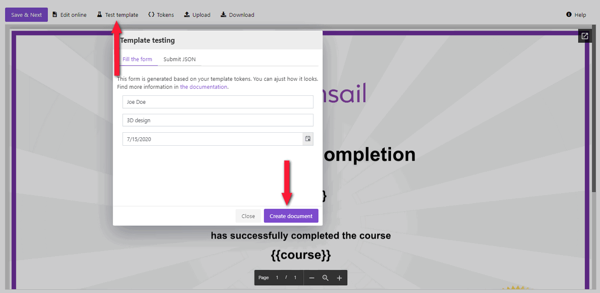
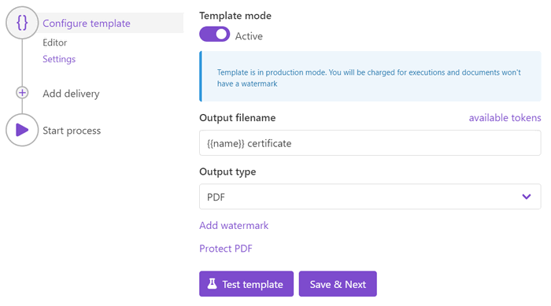

.. title:: Create custom documents from Teachable with Plumsail Documents integration in Zapier

.. meta::
   :description: Teachable data populate certificates, diplomas, contracts, invoices, or other documents with Plumsail Documents integrations for Zapier. 

How to automatically create custom Teachable certificates or diplomas and send them to students by e-mail using Zapier
=======================================================================================================================

Conducting online courses or coaching business is much easier with such platforms as `Teachable <https://teachable.com/>`_. 
It will serve you whatever your goal is – to educate your company’s team or provide a wide range of educational services. 

To make processes even smoother, you can connect Teachable to your document generation. 
With the help of `Plumsail Documents <https://plumsail.com/documents/>`_ integration for `Zapier <../../../getting-started/use-from-zapier.html>`_, it’s possible to populate any custom documents with data from Teachable. 

In this article, we’ll show you an example of how to generate certificates and diplomas and send them attached to a personalized email automatically when a student completes the course. 

The same approach is suitable for creating other documents – contracts, invoices, personalized instructions – when, say, a new student enrolls, or any other trigger event happens.  

.. contents::
    :local:
    :depth: 2

Create Teachable course
~~~~~~~~~~~~~~~~~~~~~~~

We assume that you already have a Teachable course created. 
If not, follow the `instructions to create your Teachable online course <https://support.teachable.com/hc/en-us/articles/220340327-Create-and-Set-Up-Your-Course->`_. 

We’ve created a simple course to perform the scenario for generating documents on its completion:

Configure document generation process
~~~~~~~~~~~~~~~~~~~~~~~~~~~~~~~~~~~~~~

Now, let’s proceed to create and configure the process which will populate Teachable data into certificate templates and email the resulting diploma to the student. 

Make certificate template 
-------------------------

We’ll create certificates from a DOCX template, them convert to PDF and send as an email attachment to the personalized letter. 

This is our Word template for the certificate of completion:

You may see double :code:`{{curly braces}}`. They frame tokens that Teachable data will replace. 

`Download the template from this example <../../../_static/files/user-guide/processes/certificate-of-completion.docx>`_. Or create your custom certificate template. For that, get acquainted with `how Plumsail DOCX templates work <../../../document-generation/docx/index.html>`_. 

Create new process
------------------

Register or login to your `Plumsail account <https://account.plumsail.com/>`_. Then select *Documents* and go to the `Processes section <https://account.plumsail.com/documents/processes>`_. 

Click on the *Add Process* button.

.. image:: ../../../_static/img/user-guide/processes/how-tos/add-process-button.png
    :alt: add process button

Name the process and upload the certificate template you've prepared, or a blank Word or PowerPoint file. You'll be able to work out the template inside the process. 

.. note:: Plumsail Documents supports `PowerPoint PPTX templates <../../../document-generation/pptx/index.html>`_ as well. If it's preferable for you to work out certificates in Microsoft PowerPoint, you're welcome.

Click the *Create* button to proceed to the nex step.

Configure template
------------------

The *Configure template* step includes two substeps:

- Editor;
- Settings.

In `Editor <../../../user-guide/processes/online-editor.html>`_, you can work on the template, make necessary modifications, and instantly check how they would affect the result. 

To see how the resulting certificate will look, click on *Test template*. 

Insert source data in JSON into the appeared dialog. This JSON data tells the templating engine what it should place into :code:`{{braces}}` instead of object names. Make sure this data correspond to tokens from the template.

To test the certificate template from this example, copy and paste sample JSON shown below.

.. note:: This is JSON for testing. We will pass data from Teachable to the process. See the `Start process section <#start-process>`_. 

.. code:: json

    {
      "name": "Joe Doe",
      "course": "3D design",
      "date": "2020-07-15T20:01:33Z"
    }

Click Save & Next to go to the **Settings**. Here you'll see the following parameters:

**Mode**. It's *Testing* by default, which means runs of this process are free of charge for you, but the resulting documents will have a Plumsail watermark. To remove it, switch mode to *Active*.

**Output filename**. To personalize it, use tokens from the template. They will work the same way as for the template. For example, we have :code:`{{name}}` token. The real student name will replace this token, and we'll get the file "Joe Doe certificate". It will change dynamically according to specified data.

**Output type**. The default is the same as the template's format. It's possible to select PDF.

**Test template**. Once you've customized all the settings, you can test the template to see the result as we did it before. 

When everything is done here, click on Save & Next to set up deliveries.

Delivery
--------

We decided to send the ready certificates and diplomas to our students by email. You can add as many deliveries as you need - check out the `full list of available deliveries <../../../user-guide/processes/create-delivery.html>`_.

So, we add an email delivery, put token :code:`{{email}}` as a recipient's email address. It will adjust dynamically every time according to the specified data. We'll pull it from Teachable. 

We filled in the subject and email body. Aditionally, you can expand Advanced settings to customize *Display name* and *Reply-to*. The default display name is 

Start process
-------------

We'll start our process from Zapier.

Create Zap
~~~~~~~~~~

Zap is an automated connection between web services in Zapier. 
You can create it from scratch, following the steps explained below.

Or you can utilize the zap template. Click **Use this zap**, and then just customize the steps as it's described further in this article.

|Widget|

.. |Widget| raw:: html

    

This is how the complete Zap looks:

Below is a step-by-step description.

Course completed in Teachable
-----------------------------

Once a student has completed a course, our Zap starts. For that, we have set a trigger *Course completed* from the Teachable integration. 

.. image:: ../../../_static/img/user-guide/processes/how-tos/start-process-zapier.png
    :alt: start process from Zapier action

If you use this integration for the first time, you'll need to create a connection between your Zapier and Teachable accounts. You'll be invite to sign into your Teachable account from Zapier.

After it's done, you need to test the trigger to find sample data that will be used in the next step. 

Start process in Plumsail Documents
-----------------------------------

The trigger is set. Now, search for Plumsail Documents and add a *Start process* action.

Click Continue. If this is your first Zap, at this point, you'll need to Sign in to your Plumsail Account from Zapier to establish a connection between the app and your account. If you already have a Plumsail account tied to the app, you can add another one at this step, and use it instead.

Customize Start Process
***********************

Choose the process you want to start by this Zap from the dropdown. 
Then, you need to specify the data in JSON. This data will be applied to the template to personalize documents.

.. important:: Properties from the JSON object should correspond to tokens used in your template. Learn more about templates `here <../user-guide/processes/create-template.html>`_.

Use the output from the trigger to specify values:

Our Zap is ready. See how the resulting file looks:

Sign up for Plumsail Documents
~~~~~~~~~~~~~~~~~~~~~~~~~~~~~~

As you can see, it's easy to automate generating customized documents from Teachable with the help of Plumsail Documents. The approach we've overviewed in this article is suitable for other scenarios like creating custom contracts and invoices when a new student enrolls a course. 

`Sign-up for Plumsail Documents <https://auth.plumsail.com/Account/Register?ReturnUrl=https://account.plumsail.com/documents/processes/reg>`_ now to get your free month trial.

