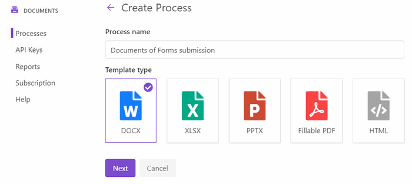

.. title:: JotForm to populate Word DOCX templates and then convert to PDF using Zapier integration

.. meta::
   :description: An example of how to auto generate Word and PDF documents from JotForm entries with Plumsail Documents integration for Zapier.

How to create Word and PDF documents from JotForm in Zapier
===========================================================

This article demonstrates how to create PDF documents from a DOCX template on a `JotForm <https://www.jotform.com/>`_ submission with the help of `Processes <../../../user-guide/processes/index.html>`_ in Zapier. It may help you to automate the generation of different documents like applications, requests, orders, etc., in your company. 

**Processes** are a `Plumsail Documents <https://plumsail.com/documents/>`_ feature with an intuitive interface for creating documents from templates.

**JotForm** is an online form builder that allows you to create forms with a drag and drop creation tool and an option to encrypt user data.

We'll connect them in `Zapier <https://zapier.com/apps/plumsail-documents/integrations>`_ to automatically collect data from a JotForm, apply the data to our template, and generate a new PDF document.

.. contents::
    :local:
    :depth: 2

Create a Form
-------------

We've already created a JotForm with a guest's request. We will use data from its submission. If you haven't created JotForms before, follow `this link <https://www.jotform.com/help/2-How-to-Create-Your-First-Web-Form>`_ to learn how to do it.

It's possible to use the Form from this example. After you've clicked on the *Create Form* button in your JotForm account, select *Import Form* -> *From a web page* -> insert this URL :code:`https://form.jotform.com/200634544724351`. And you'll have our form in your account. 

Below is a screenshot of the form:

.. image:: ../../../_static/img/flow/how-tos/JotForm.png
    :alt: JotForm

Configure the Process
---------------------

Before creating the Zap (an automated workflow in Zapier), we also need to set a Process, which will generate PDF documents from a DOCX template.

Create a new process
~~~~~~~~~~~~~~~~~~~~

Go to `the Processes section <https://account.plumsail.com/documents/processes>`_ in your Plumsail account. 

Click on the *Add process* button.

.. image:: ../../../_static/img/user-guide/processes/how-tos/add-process-button.png
    :alt: add process button

Set the Process name. Select **DOCX** for a template type.

Configure a template
~~~~~~~~~~~~~~~~~~~~

Once you're done with the first step *Create Process*, press the *Next* button, and you’ll proceed to the next step – *Configure Template*.

It includes two substeps:

- Editor;
- Settings.

In `Editor <../../../user-guide/processes/online-editor.html>`_, you can compose the template from scratch or upload a pre-made one. It's also possible to modify the uploaded template online.

Feel free to `download a DOCX template <../../../_static/files/flow/how-tos/Create-Word-and-PDF-Request-template.docx>`_ we have prepared beforehand. It's a guest's request:

.. image:: ../../../_static/img/flow/how-tos/create-docx-pdf-template.png
    :alt: Docx template

Then upload it to the process.

.. image:: ../../../_static/img/user-guide/processes/how-tos/upload-template.png
    :alt: upload template file

Templating syntax
*****************

When creating your own templates, mind the templating language. Plumsail Word DOCX templates use a different approach than most other templating solutions. It uses a minimal amount of syntax to make your work done.

In short, the templating engine thinks that everything between curly :code:`{{ }}` brackets is variables where it will apply your specified data. 
Read `this article <../../../document-generation/docx/how-it-works.html>`_ to get familiar with the templating engine.

Test template
*************

You can test a template as well, to see how it will look at the end. After clicking on the *Test template* button, you’ll need to ‘feed’ a template with your data in JSON format. To understand what JSON to feed, you need to look at tokens in your template. 
In our template we have :code:`{{Fullname}}`, :code:`{{PhoneNumber}}`, etc, that's how the sample JSON for testing might look in our case:

.. code:: json

    {
      "FullName": "Nikola Vlasic",
      "PhoneNumber": "+8987654321",
      "ApartmentNumber": "124",
      "Request": "The tap in the kitchen is dripping. Could you send a plumber, please?"
    }

.. image:: ../../../_static/img/flow/how-tos/test-template-jotform-processes.png
    :alt: test template

It’s testing. We’re going to apply the data from the JotForm to our template. 

Once you've tested the template, press *Save&Next* to proceed further - to the **Settings** substep:

- Switch to an active mode to remove Plumsail watermarks from resulting documents
- Fill in the name of the result file
- Select PDF format for the output file
- `Protect the result PDF <../configure-settings.html#add-watermark>`_ if you wish

.. image:: ../../../_static/img/flow/how-tos/configure-template-forms.png
    :alt: Configure template

Delivery
~~~~~~~~

The next step is delivery. For demonstrating purpose, we’ll store the result file in `OneDrive <../../../user-guide/processes/deliveries/one-drive.html>`_. But there are `other options <../../../user-guide/processes/create-delivery.html#list-of-available-deliveries>`_.

Select the folder where the ready document will be saved. 

.. image:: ../../../_static/img/flow/how-tos/onedrive-forms.png
    :alt: create pdf from template on form submission

You can configure as many deliveries as you need.

Start the Process
~~~~~~~~~~~~~~~~~
We will start our Process from Zapier. 

Create a Zap
-------------
Zap is an automated connection between web services in Zapier. 
You can create it from scratch following the steps explained below.

Or you can utilize the zap template. Click **Use this zap**, and then just customize the steps as it's described further in this article.

|Widget|

.. |Widget| raw:: html

    

This is how our Zap looks:

Check out the Zap steps described below.

New submission in JotForm
~~~~~~~~~~~~~~~~~~~~~~~~~

We need to start the Zap everytime somebody submits our JotForm. For that, search for *JotForm* in Zapier and select *New submission in JotForm* as a trigger.

If this is your first Zap with JotForm, on this step, sign in to your JotForm Account from Zapier to use your forms inside Zaps.

Then, you'll need to pick the form you want to track in the dropdown.

The last thing to do with the trigger - **Find data**. Press *Test&Review* to find data. It will allow you to use the trigger output on the next step.

Start process in Plumsail Documents
~~~~~~~~~~~~~~~~~~~~~~~~~~~~~~~~~~~

Once the trigger is set, search for Plumsail Documents and add an action *Start process*.

.. image:: ../../../_static/img/user-guide/processes/how-tos/start-process-zapier.png
    :alt: start process from Zapier action

Click Continue. If this is your first Zap, at this point, you'll need to Sign in to your Plumsail Account from Zapier to establish a connection between the app and your account. If you already have a Plumsail account tied to the app, you can add another one at this step, and use it instead.

Customize Start Process
***********************

Choose the process you want to start by this Zap from the dropdown. 

Then, you need to specify data by completing the fields. They have the same names as tokens in the template. This data will be applied to the template to personalize documents every time a Cognito form is entered.

Use the output from the trigger to specify values:

.. image:: ../../../_static/img/user-guide/processes/how-tos/json-jotform-zapier.png
    :alt: JSON data 

Our Zap is ready! 🎉 See how the resulting file looks:

.. image:: ../../../_static/img/flow/how-tos/JotForms-DOCX-PDF-result.png
    :alt: Final document

Sign up for Plumsail Documents
------------------------------

As you can see, it's simple to automize the generation of documents on JotForms submission. If you're new to Plumsail Documents, `register an account <https://auth.plumsail.com/Account/Register?ReturnUrl=https://account.plumsail.com/documents/processes/reg>`_ and follow the steps described in the article to set the process for automatic creation of PDFs from JotForms. A 30-day trial is free.

.. hint:: Use Plumsail Documents zap templates to start documents generation processes. All available zap templates are presented `on this page <https://zapier.com/apps/plumsail-documents/integrations#zap-template-list>`_.