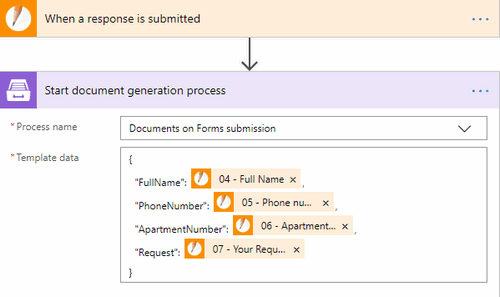

.. title:: How to populate Word DOCX templates on JotForm submission and then convert to PDF in Power Automate Flow

.. meta::
   :description: An example of how to auto generate Word and PDF documents from JotForm entries in Power Automate (Microsoft Flow) and Azure Logic Apps

How to create Word and PDF documents from JotForm in Power Automate (Microsoft Flow) and Azure Logic Apps
=========================================================================================================

This article demonstrates how to create PDF documents from a DOCX template on a `JotForm <https://www.jotform.com/>`_ submission with the help of `Processes <../../../user-guide/processes/index.html>`_ in Power Automate (MS Flow). It may help you to automate the generation of different documents like applications, requests, orders, etc., in your company. 

**Processes** are a `Plumsail Documents <https://plumsail.com/documents/>`_ feature with an intuitive interface for creating documents from templates.

**JotForm** is an online form builder that allows you to create forms with a drag and drop creation tool and an option to encrypt user data.

We'll connect them in Power Automate (Flow) to automatically collect data from a JotForm, apply the data to our template, and generate a new PDF document.

.. contents::
    :local:
    :depth: 2

Create a Form
-------------

We've already created a JotForm with a guest's request. We will use data from its submission. If you haven't created JotForms before, follow `this link <https://www.jotform.com/help/2-How-to-Create-Your-First-Web-Form>`_ to learn how to do it.

It's possible to use the Form from this example. After you've clicked on the *Create Form* button in your JotForm account, select *Import Form* -> *From a web page* -> insert this URL :code:`https://form.jotform.com/200634544724351`. And you'll have our form in your account. 

Below is a screenshot of the form:

.. image:: ../../../_static/img/flow/how-tos/JotForm.png
    :alt: JotForm

Configure the Process
---------------------

Before creating the Flow, we also need to set a Process, which will generate PDF documents from a DOCX template.

Create a new process
~~~~~~~~~~~~~~~~~~~~

Go to `the Processes section <https://account.plumsail.com/documents/processes>`_ in your Plumsail account. 

Click on the *Add process* button.

.. image:: ../../../_static/img/user-guide/processes/how-tos/add-process-button.png
    :alt: add process button

Set the Process name.  Select **DOCX** for a template type.

.. image:: ../../../_static/img/user-guide/processes/how-tos/create-docx-process-forms.png
    :alt: generate PDF from Cognito Forms 

Configure a template
~~~~~~~~~~~~~~~~~~~~

Once you're done with the first step *Create Process*, press the *Next* button, and you’ll proceed to the next step – *Configure Template*.

It includes two substeps:

- Editor;
- Settings.

In `Editor <../../../user-guide/processes/online-editor.html>`_, you can compose the template from scratch or upload a pre-made one. It's also possible to modify the uploaded template online.

Feel free to `download a DOCX template <../../../_static/files/flow/how-tos/Create-Word-and-PDF-Request-template.docx>`_ we have prepared beforehand. It's a guest's request:

.. image:: ../../../_static/img/flow/how-tos/create-docx-pdf-template.png
    :alt: Docx template

Then upload it to the process.

.. image:: ../../../_static/img/user-guide/processes/how-tos/upload-template.png
    :alt: upload template file

Templating syntax
*****************

When creating your own templates, mind the templating language. Plumsail Word DOCX templates use a different approach than most other templating solutions. It uses a minimal amount of syntax to make your work done.

In short, the templating engine thinks that everything between curly :code:`{{ }}` brackets is variables where it will apply your specified data. 
Read `this article <../../../document-generation/docx/how-it-works.html>`_ to get familiar with the templating engine.

Test template
*************

You can test a template as well, to see how it will look at the end. After clicking on the *Test template* button, you’ll need to fill in the auto-generated testing form. 
Fields of this form are created based on tokens from your document template. You can `adjust the look of the testing form by changing token types <../custom-testing-form.html>`_.

.. image:: ../../../_static/img/flow/how-tos/test-template-jotform-processes.png
    :alt: test template

It’s testing. We’re going to apply the data from the JotForm to our template. 

Once you've tested the template, press *Save&Next* to proceed further - to the **Settings** substep:

- Switch to an active mode to remove Plumsail watermarks from resulting documents
- Fill in the name of the result file
- Select PDF format for the output file
- `Protect the result PDF <../configure-settings.html#add-watermark>`_ if you wish

.. image:: ../../../_static/img/flow/how-tos/configure-template-forms.png
    :alt: Configure template

Delivery
~~~~~~~~

The next step is delivery. For demonstrating purpose, we’ll store the result file in `OneDrive <../../../user-guide/processes/deliveries/one-drive.html>`_. But there are `other options <../../../user-guide/processes/create-delivery.html#list-of-available-deliveries>`_.

Select the folder where the ready document will be saved. Fill in the file's name. 

.. image:: ../../../_static/img/flow/how-tos/onedrive-forms.png
    :alt: create pdf from template on form submission

You can configure as many deliveries as you need.

Start the Process
~~~~~~~~~~~~~~~~~
We will start our Process from Power Automate (Microsoft Flow). 

Create a Flow
-------------
This is how our Flow looks:

Check out the Flow steps described below.

Form is submitted
~~~~~~~~~~~~~~~~~

We need to start the Flow everytime somebody submits our JotForm. For that, search for *JotForm* in Power Automate and set *JotForm - When a response is submitted* as a trigger.

If this is your first Flow with JotForm, on this step, sign in to your JotForm Account from MS Flow to use your forms inside Flows.

Then, you'll need to pick the form you want to track in the dropdown.

.. image:: ../../../_static/img/flow/how-tos/jotform-trigger.png
    :alt: typeform trigger

Start document generation process
~~~~~~~~~~~~~~~~~~~~~~~~~~~~~~~~~
This is the action from `Plumsail Documents connector <../../../getting-started/use-from-flow.html>`_. This action is suitable for starting the Process of generating documents from a template. You can find more information about this action by visiting `this page <../../../flow/actions/document-processing.html#start-document-generation-process>`_.

Using the action for the first time, you’ll be asked for *''Connection Name''* and *''Access Key''*. 

.. image:: ../../../_static/img/getting-started/create-flow-connection.png
    :alt: create flow connection

You can type any name for the connection. For example, *''Plumsail Documents''*. 

Then `create an API key in your Plumsail Account page <https://plumsail.com/docs/documents/v1.x/getting-started/sign-up.html>`_, copy and paste it to *''Access Key''* field.

The action has two parameters:

.. image:: ../../../_static/img/user-guide/processes/how-tos/start-generation-docs-action.png
    :alt: start generation documents action

- *Process name*. Select the process you need from available ones. 
- *Template data*. Specify source data in JSON format:

This object contains information from our form. We selected the dynamic content from the output of *JotForm- When a response is submitted* action:

.. image:: ../../../_static/img/flow/how-tos/JotForm-DOCX-PDF-Dynamic-content.png
    :alt: dynamic content of JotForm is submitted

Use the ready document in Flow
~~~~~~~~~~~~~~~~~~~~~~~~~~~~~~

You can stop on the step **Start document generation process**. 

Steps described above are enough for generating PDFs from a DOCX template based on the JotForm submission. Your result file will be saved to OneDrive in this case. See how it will look:

.. image:: ../../../_static/img/flow/how-tos/JotForms-DOCX-PDF-result.png
    :alt: Final document

But if you need an advanced logic, it's possible to work with the result file right in the Flow. 

Here is an example of how you can send the ready document for approval. 

Add an action *Create an approval* from the *Approvals* connector. Select an output of the previous step for an attachment.

.. image:: ../../../_static/img/user-guide/processes/how-tos/create-an-approval.png
    :alt: send pdf for approval

Sign up for Plumsail Documents
------------------------------

As you can see, it's simple to automize the generation of documents on JotForms submission. If you're new to Plumsail Documents, `register an account <https://auth.plumsail.com/Account/Register?ReturnUrl=https://account.plumsail.com/documents/processes/reg>`_ and follow the steps described in the article to set the process for automatic creation of PDFs from JotForms. A 30-day trial is free.

.. hint:: You can generate PDFs from Web Forms even without Power Automate (Microsoft Flow). Check the article `How to generate PDF documents from a DOCX template on Plumsail Forms submission <../../../user-guide/processes/examples/create-word-and-pdf-documents-from-plumsail-forms.html>`_.