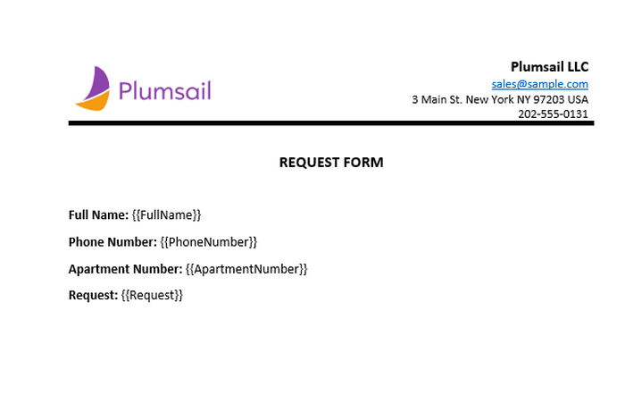
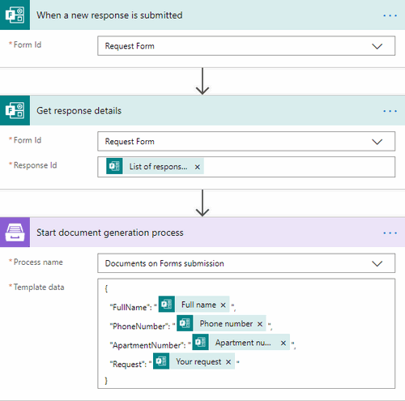

.. title::  Create Word and PDF documents from Microsoft Forms in Power Automate and Azure Logic Apps

.. meta::
   :description: Check out a ready-to-use example of Microsoft Forms populating Word DOCX templates and convert to PDF in Power Automate Flow.

Create Word and PDF from Microsoft Forms
========================================

This article demonstrates how to merge `Microsoft Form <https://forms.office.com/>`_ responses into a Word template and convert the resulting document to PDF. 
It may help you to automate the generation of documents such as certificates, applications, requests, and others from Microsoft Forms. 

To follow the steps from the article, you will need these accounts:

   1. `Plumsail Documents <https://auth.plumsail.com/account/Register?ReturnUrl=https://account.plumsail.com/documents/processes/reg>`_
   2. `Microsoft Forms <https://forms.microsoft.com/>`_
   3. `Power Automate <https://flow.microsoft.com/>`_

We'll connect Microsoft Forms to Plumsail Documents using the Power Automate (Microsoft Flow) platform. We'll create an automated flow to automatically export data from a Microsoft Form, apply the data to our Word template, and generate a new PDF document.

.. contents:: Table of contents
    :local:
    :depth: 2

Create Microsoft Form
---------------------

First, you need to create a Microsoft form. We наve already created a guest's request form. We will use data from its submission. If you haven't created MS Forms before, follow `the link to learn how to do it <https://support.office.com/en-gb/article/create-a-form-with-microsoft-forms-4ffb64cc-7d5d-402f-b82e-b1d49418fd9d>`_.

It's possible to use the form from this example. After you've logged into your Microsoft Forms account, click on `the link to duplicate the form <https://forms.office.com/Pages/ShareFormPage.aspx?id=sw17qLgWx0qMVHqdDlcIbmR30TR_6NdLl37R-A7gviRURUxUSDJTMjhVR1lWQjFDVkFOVDhLSkRDNC4u&sharetoken=Fp7WzOz6WSxbJFcBy8Qq>`_. After duplicating you'll be able to use the form as your own. 

Below is a screenshot of the form:

Configure Plumsail Documents Process
------------------------------------

Next, you need to go to your Plumsail account - `Processes section <https://auth.plumsail.com/account/Register?ReturnUrl=https://account.plumsail.com/documents/processes/reg>`_ - and add a new process: 

.. image:: ../../../_static/img/user-guide/processes/how-tos/create-process-msforms.gif
    :alt: add new process

Set the Process name. Select **DOCX** for a template type.

Configure Word template
~~~~~~~~~~~~~~~~~~~~~~~

Once the process is created, you'll see the Configure template step including two substeps:

- Editor;
- Settings.

In `Editor <../../../user-guide/processes/online-editor.html>`_, you can compose the template from scratch or upload a pre-made one. It's also possible to modify the uploaded template online.

Feel free to `download a DOCX template <../../../_static/files/flow/how-tos/Create-Word-and-PDF-Request-template.docx>`_ we have prepared beforehand. It's a guest's request:

Then upload it to the process.

.. image:: ../../../_static/img/user-guide/processes/how-tos/upload-template.png
    :alt: upload template file

Templating syntax
*****************

When creating your own templates, mind the templating language. `Plumsail Word DOCX templates <../../../document-generation/docx/how-it-works.html>`_ use a different approach than most other templating solutions. It uses a minimal amount of syntax to make your work done.

In short, the templating engine thinks that everything between curly :code:`{{ }}` brackets is variables where it will apply your specified data. 

Press *Save&Next* to proceed further - to the **Settings** substep:

- Switch to an active mode to remove Plumsail watermarks from resulting documents
- Fill in the name of the result file
- Select PDF format for the output file
- `Protect the result PDF <../configure-settings.html#add-watermark>`_ if you wish

.. image:: ../../../_static/img/flow/how-tos/configure-template-forms.png
    :alt: Configure template

Delivery
~~~~~~~~

The next step is delivery. For demonstrating purpose, we’ll store the result file in `OneDrive <../../../user-guide/processes/deliveries/one-drive.html>`_. But there are `other options <../../../user-guide/processes/create-delivery.html#list-of-available-deliveries>`_.

Select the folder where the ready document will be saved. Fill in the file's name.

.. image:: ../../../_static/img/flow/how-tos/onedrive-forms.png
    :alt: create pdf from template on form submission

You can configure as many deliveries as you need.

Start Process
~~~~~~~~~~~~~
We will start our Process from Power Automate (Microsoft Flow). 

Create Flow
-----------
This is how our Flow looks:

Check out the Flow steps described below.

Form is submitted
~~~~~~~~~~~~~~~~~

We need to start the Flow every time somebody submits our request form. For that, search for *Microsoft Forms* in Power Automate and set *Microsoft Forms - When a response is submitted* as a trigger.

If this is your first Flow with Microsoft Forms, on this step, sign in to your Microsoft Forms Account from MS Flow to use your forms inside Flows.

Then, you'll need to pick the form you want to track from the dropdown.

.. image:: ../../../_static/img/flow/how-tos/MSform-trigger.png
    :alt: Microsoft Form trigger

Get response details
~~~~~~~~~~~~~~~~~~~~
As we want to get the submitted data, we need to add *Microsoft Forms - Get response details* action. On this action, we select the same **Form Id** that we used in the trigger. Then, we click in the **Response Id** text box and pick **List of response notifications - Response Id** in the Dynamic content menu on the right:

.. image:: ../../../_static/img/flow/how-tos/Microsoft-Forms-Response-ID.png
    :alt: Get response details

Start document generation process
~~~~~~~~~~~~~~~~~~~~~~~~~~~~~~~~~
This is the action from `Plumsail Documents connector <../../../getting-started/use-from-flow.html>`_. This action is suitable for starting the Process of generating documents from a template. You can find more information about this action by visiting `this page <../../../flow/actions/document-processing.html#start-document-generation-process>`_.

Using the action for the first time, you’ll be asked for *''Connection Name''* and *''Access Key''*. 

.. image:: ../../../_static/img/getting-started/create-flow-connection.png
    :alt: create flow connection

You can type any name for the connection. For example, *''Plumsail Documents''*. 

Then `create an API key in your Plumsail Account page <https://account.plumsail.com/documents/api-keys>`_, copy and paste it to *''Access Key''* field.

The action has two parameters:

.. image:: ../../../_static/img/user-guide/processes/how-tos/start-generation-docs-action.png
    :alt: start generation documents action

- *Process name*. Select the process you need from available ones. 
- *Template data*. Specify source data in JSON format:

This object contains information from our form. We selected the dynamic content from the output of *Microsoft Forms - Get response details* action:

Use the ready document in Flow
~~~~~~~~~~~~~~~~~~~~~~~~~~~~~~

You can stop on the step **Start document generation process**. 

Steps described above are enough for generating PDFs from a DOCX template based on the Microsoft Form submission. Your result file will be saved to OneDrive in this case. See how it will look:

But if you need an advanced logic, it's possible to work with the result file right in the Flow. 

Here is an example of how you can send the ready document for approval. 

Add an action *Create an approval* from the *Approvals* connector. Select an output of the previous step for an attachment.

.. image:: ../../../_static/img/user-guide/processes/how-tos/create-an-approval.png
    :alt: send pdf for approval

Sign up for Plumsail Documents
------------------------------

As you can see, it's simple to automate the generation of documents on Microsoft Forms submission. If you're new to Plumsail Documents, `register an account <https://auth.plumsail.com/Account/Register?ReturnUrl=https://account.plumsail.com/documents/processes/reg>`_ and follow the steps described in the article to set the process for automatic creation of PDFs from Microsoft Forms. A 30-day trial is free.

.. hint:: Check out how to `convert Microsoft Forms responses with attachments to one PDF file <../../../flow/how-tos/documents/convert-microsoft-forms-with-attachments-to-pdf.html>`_. 