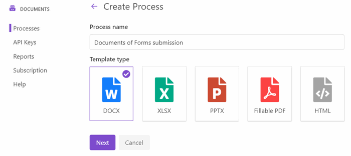
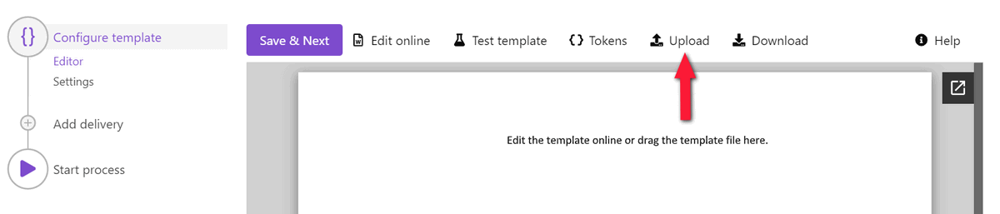
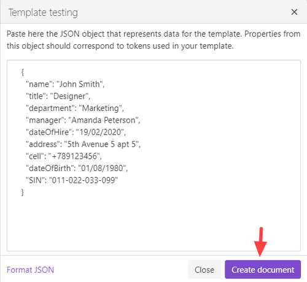
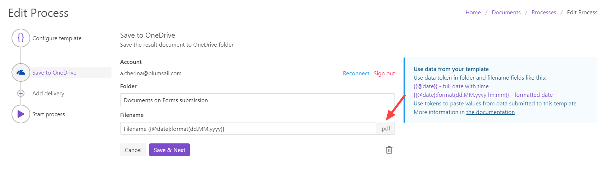
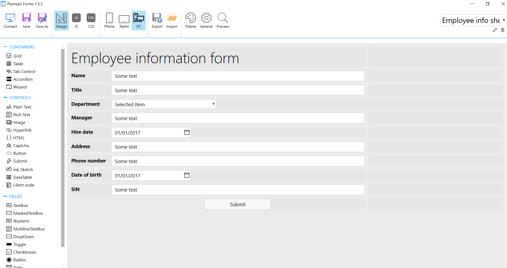
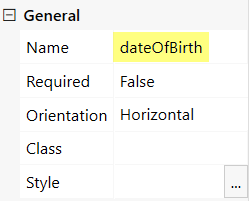
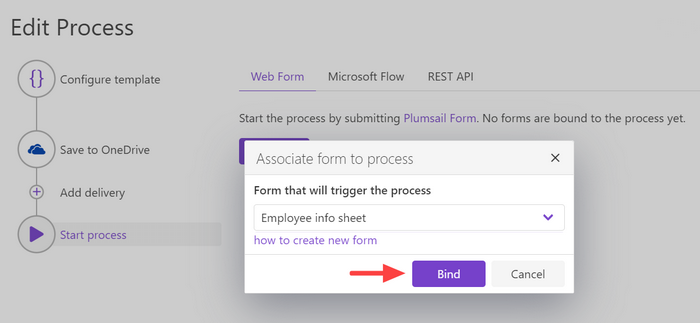
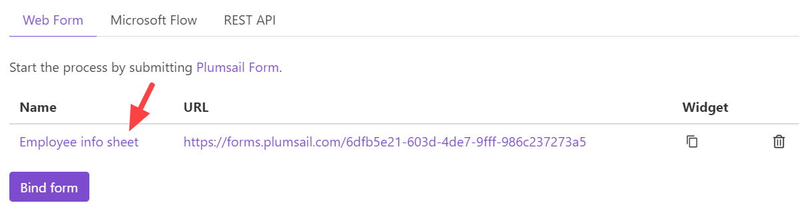
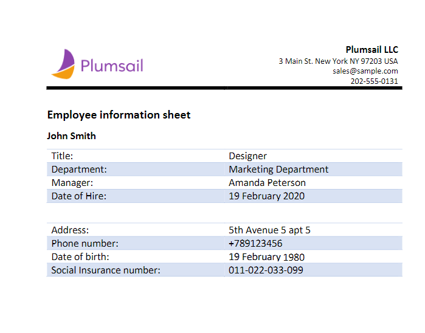

.. title:: How to create Word DOCX and PDF documents from Plumsail Web Forms

.. meta::
   :description: Example of how use web forms to auto populate Word DOCX templates and convert the result to PDF format.

Generate PDF documents from DOCX template on Plumsail Forms submission
===============================================================================

In this article, you will learn how to automate the generation of documents in your company. For example, applications, orders, invoices, cards and others. We’ll show you a simple way how to create PDF documents from a DOCX template on `Plumsail Forms <https://plumsail.com/forms/>`_ submission by its integration with `Processes <../../../user-guide/processes/index.html>`_. 

**Processes** are a `Plumsail Documents <https://plumsail.com/documents/>`_ feature with an intuitive interface for creating documents from templates. 

By means of **Plumsail Forms**, you can design elegant, responsive, and highly customizable forms for SharePoint Modern UI or any web page. In our example, we will collect data from a *Web Form*, apply it to our template and generate a new PDF document with the help of *Processes*.

.. contents::
    :local:
    :depth: 2

Configure the Process
-----------------------

First of all, we need to create and configure the Process.

Create a new process
~~~~~~~~~~~~~~~~~~~~
To create a new process, which will generate PDF documents from a DOCX template, go to `the Processes section <https://auth.plumsail.com/account/Register?ReturnUrl=https://account.plumsail.com/documents/processes/reg>`_ in your Plumsail account. 

Click on the *Add process* button.

.. image:: ../../../_static/img/user-guide/processes/how-tos/add-process-button.png
    :alt: add process button

Set the Process name. Select **DOCX** for a template type.

Configure a template
~~~~~~~~~~~~~~~~~~~~

Once you're done with the first step *Create Process*, press the *Next* button, and you’ll proceed to the next step – *Configure Template*.

It includes two substeps:

- Editor;
- Settings.

In `Editor <../../../user-guide/processes/online-editor.html>`_, you can compose the template from scratch or upload a pre-made one. It's also possible to modify the uploaded template online.

Feel free to `download a DOCX template <../../../_static/files/flow/how-tos/Create_DOCX_and_PDF_template.docx>`_ we have prepared beforehand. It's a short employee information sheet:

.. image:: ../../../_static/img/flow/how-tos/template_emp_info.png
    :alt: Docx template

Then upload it to the process.

Templating syntax
*****************
When creating your own templates, mind the templating language. Plumsail Word DOCX templates use a different approach than most other templating solutions. It uses a minimal amount of syntax to make your work done.

In short, the templating engine thinks that everything between curly :code:`{{ }}` brackets is variables where it will apply your specified data. 
Read `the article to get familiar with the templating engine <../../../document-generation/docx/how-it-works.html>`_.

Test template
*************

You can test a template as well, to see how it will look at the end. After clicking on the *Test template* button, you’ll need to fill in the auto-generated testing form. 
Fields of this form are created based on tokens from your document template. You can `adjust the look of the testing form by changing token types <../custom-testing-form.html>`_.

It’s testing. We’re going to apply the data from the form to our template. 

Once you've tested the template, press *Save&Next* to proceed further - to the **Settings** substep:

- Switch to an active mode to remove Plumsail watermarks from resulting documents
- Fill in the name of the result file
- Select PDF format for the output file
- `Protect the result PDF <../configure-settings.html#add-watermark>`_ if you wish

.. image:: ../../../_static/img/flow/how-tos/configure-template-forms.png
    :alt: Configure template

Delivery
~~~~~~~~

The next step is delivery. For demonstrating purpose, we’ll store the result file in `OneDrive <../../../user-guide/processes/deliveries/one-drive.html>`_. But there are `other options <../../../user-guide/processes/create-delivery.html#list-of-available-deliveries>`_.

Just set the folder's name where the ready document will be saved.

You can configure as many deliveries as you need.

Start the Process on Form submission
------------------------------------

We will start our Process by submitting Plumsail Web Form.

Prepare a Form
~~~~~~~~~~~~~~

We've already prepared a Plumsail form and will use data from its submission. To learn how to create and publish Plumsail forms, read `the documentation article <https://plumsail.com/docs/forms/design.html>`_.

Below is a screenshot of our form. You may download this form `here <../../../_static/files/flow/how-tos/Employee_info_sheet.xfds>`_ , import it into `Plumsail Forms designer <https://account.plumsail.com/forms/designer>`_ and use as a template.

**Understanding Internal Names of Form's fields**

The important thing is that the templating engine needs to identify what will be pasted into brackets somehow. Please, check that the Internal Names of form's fields correspond to tokens in the template. 

You can set Internal Names for Form’s fields in its general propeties:

Bind the Form
~~~~~~~~~~~~~

To start the process by submitting our Plumsail Form, we need to bind it. It's easy to do.

Press the *Bind* button and select the form to bind from the list. 

Once we've done it, the Form will appear in the list of Plumsail Forms bound to this Process. 

Every time somebody submits the form, the Process of generating PDF documents from a DOCX template will start. It will apply the Form submission data to the template and deliver the result document to OneDrive.

See how the result file looks:

Sign up for Plumsail Documents
------------------------------

As you can see, it's simple to automize the generation of documents on Plumsail Forms submission. If you're new to Plumsail Documents, `register an account <https://auth.plumsail.com/Account/Register?ReturnUrl=https://account.plumsail.com/documents/processes/reg>`_ and follow the steps described in the article to set the process for automatic creation of PDFs from Plumsail Forms. A 30-day trial is free.

.. hint:: It's possible to implement more complex scenarios using Power Automate (Microsoft Flow). For example, you can generate PDF documents from a DOCX template on Plumsail Forms submission and use the result file right in the Flow.  Trigger your Flow with Plumsail `Form is submitted <https://plumsail.com/docs/forms-web/microsoft-flow.html>`_ and follow the steps described in `this article <../../../user-guide/processes/examples/create-pdf-from-docx-template-processes.html>`_.