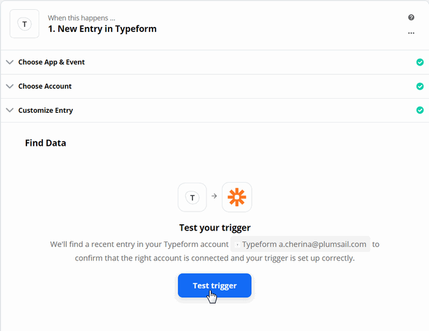

How to create Word and PDF documents from Typeform in Zapier
============================================================

This article demonstrates how to create PDF documents from a DOCX template on `Typeform <https://www.typeform.com/>`_ submission with the help of `Processes <../../../user-guide/processes/index.html>`_ in Zapier. It may help you to automate the generation of different documents like applications, requests, orders, etc., in your company. 

**Processes** are a `Plumsail Documents <https://plumsail.com/documents/>`_ feature with an intuitive interface for creating documents from templates.

**Typeform** is an online form builder that allows you to create modern responsive forms for your website.

Let’s see how to connect them in `Zapier <https://zapier.com/apps/plumsail-documents/integrations>`_ to automatically collect data from a Typeform, apply the data to our template, and generate a new PDF document.

.. contents::
    :local:
    :depth: 2

Create a Form
-------------

We've already created a Typeform. We will use data from its submission in our Flow. If you haven't created Typeforms before, follow `this link <https://www.typeform.com/help/my-1st-typeform/>`_ to learn how to do it.

Below is a screenshot of our form:

Configure the Process
---------------------

Then, let's configure the Process, which will generate PDF documents from a DOCX template.

Create a new process
~~~~~~~~~~~~~~~~~~~~

Go to `the Processes section <https://account.plumsail.com/documents/processes>`_ in your Plumsail account.

Click on the *Add process* button.

.. image:: ../../../_static/img/user-guide/processes/how-tos/add-process-button.png
    :alt: add process button

Set the Process name. 

.. image:: ../../../_static/img/flow/how-tos/create-new-process-plumsail-forms.png
    :alt: generate PDF from Typeform

Upload the template you're gonna use. Here is the `link for downloading the template <../../../_static/files/flow/how-tos/Create-Word-and-PDF-template.docx>`_ we use in this example:

.. image:: ../../../_static/img/flow/how-tos/docx-template_forms_processes.png
    :alt: Docx template

When creating your own templates, mind the templating language. Plumsail Word DOCX templates use a different approach than most other templating solutions. It uses a minimal amount of syntax to make your work done.

In short, the templating engine thinks that everything between curly :code:`{{ }}` brackets is variables where it will apply your specified data. 
Read `this article <../../../document-generation/docx/how-it-works.html>`_ to get familiar with the templating engine.

Configure a template
~~~~~~~~~~~~~~~~~~~~

Once you're done with the first step *Create Process*, press the *Submit* button, and you’ll proceed to the next – *Configure Template*:

- Fill in the name of the result file
- Select PDF format for the output file
- `Protect the result PDF <../../../user-guide/processes/create-process.html#add-watermark>`_ if you wish

.. image:: ../../../_static/img/flow/how-tos/configure-template-forms.png
    :alt: Configure template

You can test a template as well, to see how it will look at the end. After clicking on the *Test template* button, you’ll need to ‘feed’ a template with your data in JSON format. In our case, it might be:

.. code:: json

    {
      "FieldName1": "Value1",
      "FieldName2": "Value2",
      "FieldName3": "Value3",
      "FieldName4": "Value4"
    }

.. image:: ../../../_static/img/flow/how-tos/test-template-forms-processes.png
    :alt: test template

It’s testing. We’re going to apply the data from the Typeform to our template. 

Delivery
~~~~~~~~

The next step is delivery. For demonstrating purpose, we’ll store the result file in `OneDrive <../../../user-guide/processes/deliveries/one-drive.html>`_. But there are `other options <../../../user-guide/processes/create-delivery.html#list-of-available-deliveries>`_.

Select the folder where the ready document will be saved. Fill in the file's name. You don't need to put :code:`.extension`, it'll be done automatically based on the output file type you set on the *Configure template* step.

.. image:: ../../../_static/img/flow/how-tos/onedrive-forms.png
    :alt: create pdf from template on form submission

You can configure as many deliveries as you need.

Start the Process
~~~~~~~~~~~~~~~~~
We will start our Process from Zapier. 

Create a Zap
-------------

Zap is an automated connection between web services in Zapier. 
You can create it from scratch following the steps explained below.

Or you can utilize the zap template. Click **Use this zap**, and then just customize the steps as it's described further in this article.

|Widget|

.. |Widget| raw:: html

    

This is how our Zap looks:

.. image:: ../../../_static/img/flow/how-tos/zap-excel-cognito.png
    :alt: xlsx to pdf from Cognito Forms Zap

Below is a step-by-step description.

New entry in Typeform
~~~~~~~~~~~~~~~~~~~~~

We need to start the Zap everytime somebody submits our Typeform. For that, search for  *Typeform* in Zapier and add *New entry* as a trigger.

If this is your first Zap with Typeform, on this step, sign in to your Typeform Account from Zapier to use your forms inside Zaps.

Then, you'll need to pick the form you want to track in the dropdown.

The last thing to do with the trigger - **Find data**. Press "Test trigger" to find data. It will allow you to use the trigger output on the next step.

Start process in Plumsail Documents
~~~~~~~~~~~~~~~~~~~~~~~~~~~~~~~~~~~

Once the trigger is set, search for Plumsail Documents and add an action *Start process*.

.. image:: ../../../_static/img/user-guide/processes/how-tos/start-process-zapier.png
    :alt: start process from Zapier action

Click Continue. If this is your first Zap, at this point, you'll need to Sign in to your Plumsail Account from Zapier to establish a connection between the app and your account. If you already have a Plumsail account tied to the app, you can add another one at this step, and use it instead.

Customize Start Process
***********************

Choose the process you want to start by this Zap from the dropdown. 
Then, you need to specify the data in JSON. This data will be applied to the template to personalize documents.

.. important:: Properties from the JSON object should correspond to tokens used in your template. Learn more about templates `here <../user-guide/processes/create-template.html>`_.

Use the output from the trigger to specify values:

Our Zap is ready. See how the resulting file looks:

.. image:: ../../../_static/img/flow/how-tos/Plumsail-Forms-DOCX-PDF-Template-PDF.png
    :alt: pdf from Typeform result file

Sign up for Plumsail Documents
------------------------------

As you can see, it's simple to automize the generation of documents on Typeforms submission. If you're new to Plumsail Documents, `register an account <https://auth.plumsail.com/Account/Register?ReturnUrl=https://account.plumsail.com/documents/processes/reg>`_ to get a free 30-day trial.

.. hint:: See how to `generate PDF documents from an XLSX template on Typeform entries in Zapier <../../../user-guide/processes/examples/create-excel-and-pdf-documents-from-typeform-zapier.html>`_.