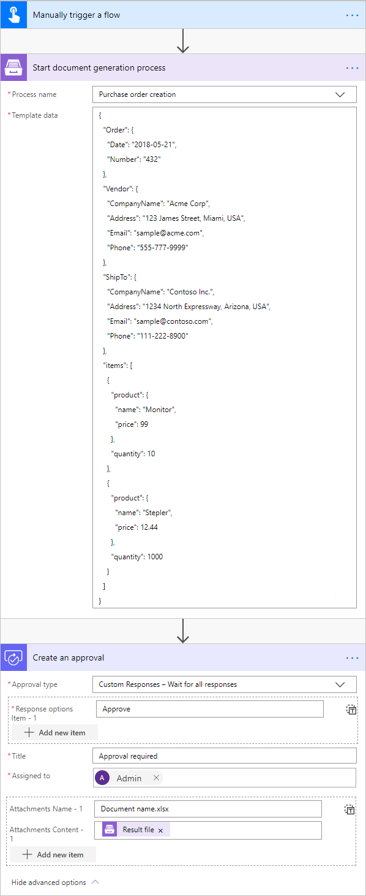

How to create Excel XLSX document from template in Power Automate (Microsoft Flow), Azure Logic Apps and PowerApps
==================================================================================================================
If you want to automate the generation of purchase orders in your company, this article will help you achieve that. 
After going through it you will know how to create an XLSX file from a template with the help of `Processes <../../../user-guide/processes/index.html>`_, a `Plumsail Documents <https://plumsail.com/documents/>`_ feature.

The Processes are a user-friendly intuitive interface for creating documents from templates, converting them and delivering to different systems for further management. 

With its help, we'll create a purchase order from a template. This is how the result document will look at the end:

.. image:: ../../../_static/img/flow/how-tos/create-xlsx-from-template-result.png
    :alt: create xlsx from template

Let’s go through each step from the very beginning.

Configuring the Process
-----------------------
First, register or login to your `Plumsail account`_. Then select *Documents* and go to the `Processes section <https://account.plumsail.com/documents/processes>`_. 

Create a new process
~~~~~~~~~~~~~~~~~~~~

Click on the *Add Process* button.

.. image:: ../../../_static/img/user-guide/processes/how-tos/add-process-button.png
    :alt: add process button

Give a name to the Process to recognize it later.

Upload the template you want to use. Here is `the link for downloading the template`_ we use in this example.

|create-xlsx-process|

When creating your own ones, mind the templating language. 

Plumsail Excel XLSX templates use a different approach than most other templating solutions. It uses a minimal amount of syntax to make your work done.

Read `this article`_ to get familiar with the templating engine.

In short, the templating engine thinks that everything between these :code:`{{ }}` brackets is variables to which it will apply your specified data. 
In our case, the example would be :code:`{{Order.Date}}` and :code:`{{Order.Number}}` object, it lets the engine know that we want to render the purchase order’s number and date.

But of course, we can implement a more complex scenario. In our template we are referring to properties inside simple objects and collections, as well as properties in nested constructions. 
To select properties of our objects inside of the array (in JSON data) we are using a dot operator:

- The :code:`{{Vendor.CompanyName}}`, :code:`{{Vendor.Address}}`, :code:`{{Vendor.Email}}`, :code:`{{Vendor.Phone}}` tags let the engine know that we want to render properties of the Vendor object.
- The :code:`{{ShipTo.CompanyName}}`, :code:`{{ShipTo.Address}}`, :code:`{{ShipTo.Email}}`, :code:`{{ShipTo.Phone}}` tags let the engine know that we want to render properties of the ShipTo object.
- The :code:`{{items.product.name}}`, :code:`{{items.quantity}}`, :code:`{{items.product.price}}`, :code:`{{items.cost}}` tags get the name, quantity, price and total cost properties in each item's product object.

The templating engine is smart enough to understand that we refer to properties inside a collection. 
That is how it knows what content to duplicate. It will iterate through all objects in the array to render them and add the rows automatically.

You can learn more about table rendering `here <../../../document-generation/xlsx/how-it-works.html#repeating-rows-and-tables>`_.

Please also note that we are using these formulas to calculate the total cost for each item individually and for all of the items:

- :code:`=[Quantity]*[Unit Price]` - for each item
- :code:`=SUM(D14)` - for all of the items

Configure a template
~~~~~~~~~~~~~~~~~~~~

Once you've created the Process and submited the template, you'll proceed to the next step - *Configure template*:

- Fill in the name of the result file;

- Select XLSX format for the output file;

- Test the template to see how it will look at the end by clicking the *Test template* button.

Test the template
~~~~~~~~~~~~~~~~~

|configure-template-xlsx|

To test a template, you need to insert source data in JSON format into the window like in the picture below. This JSON data represents what will be pasted into :code:`{{ }}` brackets instead of object names and their properties. So, it must correspond to tokens from the template.

|test-template-xlsx|

To test the template from our example, you can copy and paste this JSON data:

.. code:: json

    {
      "Order": {
        "Date": "2018-05-21",
        "Number": "432"
      },
      "Vendor": {
        "CompanyName": "Acme Corp",
        "Address": "123 James Street, Miami, USA",
        "Email": "sample@acme.com",
        "Phone": "555-777-9999"
      },
      "ShipTo": {
        "CompanyName": "Contoso Inc.",
        "Address": "1234 North Expressway, Arizona, USA",
        "Email": "sample@contoso.com",
        "Phone": "111-222-8900"
      },
      "items": [
        {
          "product": {
            "name": "Monitor",
            "price": 99
          },
          "quantity": 10
        },
        {
          "product": {
            "name": "Stepler",
            "price": 12.44
          },
          "quantity": 1000
        },
        {
          "product": {
            "name": "Fridge",
            "price": 4219.99
          },
          "quantity": 1
        },
        {
          "product": {
            "name": "Microwave",
            "price": 99.99
          },
          "quantity": 5
        },
        {
          "product": {
            "name": "Pen",
            "price": 7.23
          },
          "quantity": 100
        }
      ]
    }

Delivery
~~~~~~~~

The next step is delivery. For demonstrating purpose, we’ll store the result file in `OneDrive <https://plumsail.com/docs/documents/v1.x/user-guide/processes/deliveries/one-drive.html>`_. But there are other options:

- `Sending by e-mail <https://plumsail.com/docs/documents/v1.x/user-guide/processes/deliveries/send-email.html>`_

- `Saving to DropBox <https://plumsail.com/docs/documents/v1.x/user-guide/processes/deliveries/dropbox.html>`_

And others are coming soon. 

Select the folder where the ready document will be saved. And fill in the file's name. You don't need to put :code:`.extension`, it'll be done automatically based on the output file type you set on the *Configure template* step.

|store-onedrive|

You can configure as many deliveries as you need.

Start the Process
~~~~~~~~~~~~~~~~~

The last thing to do is to start the Process. We will start it using `Power Automate (Microsoft Flow) <https://flow.microsoft.com/>`_. You can check out `other options <https://plumsail.com/docs/documents/v1.x/user-guide/processes/start-process.html>`_ as well.

|start-process|

Creating the Flow
-----------------

As everything is prepared in the Plumsail account, the Flow itself has just one step and looks like in the picture below:

**Flow trigger** 

You can actually pick any trigger. We are using "*Manually trigger a flow*" trigger here to simplify the Flow.

**Start document generation process**

This is the action from `Plumsail Documents connector <https://plumsail.com/docs/documents/v1.x/flow/actions/document-processing.html?%20connector#start-document-generation-process>`_. This action is suitable for starting the Process of generating documents from a template.

.. important:: This action is not available in `the global Microsoft Flow connector <https://docs.microsoft.com/en-us/connectors/plumsail/>`_ yet. To use it, you need to `add Plumsail Documents as a custom connector <../create-custom-connector.html>`_.

Using the action for the first time, you’ll be asked for *''Connection Name''* and *''Access Key''*. 

.. image:: ../../../_static/img/getting-started/create-flow-connection.png
    :alt: create flow connection

You can type any name for the connection. For example, *''Plumsail Documents''*. 

Then `create an API key in your Plumsail Account page <https://plumsail.com/docs/documents/v1.x/getting-started/sign-up.html>`_, copy and paste it to *''Access Key''* field.

The action has two parameters:

.. image:: ../../../_static/img/user-guide/processes/how-tos/start-generation-docs-action.png
    :alt: start generation documents action

- *Process name*. Select the one process you need among available. 
- *Template data*. Specify your data in JSON format as we did on `the step of testing the template <../../../user-guide/processes/examples/create-xlsx-from-template-processes.html#test-the-template>`_.

That's it! Run the Flow any time you need to generate XLSX documents from a template.

.. note:: There is another - a little bit more complicated - way to create XLSX documents from a template. Check `the article <../../../flow/how-tos/documents/create-xlsx-from-template.html>`_.

.. _Plumsail account: https://account.plumsail.com/
.. _Create XLSX document from template: ../../actions/document-processing.html#create-xlsx-document-from-template
.. _the link for downloading the template: ../../../_static/files/flow/how-tos/create-xlsx-from-template.xlsx
.. _this article: ../../../document-generation/xlsx/how-it-works.html

.. |purchase-order-template| image:: ../../../_static/img/flow/how-tos/create-xlsx-from-template.png

.. |create-xlsx-process| image:: ../../../_static/img/user-guide/processes/how-tos/create-xlsx-process.png

.. |store-onedrive| image:: ../../../_static/img/user-guide/processes/how-tos/store-one-drive-xlsx.png
.. |start-process| image:: ../../../_static/img/user-guide/processes/how-tos/microsoft-flow.png
.. |configure-template-xlsx| image:: ../../../_static/img/user-guide/processes/how-tos/configure-template-xlsx.png