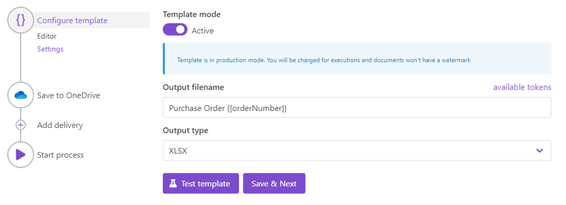
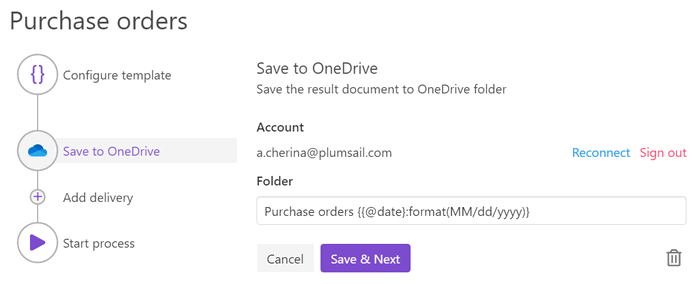
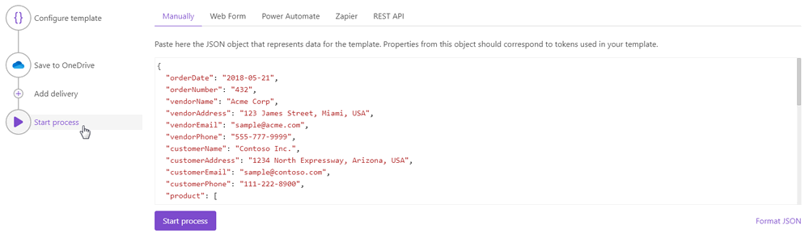

.. title:: Create Excel XLSX documents from a template using Zapier and Power Automate Flow

.. meta::
   :description: Use Plumsail Documents processes to generate customized documents from Excel templates in a few simple steps.

How to create Excel XLSX document from template in Zapier, Power Automate (Microsoft Flow), Azure Logic Apps, and PowerApps
=============================================================================================================================
If you want to automate the generation of purchase orders in your company, this article will help you achieve that. 
After going through it, you will know how to create an XLSX file from a template with the help of `Processes <../../../user-guide/processes/index.html>`_, a `Plumsail Documents <https://plumsail.com/documents/>`_ feature.

The Processes are a user-friendly intuitive interface for creating documents from templates, converting them, and delivering to different systems for further management. 

With its help, we'll create a purchase order from a template. This is how the result document will look at the end:

.. image:: ../../../_static/img/flow/how-tos/create-xlsx-from-template-result.png
    :alt: create xlsx from template

Let’s go through each step from the very beginning.

.. contents::
    :local:
    :depth: 2

Configure Process
-----------------
First, register or login to your `Plumsail account`_. Then select *Documents* and go to the `Processes section <https://account.plumsail.com/documents/processes>`_. 

Create new process
~~~~~~~~~~~~~~~~~~

Click on the *Add Process* button.

.. image:: ../../../_static/img/user-guide/processes/how-tos/add-process-button.png
    :alt: add process button

Give a name to the Process to recognize it later.

Upload the template you want to use. Here is `the link for downloading the template`_ we use in this example.

|create-xlsx-process|

When creating your own ones, mind the templating language. 

Plumsail Excel XLSX templates use a different approach than most other templating solutions. It uses a minimal amount of syntax to make your work done.

Read `this article`_ to get familiar with the templating engine.

In short, the templating engine thinks that everything between these :code:`{{ }}` brackets is variables to which it will apply your specified data. 
In our case the most basic example would be :code:`{{orderDate}}` and :code:`{{orderNumber}}` tags. They let the engine know that we want to render the purchase order’s number and date.

But of course, we can implement a more complex scenario. In our template, we refer to properties inside a collection of products. For that, we use nested tags with a dot operator:

- The :code:`{{product.name}}`, :code:`{{product.quantity}}`, :code:`{{product.price}}`, :code:`{{product.cost}}` tags get the name, quantity, price, and total cost properties in each product object.

The templating engine is smart enough to understand that we refer to properties inside a collection. 
That is how it knows what content to duplicate. It will iterate through all objects in the array to render them and add the rows automatically.

You can learn more about table rendering `here <../../../document-generation/xlsx/how-it-works.html#repeating-rows-and-tables>`_.

Please also note that we are using these formulas to calculate the total cost for each item individually and for all of the items:

- :code:`=[Quantity]*[Unit Price]` - for each item
- :code:`=SUM(D14)` - for all of the items

Configure template
~~~~~~~~~~~~~~~~~~

Once you've created the Process and submitted the template, you'll proceed to the next step - **Configure template**.

It consists of two substeps:

- Editor;
- Settings.

In `Editor <../../../user-guide/processes/online-editor.html>`_, you can work on and modify the template, and instantly check how the made changes will affect the result. 

Just click on the *Test template* button. You will see the dialog where you need to insert some data in JSON format. This data represents what the templating engine should paste into :code:`{{brackets}}` instead of object names and their properties. So, it must correspond to tokens from the template. 

|test-template-xlsx|

To test the template from our example, you can copy and paste the JSON data shown below.

.. note:: This is JSON for testing. You can pass data from an external system or web form to the process. See the `Start process section <#start-process>`_. 

.. code:: json

    {
      "orderDate": "2018-05-21",
      "orderNumber": "432",
      "vendorName": "Acme Corp",
      "vendorAddress": "123 James Street, Miami, USA",
      "vendorEmail": "sample@acme.com",
      "vendorPhone": "555-777-9999",
      "customerName": "Contoso Inc.",
      "customerAddress": "1234 North Expressway, Arizona, USA",
      "customerEmail": "sample@contoso.com",
      "customerPhone": "111-222-8900",
      "product": [
        {
          "name": "Monitor",
          "price": 9,
          "quantity": 10
        },
        {
          "name": "Stepler",
          "price": 12.44,
          "quantity": 1000
        },
        {
          "name": "Fridge",
          "price": 4219.99,
          "quantity": 1
        },
        {
          "name": "Microwave",
          "price": 99.99,
          "quantity": 5
        },
        {
          "name": "Pen",
          "price": 7.23,
          "quantity": 100
        }
      ]
    }

To proceed to the **Settings** substep, press *Save&Next*.

There you'll set the following parameters. Descriptions are under the picture.

**Template mode**

It is *Testing* by default. It means you won't be charged for this process runs, but result documents will have a Plumsail watermark. Change it to *Active* to remove the watermark.

**Output filename**

Use tokens to make it personalized. They work the same way as in the template. For instance, we use the following tokens to define the output file name - :code:`{{orderNumber}}`. As a result, we'll receive a purchase order marked with its number - *Purchase order 432*.

**Output type**

By default, it is the same as your template's format. In this particular case, it's XLSX. And we kept it to create the Excel XLSX document from a template.

**Test template**

You can test the template from here as well - to check how the customized settings will appear in the resulting document. The procedure is the same as we've already described above.

Delivery
~~~~~~~~
The next step is delivery. For demonstrating purpose, we’ll store the result file in `OneDrive <../../../user-guide/processes/deliveries/one-drive.html>`_. But there are `other options <../../../user-guide/processes/create-delivery.html>`_.

You need to connect to your OneDrive from the Plumsail account. After that, set the folder's name where to save the ready document. Here you can use tokens as well. 

You can configure as many deliveries as you need.

Start Process
-------------

Now everything is ready, and you can start generating Excel XLSX documents. The step **Start process** will show available options with a description for each.

You can start the process :

- `manually <../start-process-manually.html>`_ with your JSON data;
- `by Plumsail Web form <../start-process-web-form.html>`_ bound to the process;
- `using Power Automate (former Microsoft Flow) <../start-process-ms-flow.html>`_;
- `using Zapier <../start-process-zapier.html>`_
- `using REST API <../start-process-rest-api.html>`_;

.. hint:: Use `Power Automate Flow <../../../getting-started/use-from-flow.html>`_ and `Zapier <../../../getting-started/use-from-zapier.html>`_ to connect the process with other apps. It enables you to gather data from one app and pass on to the process to populate an XLSX template. Thus, you can populate the XLSX template from various web forms, CRM systems, SharePoint lists, and thousands of other web applications. 

.. note:: There is another - a little bit more complicated - way to create XLSX documents from a template. Check `the article <../../../flow/how-tos/documents/create-xlsx-from-template.html>`_.

.. _Plumsail account: https://account.plumsail.com/
.. _the link for downloading the template: ../../../_static/files/user-guide/processes/create-xlsx-from-template.xlsx
.. _this article: ../../../document-generation/xlsx/how-it-works.html

.. |purchase-order-template| image:: ../../../_static/img/flow/how-tos/create-xlsx-from-template.png
.. |purchase-order-create-file| image:: ../../../_static/img/flow/how-tos/create-xlsx-from-template-flow-create-file.png
.. |create-xlsx-process| image:: ../../../_static/img/user-guide/processes/how-tos/create-xlsx-process.png
.. |test-template-xlsx| image:: ../../../_static/img/user-guide/processes/how-tos/test-template-xlsx.png

.. |start-process| image:: ../../../_static/img/user-guide/processes/how-tos/microsoft-flow.png
