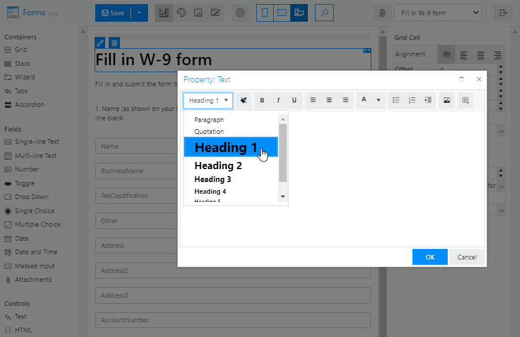
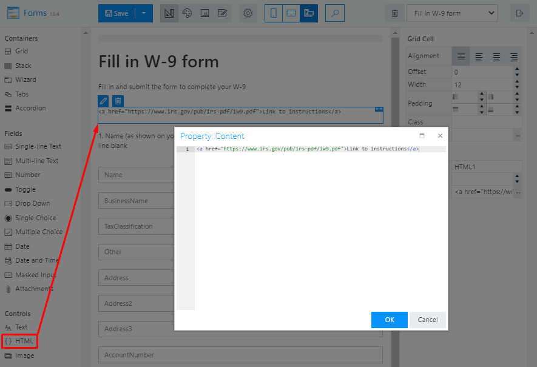
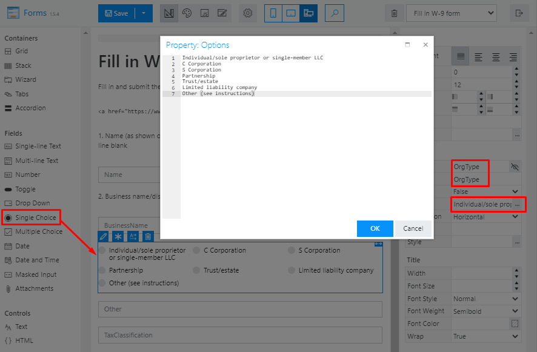
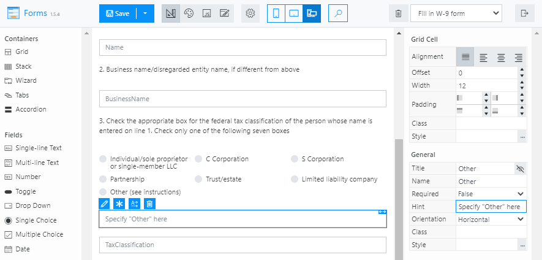
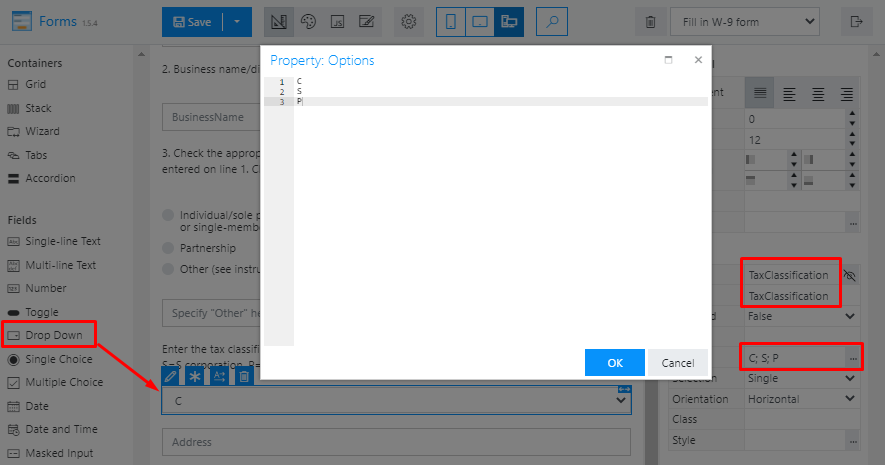
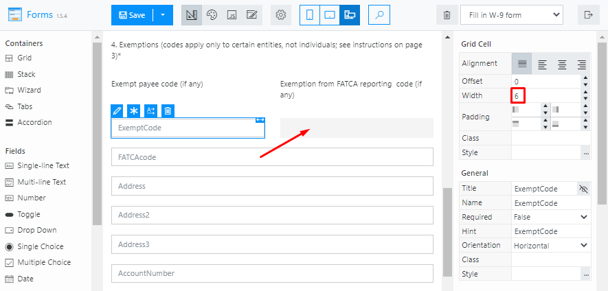
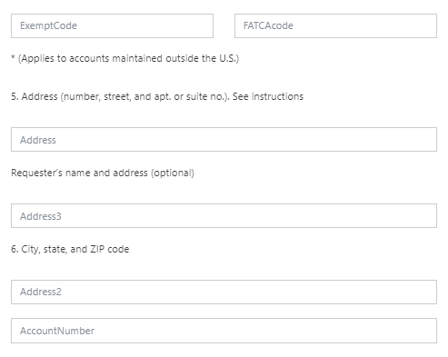
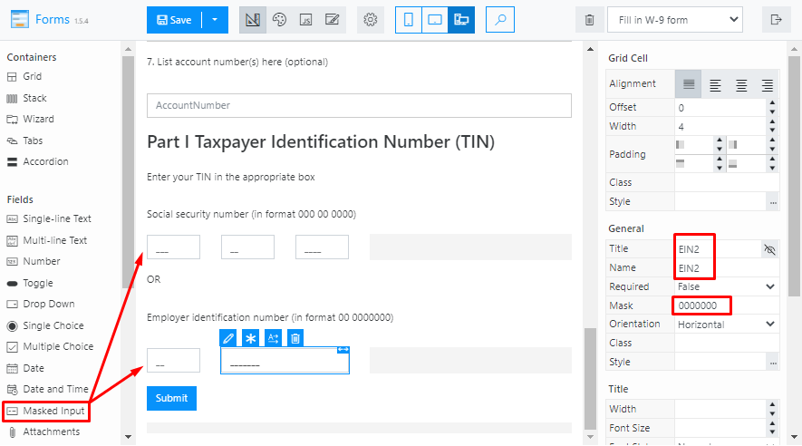
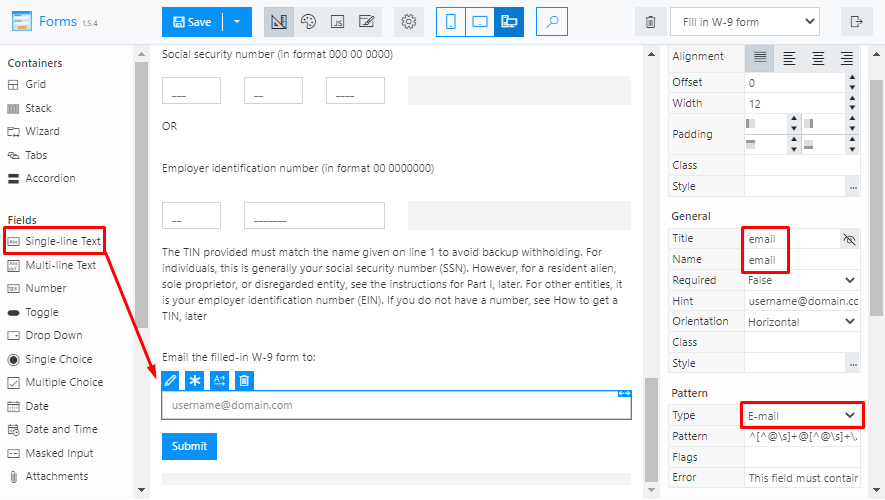
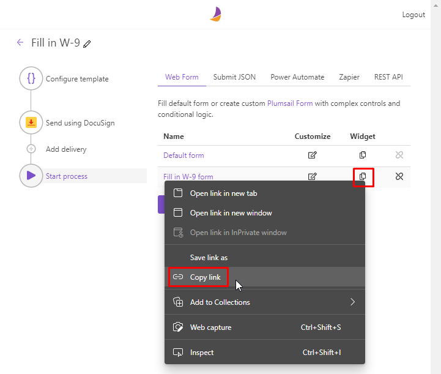

.. title:: How to fill in W-9 tax form and securely sign it using DocuSign

.. meta::
   :description: Fill in W-9 tax form and securely sign it using DocuSign and Plumsail Documents

Fill in W-9 tax form and securely sign it using DocuSign
=========================================================

Dealing with different contractors or freelancers requires you to collect the IRS W-9 tax form filled in and signed by them.
You may want to automate the bureaucracy routine and make the process transparent, fast and convenient.
`Plumsail Documents`_ can help you with this.
The `Plumsail process`_ automates filling in the W-9 tax form and support integration with DocuSign_ service for secure signing.

.. contents::
    :local:
    :depth: 1

Prepare W-9 PDF form
--------------------

The W-9 PDF form is available on an official site of the `Internal Revenue Service`_.
Get the one, create your own from scratch or use the form_ prepared for our automating purposes.
We renamed fields for further convenience of creating a web form.
Also, we added two hidden `tags for DocuSign`_ to indicate places for a signature and date (``\s1\`` and ``\d1\`` respectively).
For hiding, color them white.

|tags|

Configure process
-----------------

Go to the `Processes section`_ in your Plumsail account and click the *Add process* button.

|add|

Set the Process name and select the *Fillable PDF* template.

|create|

Upload the prepared PDF form.

|upload|

On the *Configure template* step, overview the template tokens: you will need their names to create a web form.

|tokens|

Configure the result file and add a token to use the data from the filled form in the file name.

|output|

Add a `DocuSign delivery`_ or `any other`_ for e-signing.
In this step, you can use tokens both from the PDF form and from the web form that we will create later.
It will contain an ``email`` field, so I added an accordant token to the delivery.

|delivery|

The next step is preparing a web form to start the process by its submission. We'll customize a default form that was generated based on the fields from the PDF template.

|form|

Configure web form
------------------

By default, the form grabs all the fields you have in the PDF template and name them accordingly.
It does not fit our automation process in the current state and requires some improvements.
To save time, you could `download the web form`_ we prepared and import it.
Even if you decide to customize the default form by yourself or create one from scratch, it will come in handy as a guiding sample.

|import|

You can organize the elements in the required way and add controls to structure the form.
The `web designer`_ is simple to use: drag and drop items you need and configure them using the right panel.

|fields|

First, start adding headings, questions and notes using a ``Text`` control. You can include the text from our form.

|text|

Add the link to the `IRS instruction`_ for reference using an ``HTML`` control:

|html|

Delete the default field *OrgType*, replace it with a ``Single Choice`` field of the same name and put it and the *Other* one right after the *BusinessName*.
The *OrgType* field should contain the required options according to the IRS instruction.

|replacement|

Update a hint for the *Other* field.

|hint|

Replace the *TaxClassification* field with a ``Drop Down`` that has required options.

|drop|

Next, put the *ExemptCode* and *FATCAcode* in one line. Change the width of the first field to 6 and place another on the empty square.

|codes|

Place the address fields as on the screenshot below.

|address|

Replace the fields for SSN and EIN numbers with ``Masked Input`` for each part of each number.
They should be in one row if they relate to one number.

|numbers|

And the last step is adding a ``Single-line Text`` field for providing an e-mail address.

|email|

Here is how the ready-for-use form looks:

|look|

Share web form
--------------

You can share a link to the form or copy it as an HTML widget and embed it into your site.

|share|

Provide your contractors with access to the form in either way.
After they filled and submitted it, the process generates a PDF file.
Then, it sends a link to the contractors for signing the W-9 form in DocuSign.
The signed documents will be available in your DocuSign account.

.. note::

  It is just one of the bulk of possible Documents integrations. Find here_ others that will work for you.

.. _`Plumsail Documents`: https://plumsail.com/documents/
.. _`Plumsail process`: ../index.html
.. _DocuSign: https://www.docusign.com/
.. _`Internal Revenue Service`: https://www.irs.gov/forms-pubs/about-form-w-9
.. _form: ../../../_static/files/user-guide/processes/fw9-template.pdf
.. _`tags for DocuSign`: ../deliveries/docusign.html#use-signature-and-other-related-tags
.. _`Processes section`: https://account.plumsail.com/documents/processes
.. _`DocuSign delivery`: ../deliveries/docusign.html
.. _`any other`: ../create-delivery.html
.. _`web designer`: https://plumsail.com/docs/forms-web/design.html#web-designer
.. _`IRS instruction`: https://www.irs.gov/pub/irs-pdf/iw9.pdf
.. _`download the web form`: ../../../_static/files/user-guide/processes/fill-in-w-9-form.json
.. _here: https://plumsail.com/documents/integrations/

.. |tags| image:: ../../../_static/img/user-guide/processes/how-tos/docusign-w-9-tags.png
   :alt: DocuSign tags
.. |add| image:: ../../../_static/img/user-guide/processes/how-tos/add-process-context.png
   :alt: Add process button
.. |create| image:: ../../../_static/img/user-guide/processes/how-tos/docusign-w-9-create.png
   :alt: Create process
.. |upload| image:: ../../../_static/img/user-guide/processes/how-tos/docusign-w-9-upload.png
   :alt: Upload PDF template
.. |tokens| image:: ../../../_static/img/user-guide/processes/how-tos/docusign-w-9-tokens.png
   :alt: Overview tokens
.. |output| image:: ../../../_static/img/user-guide/processes/how-tos/docusign-w-9-output.png
   :alt: Configure output
.. |delivery| image:: ../../../_static/img/user-guide/processes/how-tos/docusign-w-9-delivery.png
   :alt: Add DocuSign
.. |form| image:: ../../../_static/img/user-guide/processes/how-tos/docusign-w-9-form.png
   :alt: Create new form
.. |fields| image:: ../../../_static/img/user-guide/processes/how-tos/docusign-w-9-fields.png
   :alt: Default fields

.. |look| image:: ../../../_static/img/user-guide/processes/how-tos/docusign-w-9-look.png
   :alt: Look of the form
.. |import| image:: ../../../_static/img/user-guide/processes/how-tos/docusign-w-9-import.png
   :alt: Import of the form
