.. title:: Fill in W-9 with web form and send it for e-signature with DocuSign

.. meta::
   :description: Fill in a W-9 PDF form and sign it using DocuSign and Plumsail Documents

How to fill in W-9 with web form and sign it electronically using DocuSign
=========================================================================

Dealing with different sorts of contractors requires them to complete the IRS W-9 form.
They should sign it before submitting the form to the Internal Revenue Service (IRS).
Creating a `Plumsail process`_ can ease, speed up and automate the bureaucracy routine.
It will fill the W-9 PDF form on a web form submission and send it for signing through DocuSign_ service.

.. contents::
    :local:
    :depth: 1

Prepare W-9 PDF form
--------------------

You can find the W-9 PDF form on an official site of the `Internal Revenue Service`_.
Unfortunately, the published file is unavailable for any modifications.
It hinders understanding its structure and hence, creating a web form for filling it but still, you can use it.
As an alternative, you could create a PDF form from scratch or use the file_ we prepared.

In this article, we will use the names of the fields from our form.
Also, we added two hidden `tags for DocuSign`_ to indicate places for a signature and date (``\s1\`` and ``\d1\`` respectively).
For hiding, color them white.

|tags|

Configure process
-----------------

Go to the `Processes section`_ in your Plumsail account and click the *Add process* button.

|add|

Set the Process name and select the *Fillable PDF* template.

|create|

Upload the prepared PDF form.

|upload|

On the *Configure template* step, overview the template tokens: you will need their names to create a web form.

|tokens|

Configure the result file and add a token to use the data from the filled form in the file name.

|output|

Add a `DocuSign delivery`_ or `any other`_ for e-signing.
In this step, you can use tokens both from the PDF form and from the web form that we will create later.
It will contain an ``email`` field, so I added an accordant token to the delivery.

|delivery|

The next step is creating a new web form to start the process by its submission.

|form|

Configure web form
-----------------

By default, the form grabs all the fields you have in the PDF template and name them accordingly.
You can organize the elements in the required way and add controls to structure the form.
The `web designer`_ is simple to use: drag and drop items you need and configure them using the right panel.

|fields|

I added structuring and explanatory text controls and an HTML link to the `IRS instructions`_ for filling the W-9 form.
It was necessary to replace some fields to use proper inputs.
For example, I replaced the *OrgType* text field with radio-buttons to submit a single choice.

|updated|

Here is how the ready-for-use form looks:

|look|

You can `save the web form`_ we prepared and import it.
Even if you create yours from scratch, it will come in handy as a guiding sample.

|import|

.. _`Plumsail process`: ../index.html
.. _DocuSign: https://www.docusign.com/
.. _`Internal Revenue Service`: https://www.irs.gov/forms-pubs/about-form-w-9
.. _file: ../../../_static/files/user-guide/processes/fw9-template.pdf
.. _`tags for DocuSign`: ../deliveries/docusign.html#use-signature-and-other-related-tags
.. _`Processes section`: https://account.plumsail.com/documents/processes
.. _`DocuSign delivery`: ../deliveries/docusign.html
.. _`any other`: ../create-delivery.html
.. _`web designer`: https://plumsail.com/docs/forms-web/design.html#web-designer
.. _`IRS instructions`: https://www.irs.gov/pub/irs-pdf/iw9.pdf
.. _`save the web form`: ../../../_static/files/user-guide/processes/fill-in-w-9-form.json

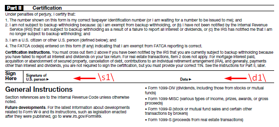
.. |add| image:: ../../../_static/img/user-guide/processes/how-tos/add-process-context.png
   :alt: Add process button
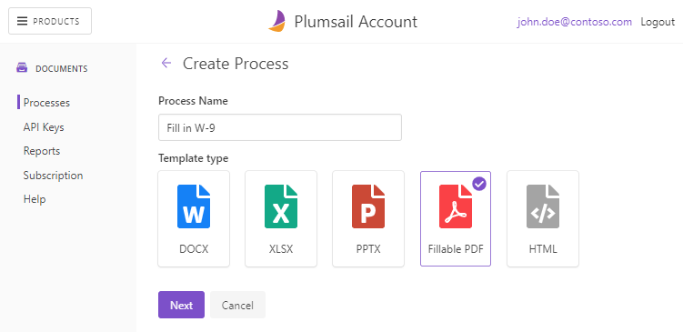
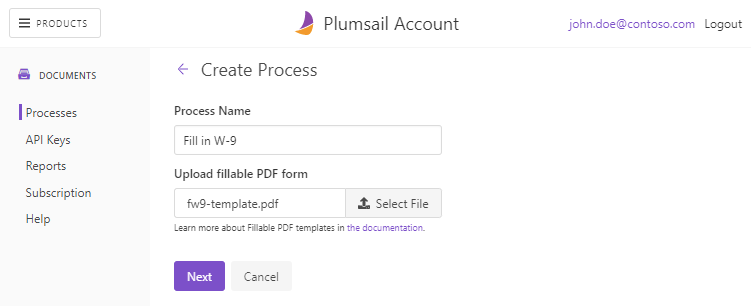
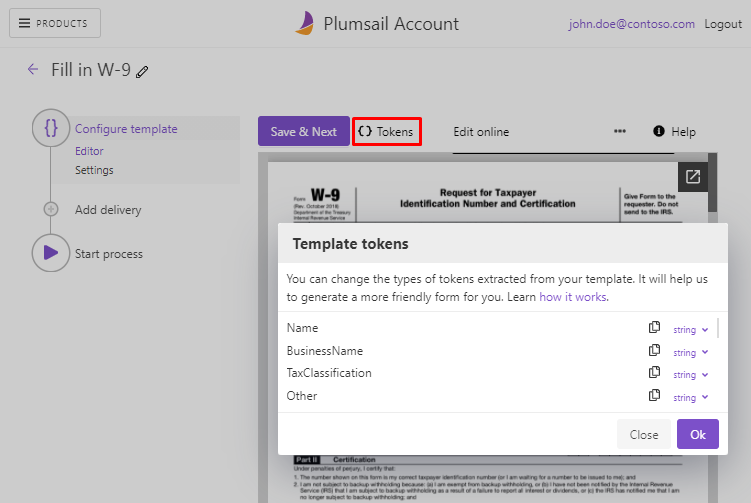
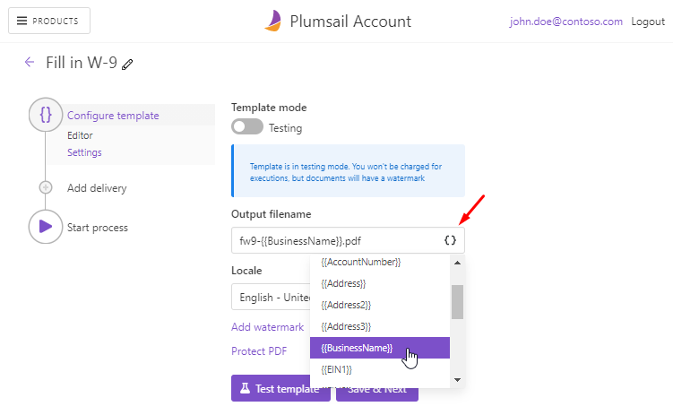
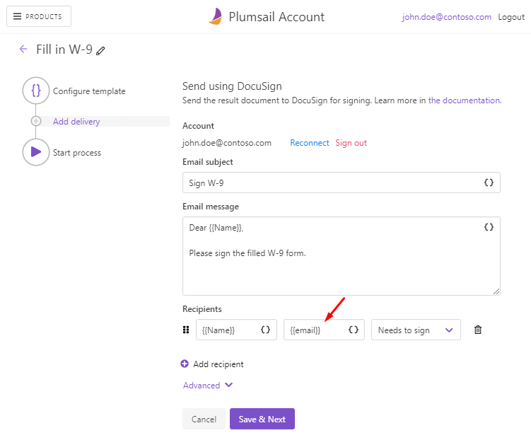
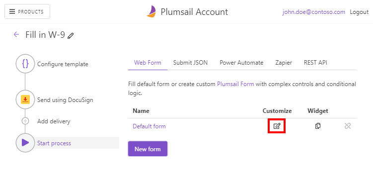
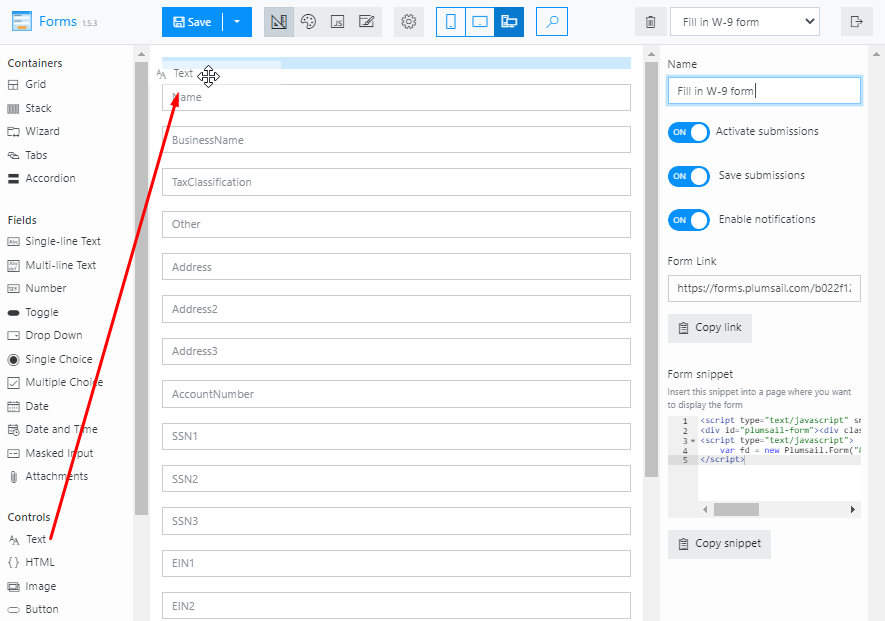
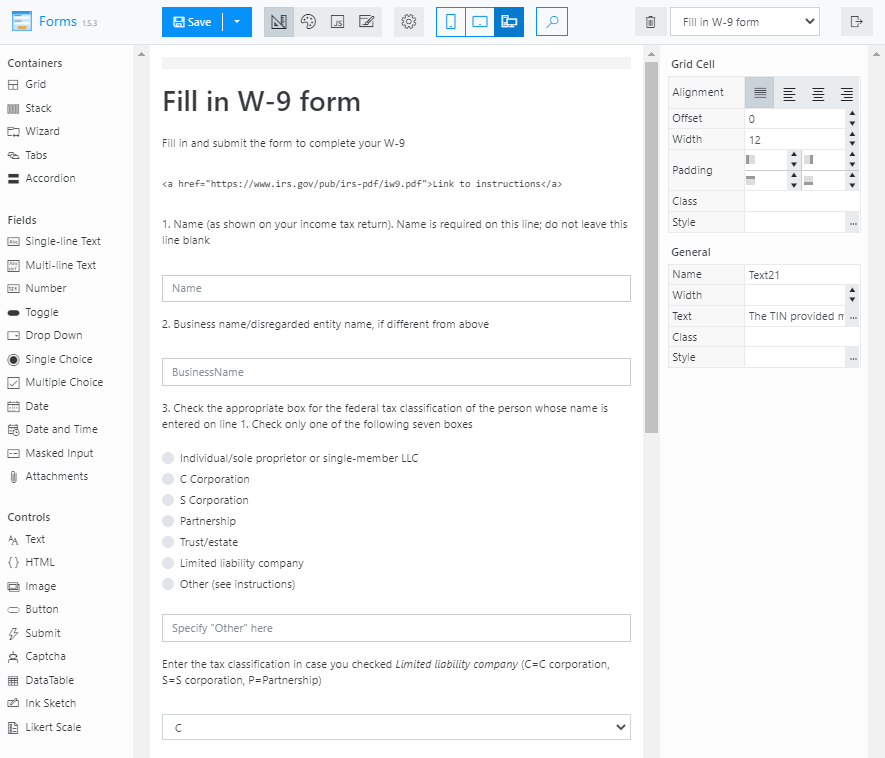
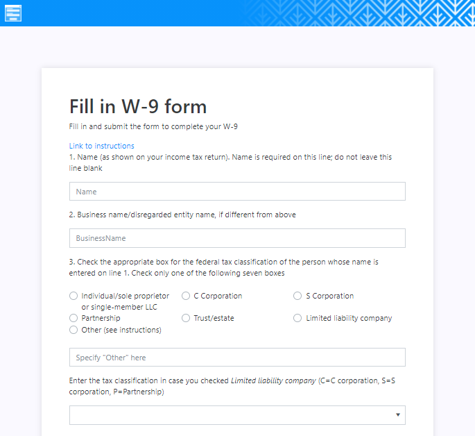
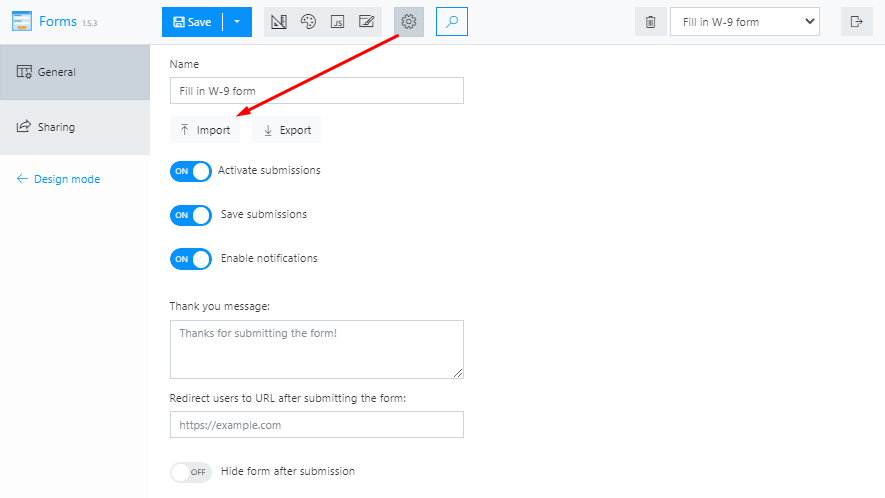