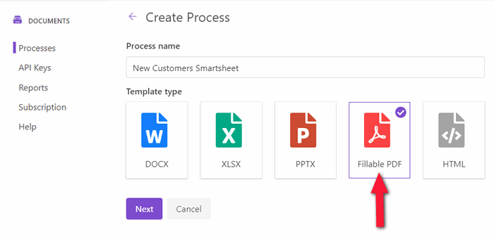

Auto-fill in PDF forms with Smartsheet data
===========================================

.. title:: How to generate PDF when new record is added to Smartsheet

.. meta::
   :description: Automate document workflow with Smartsheet and Plumsail Documents in Zapier

From this article, you will learn how to automate the process of creating documents and filling in PDF forms from `Smartsheet`_ with the help of `Plumsail Documents <https://plumsail.com/documents/>`_ in `Zapier <https://zapier.com/>`_.
Though Smartsheet has a PDF builder, it requires manual actions and not suitable for all the scenarios.

.. note:: The approach we'll describe in the article is applicable for all the scenarios with creating and filling PDFs from Smartsheet. It doesn't matter what kind of project you're working on in your Smartsheet. 

Let us say you have a contact form for new clients and a corresponding sheet for it in Smartsheet.

You need to pull data about a new customer from a Smartsheet row and populate a fillable PDF with it, then send the PDF file by email as an attachment.
Ideally, without any manual routine. This is exactly what we're going to do - **to automate the whole process**.

Systems involved:

1. `Smartsheet`_
2. `Plumsail Documents <https://auth.plumsail.com/account/Register?ReturnUrl=https://account.plumsail.com/documents/processes/reg>`_
3. `Zapier <https://zapier.com/>`_

Let's go step by step.

.. contents::
    :local:
    :depth: 1

Create Plumsail Documents process
---------------------------------

The first thing we need to do is to create the process inside Plumsail Documents. 
`Go to the Processes <https://auth.plumsail.com/account/Register?ReturnUrl=https://account.plumsail.com/documents/processes/reg>`_ in your Plumsail account. 

Click on the 'Add process' button to create a new process. Give a name to it. Select 'Fillable PDF' as a template type.

Click on the 'Next' button.

Upload fillable PDF form
------------------------

You'll be asked to upload your fillable PDF form:

Feel free to `download our New customer information form <../../../_static/files/flow/how-tos/customer-information-form.pdf>`_ and upload it to test the case. 

Otherwise, you can upload your custom-build fillable PDF. 

Click on the 'Next' button.

Configure fillable PDF template settings
----------------------------------------

Once you've uploaded the PDF form, you'll go to the Configure template step. It has two substeps - Editor and Settings.
We have nothing to do on the Editor substep except testing our PDF form template. 
We're skipping it, but if you're interested in checking how the resulting file might look, `learn how to test templates <../test-template.html>`_.

On the Settings substep, you can configure the output filename. And additionally, you can protect PDF by watermark and other restrictions.

We're moving on to the Delivery step.

Add email delivery
------------------

We decided to send PDF forms created from Smartsheet as email attachments. But there is a `rich set of other deliveries <../create-delivery.html>`_. 
Moreover, you can add as many of them as you want.

For example, you can send the PDF by email and save it to such cloud storage as OneDrive, Google Drive, and others.

Inside the email delivery, the settings are self-explanatory. You just specify recipients and fill in the email subject and body.

Additionally, you can expand Advanced settings and set Display name and Reply-To address.

That is it, the only thing left to do is to start our process. We'll do it from Zapier.

Connect Smartsheet to Plumsail Documents in Zapier
--------------------------------------------------

We will start the process of populating PDF forms when a new row is added to Smartsheet. 
For that, we'll create an automated connection between Smartsheet and Plumsail Documents in Zapier.

You can create a zap from scratch or start from a ready-to-go zap template, then customize it as described further in the guide. 
To start from the zap template, click on **Use this zap** on the widget below:

|Widget|

.. |Widget| raw:: html

    

To create a zap from scratch, go to your Zapier account, add a new zap. For the zap trigger, search for Smartsheet:

Choose 'New Row' as a trigger event:

On the next step, you'll be asked to sign in to your Smartsheet account from Zapier. 

After that, you need to select the sheet you'd like to track for new rows:

Don't skip testing the trigger to be able to use its output further.

Click on Continue to proceed to add an action that will be executed on the trigger event. Search for Plumsail Documents.

.. image:: ../../../_static/img/user-guide/processes/how-tos/plumsail-documents-action-zapier.png
    :alt: Plumsail Documents action in Zapier

Choose 'Start process' as an action event:

On the next step, you'll be asked to sign in to your Plumsail Account from Zapier. After that, you need to select the process to run by this Zap.
Once you've picked it up, you see fields to complete. These are our fillable PDF form fields. To specify answers, we'll use the output from the Smartsheet trigger:

Our Zap is done. Every time a new row is added to Smartsheet, you'll get a PDF form completed with its data by email. 

.. hint:: Plumsail Documents supports not only fillable PDFs, but other document templates - Word, Excel, PowerPoint. So, you can create any custom documents based on Smartsheet data. Please, `check out some ready-to-use examples <../index.html#processes-examples>`_. You can combine approaches to adjust them to your needs. 

.. _Smartsheet: https://www.smartsheet.com/
