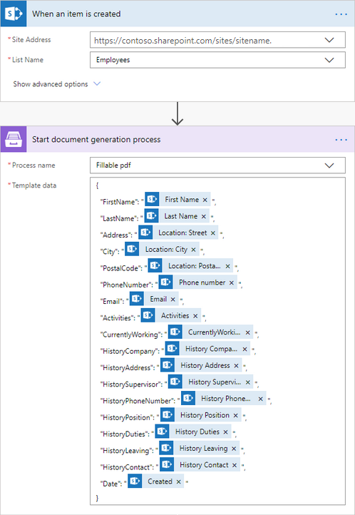

How to automatically populate fillable PDF based on data from third party system in Microsoft Flow, Azure Logic Apps or Power Apps
==================================================================================================================================

In this article, you will learn how to automatically populate fillable PDF forms in Microsoft Flow or Azure Logic Apps. We will use `Processes <../../../user-guide/processes/index.html>`_ - a Plumsail Documents feature for creating documents from templates. 

In our case, we will fill in an Application for Employment form based on the data from a SharePoint list. Actually, you can get data from any other source. We use the SharePoint list here as an example.

This is how the final PDF document with the form will look in our case:

.. image:: ../../../_static/img/flow/how-tos/fill-in-pdf-form-result.png
    :alt: fill in pdf form result

.. contents::
    :local:
    :depth: 2

Create a fillable PDF
~~~~~~~~~~~~~~~~~~~~~

Follow `this instruction <../../../document-generation/fillable-pdf/index.html>`_ to create a fillable PDF. `Download the template file <../../../_static/files/flow/how-tos/fill-in-pdf-form-template.pdf>`_ for this article.

.. image:: ../../../_static/img/flow/how-tos/fill-in-pdf-form-template.png
    :alt: fill in pdf form template

Configure the Process
~~~~~~~~~~~~~~~~~~~~~

To create a process, which will populate our PDF form of application for employment, go to `the Processes section <https://account.plumsail.com/documents/processes>`_ in your Plumsail account. 

Create a new process
--------------------

Click on the *Add process* button.

.. image:: ../../../_static/img/user-guide/processes/how-tos/add-process-button.png
    :alt: add process button

Set the Process name and upload the template you've prepared. We will use the template from the step `Create fillable PDF <../../../flow/how-tos/documents/fill-pdf-form-processes.html#create-fillable-pdf>`_.

.. image:: ../../../_static/img/flow/how-tos/create-new-process-plumsail-forms.png
    :alt: Create a new process to populate PDF form

Configure a template
--------------------

Once you're done with the first step *Create Process*, press the *Submit* button, and you’ll proceed to the next – *Configure Template*:

- Fill in the name of the result file
- `Protect the result PDF <../../../user-guide/processes/create-process.html#add-watermark>`_ if you wish

.. image:: ../../../_static/img/flow/how-tos/Configure-template-fillable-pdf.png
    :alt: Configure template

You can test a template as well, to see how it will look at the end. After clicking on the *Test template* button, you’ll need to ‘feed’ a template with your data in JSON format. In our case, it might be:

.. code:: json

    { 
    "FirstName": "David",
    "LastName": "Navarro",
    "Address": "3 Main St.",
    "City": "New York",
    "PostalCode": "972013",
    "PhoneNumber": "202-555-0131",
    "Email": "david@sample.com",
    "Activities": "Sports: football, basketball, volleyball",
    "CurrentlyWorking": true,
    "HistoryCompany": "Acme Corp",
    "HistoryAddress": "123 James St. Miami, USA",
    "HistorySupervisor": "Derek Clark",
    "HistoryPhoneNumber": "555-777-9999",
    "HistoryPosition": "Marketing director",
    "HistoryDuties": "Developing marketing strategy",
    "HistoryLeaving": "Moving to another city",
    "HistoryContact": true,
    "Date": "06/30/2020"
    }
        

It’s testing. We’re going to apply the data from the SharePoint list. 

Delivery
--------

The next step is delivery. You can configure as many of them as you need, or skip the step. Check all the available options and how to handle them `here <../../../user-guide/processes/create-delivery.html#list-of-available-deliveries>`_.

Start the Process
-----------------

We will start our Process from Microsoft Flow. 

Create a Flow
~~~~~~~~~~~~~

This is how our Flow looks:

Flow trigger
------------

You can pick any trigger. For example, you can start your Flow on `form submission <https://plumsail.com/docs/forms/microsoft-flow.html>`_. We use “When an item is created” trigger to get the newest created item from the SharePoint list.

Our SharePoint list has the same columns as fields in our fillable PDF file.

Start document generation process
---------------------------------

This is the action from `Plumsail Documents connector <../../../getting-started/use-from-flow.html>`_. This action is suitable for starting the Process of generating documents from a template. You can find more information about this action by visiting `this page <../../../flow/actions/document-processing.html#start-document-generation-process>`_.

.. important:: This action is not available in `the global Microsoft Flow connector <https://docs.microsoft.com/en-us/connectors/plumsail/>`_ yet. To use it, you need to `add Plumsail Documents as a custom connector <../create-custom-connector.html>`_.

Mind, If you use the Plumsail documents action for the first time, you’ll be asked for *'Connection Name'* and *'Access Key'*. You can type any name for the connection. For example, *'Plumsail Documents'*.

Then `create an API key in your Plumsail Account page <../../../getting-started/sign-up.html>`_, copy and paste it to the *'Access Key'* field.

The **Start document generation process** action has two parameters:

.. image:: ../../../_static/img/user-guide/processes/how-tos/start-generation-docs-action.png
    :alt: start generation documents action

- *Process name*. Select the process you need from available ones. 
- *Template data*. Specify source data in JSON format.

.. image:: ../../../_static/img/flow/how-tos/JSON-data-fillable-pdf.png
    :alt: JSON data 

This object contains information from an item newly created in the SharePoint list. We selected the dynamic content from the output of *SharePoint - When an item is created*:

.. image:: ../../../_static/img/flow/how-tos/dynamic-content-fillable-pdf.png
    :alt: dynamic content of SharePoint - When an item is created

Send an Email action
--------------------

Now we send the PDF file with filled-in form. In our example, we use 'Send an Email' action from the Office 365 Outlook connector. Select an output of *Start document generation process* from Dynamic content as an attachment to the email.

Please notice how we specified the PDF file. It is essential to specify the attachment name with the correct extension.

Our Flow is ready. Now you know how to automatically populate fillable PDFs with the help of Plumsail Documents in Power Automate (Flow).

.. hint:: Check `another article <../../../flow/how-tos/documents/fill-pdf-form.html>`_ with the video describing an advanced scenario on How to automatically populate fillable PDF.
