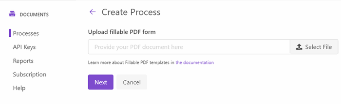
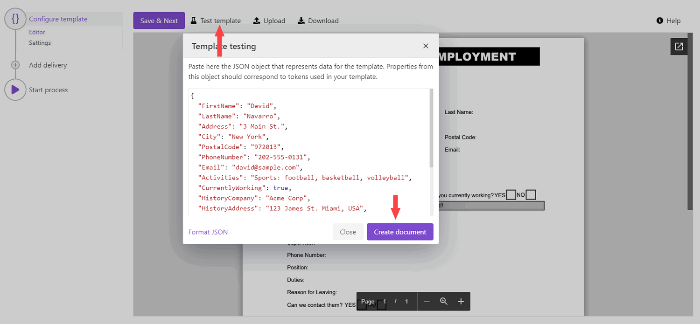
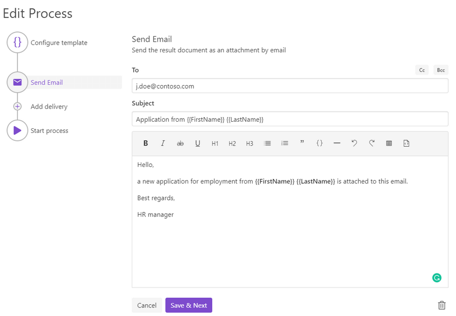
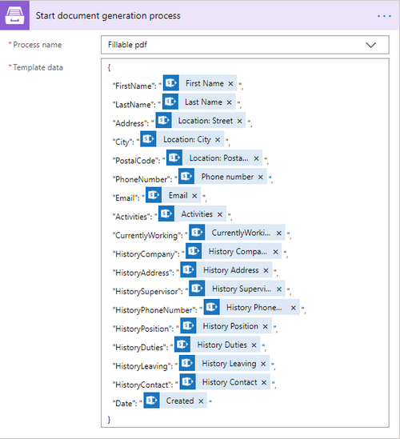
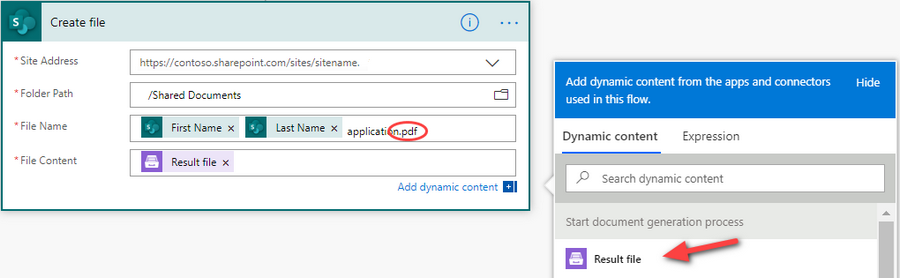

.. title:: SharePoint list to populate PDF form Flow

.. meta::
   :description: Check out how to automatically populate fillable PDF forms from SharePoint list using Plumsail Documents in Power Automate.

How to automatically populate fillable PDF based on data from third party system in Power Automate (Microsoft Flow), Azure Logic Apps, or Power Apps
=====================================================================================================================================================

In this article, you will learn how to automatically populate fillable PDF forms in Power Automate (Microsoft Flow) or Azure Logic Apps. We will use `Processes <../../../user-guide/processes/index.html>`_ - a Plumsail Documents feature for creating documents from templates. 

In our case, we will fill in an Application for Employment form based on the data from a SharePoint list. Actually, you can get data from any other source. We use the SharePoint list here as an example.

This is how the final PDF document with the form will look in our case:

.. image:: ../../../_static/img/flow/how-tos/fill-in-pdf-form-result.png
    :alt: fill in pdf form result

Here is a step-by-step description.

.. contents::
    :local:
    :depth: 2

Create a fillable PDF
~~~~~~~~~~~~~~~~~~~~~

Follow `this instruction <../../../document-generation/fillable-pdf/index.html>`_ to create a fillable PDF. `Download the template file <../../../_static/files/flow/how-tos/fill-in-pdf-form-template.pdf>`_ for this article.

.. image:: ../../../_static/img/flow/how-tos/fill-in-pdf-form-template.png
    :alt: fill in pdf form template

Configure the Process
~~~~~~~~~~~~~~~~~~~~~

To create a process, which will populate our PDF form of application for employment, go to `the Processes section <https://auth.plumsail.com/account/Register?ReturnUrl=https://account.plumsail.com/documents/processes/reg>`_ in your Plumsail account. 

Create a new process
--------------------

Click on the *Add process* button.

.. image:: ../../../_static/img/user-guide/processes/how-tos/add-process-button.png
    :alt: add process button

Set the Process name and Select a Fillable PDF for a template type. 

Click the *Next* button. You'll be offered to upload a fillable PDF template. 

Configure a template
--------------------
After you've provided the template file, you'll jump to the next step - **Configure template**.

It includes two substeps:

- Editor;
- Settings.

In `Editor <../online-editor.html>`_, it's possible to upload a new fillable PDF template. And download it to your PC.

Another feature here is testing the template. It helps you to get a sight of the resulting document and decide if you're satisfied with it.

Just click the *Test template*. You'll see the dialog where to put the source data in JSON format. 

To test the PDF form template from this example, copy and paste this JSON data:

.. code:: json

    { 
    "FirstName": "David",
    "LastName": "Navarro",
    "Address": "3 Main St.",
    "City": "New York",
    "PostalCode": "972013",
    "PhoneNumber": "202-555-0131",
    "Email": "david@sample.com",
    "Activities": "Sports: football, basketball, volleyball",
    "CurrentlyWorking": true,
    "HistoryCompany": "Acme Corp",
    "HistoryAddress": "123 James St. Miami, USA",
    "HistorySupervisor": "Derek Clark",
    "HistoryPhoneNumber": "555-777-9999",
    "HistoryPosition": "Marketing director",
    "HistoryDuties": "Developing marketing strategy",
    "HistoryLeaving": "Moving to another city",
    "HistoryContact": true,
    "Date": "06/30/2020"
    }

.. note:: It's testing, we'll pass data from the SharePoint list to the process to populate the template. See the `Start process section <#start-the-process-on-plumsail-forms-submission>`_. 

In the **Settings** substep, you customize the following settings:

**Template mode**

It is *Testing* by default. It means you won't be charged for this process runs, but result documents will have a Plumsail watermark. Change it to *Active* to remove the watermark.

**Output filename**

Use tokens to make it personalized. They work the same way as in the template. 

.. hint:: You can `protect your final PDF document with a watermark, by setting a password, or disabling some actions <../configure-settings.html#add-watermark>`_. 

**Test template**

You can test the template from the Settings as well - to check how the customized settings will appear in the resulting document. The procedure is the same as we've already described above.

.. image:: ../../../_static/img/flow/how-tos/Configure-template-fillable-pdf.png
    :alt: Configure template

.. note:: **Lock form fields** option is activated by default. If you want to keep an option to edit the result PDF file - disable the option.

Delivery
--------

The next step is delivery. For demonstrating purposes, let us set an email delivery. 

Fill-in a recipient email. Add recipients for a copy or blind copy if you need. Define the subject of the letter. And write an email body. 

You can use tokens from your template to specify details in the email subject as we did, or in the body. The submitted data will be applied to them as well. Learn more by following `this link <../../../user-guide/processes/tokens-in-process-fields.html>`_.

You can configure as many deliveries as you need, or even skip the step. Check all the available options and how to handle them `here <../../../user-guide/processes/create-delivery.html#list-of-available-deliveries>`_.

Start the Process
-----------------

We will start our Process from Power Automate (Microsoft Flow). 

Create a Flow
~~~~~~~~~~~~~

This is how our Flow looks:

.. image:: ../../../_static/img/flow/how-tos/fill-in-pdf-flow.png
    :alt: Populate fillable PDF flow

Flow trigger
------------

You can pick any trigger. For example, you can start your Flow on `form submission <https://plumsail.com/docs/forms/microsoft-flow.html>`_. We use “When an item is created” trigger to get data of the latest created item from the SharePoint list.

Our SharePoint list has the same columns as fields in our fillable PDF file.

Start document generation process
---------------------------------

This is the action from `Plumsail Documents connector <../../../getting-started/use-from-flow.html>`_. This action is suitable for starting the Process of generating documents from a template. You can find more information about this action by visiting `this page <../../../flow/actions/document-processing.html#start-document-generation-process>`_.

Mind, If you use the Plumsail documents action for the first time, you’ll be asked for *'Connection Name'* and *'Access Key'*. You can type any name for the connection. For example, *'Plumsail Documents'*.

Then `create an API key in your Plumsail Account page <../../../getting-started/sign-up.html>`_, copy and paste it to the *'Access Key'* field.

The **Start document generation process** action has two parameters:

- *Process name*. Select the process you need from available ones. 
- *Template data*. Specify source data in JSON format.

This object contains information from an item newly created in the SharePoint list. We selected the dynamic content from the output of *SharePoint - When an item is created*:

.. image:: ../../../_static/img/flow/how-tos/dynamic-content-fillable-pdf.png
    :alt: dynamic content of SharePoint - When an item is created

Use the ready PDF in Flow
-------------------------

Now we upload our ready and filled-in PDF to the SharePoint document library to see how to use the output of the *Start document generation process* action right in the Flow.

Add a Create file action from the SharePoint connector. 
For the File content, select :code:`Result file` in Dynamic content from *Start document generation process*.

Please notice how we specified the File name with :code:`.PDF`. It is essential to specify the file name with the correct extension.

Our Flow is ready. Now you know how to automatically populate fillable PDFs with the help of Plumsail Documents in Power Automate (Flow). If you're new to Plumsail Documents, `register an account <https://auth.plumsail.com/Account/Register?ReturnUrl=https://account.plumsail.com/documents/processes/reg>`_ and follow the steps described in the article. To get started is easy. 

.. hint:: Check `another article <../../../flow/how-tos/documents/fill-pdf-form.html>`_ with the video describing an advanced scenario on How to automatically populate fillable PDF.
