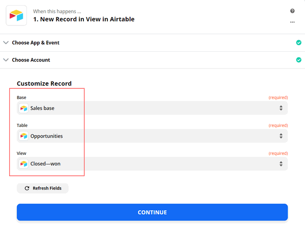

.. title:: How to auto generate contracts from Airtable data in Zapier

.. meta::
  :description: Create flexible and customized documents from Airtable. Check out How to generate contracts from Airtable deals automatically with Plumsail Documents.

Automatically generate contracts from Airtable data in Zapier
====================================================================

This article describes how to automatically populate Word contracts from Airtable closed-won opportunities, convert to PDF, and save to OneDrive with the help of `Plumsail Documents processes <../../../user-guide/processes/index.html>`_ in Zapier. 
This approach is suitable for creating customized documents such as invoices, proposals, presentations from Airtable data.

`Airtable <https://airtable.com/>`_ is a spreadsheet-alike database for team collaborating and tracking projects, orders, contacts, and more.

Plumsail Documents has `Zapier integration for document generation <../../../getting-started/use-from-zapier.html>`_. With its help, we'll pull data from Airtable and pass it to the document generation process. 

Let's concentrate on each step individually.

.. contents::
    :local:
    :depth: 2

Overview of Airtable base
~~~~~~~~~~~~~~~~~~~~~~~~~

We’ve used an Airtable Sales CRM template to create a new base for tracking customers and contracts. 
Here it is (hid some fields to show only those that will populate our service contract template):

.. image:: ../../../_static/img/user-guide/processes/how-tos/airtable-sales-crm.png
    :alt: Airtable Sales CRM

We created fields in addition to default ones (i.e. Services, Our company). And we added the 'Customer' field with the formula :code:`{Company name}`. 

The default 'Company name' is a linked field. It enables you to open the customer profile right from the table. 

We used the formula to turn the linked field into a text value to be able to pull data about the customer company name in Zapier.

Configure document generation process
~~~~~~~~~~~~~~~~~~~~~~~~~~~~~~~~~~~~~

Before creating a Zap (an automated connection of apps in Zapier), we need to set a process that will generate PDFs from a DOCX template.

Create new process
------------------

First, register or log in to your `Plumsail account <https://auth.plumsail.com/account/Register?ReturnUrl=https://account.plumsail.com/documents/processes/reg>`_.

In the Processes section, click on the 'Add process' button and select 'Start from template':

You'll be redirected to the library of document templates. We select the service contract template for our scenario:

Name the process and click 'Next' to proceed. Then you'll jump to the 'Configure template' step. 

In the Editor mode, you can adjust the document template to your needs. Everything in the curly brackets will be replaced with Airtable data dynamically. 
You can add more placeholders. They work quite simply and support even some complex logic with tables, charts, conditions, and more. 
`Learn how Plumsail Documents Word DOCX templates work here <../../../document-generation/docx/how-it-works.html>`_. 

Click Save & Next to go to the Settings substep. 

Here you'll see the following parameters:

**Template mode**

It is *Testing* by default. It means you won't be charged for this process runs, but result documents will have a Plumsail watermark. Change it to *Active* to remove the watermark.

**Output filename**

Use tokens to make it personalized. They work the same way as in the template. For instance, we use the following tokens to define the output file name - :code:`{{customerName}}`. As a result, we'll receive an agreement with the name - *Service Contract/Bear Paw Solutions*.

**Output type**

By default, it is the same as your template's format. In this particular case, it's DOCX. We're changing it to PDF to generate PDF contracts from the Word template.

.. hint:: You can `protect your final PDF document with a watermark, by setting a password, or disabling some actions <../create-process.html#add-watermark>`_. 

**Test template**

Once you've customized all the settings, you can test the template to see the result. 

When everything is done here, click on Save & Next to set up deliveries.

Add OneDrive delivery
----------------------

The next step is delivery. For demonstration purpose, we’ll store the result file in `OneDrive <../../../user-guide/processes/deliveries/one-drive.html>`_. But there are `other options <../../../user-guide/processes/create-delivery.html>`_. You can send contracts for e-signing to your customers dynamically.

You need to connect to your OneDrive from the Plumsail account. After that, set the folder's name where to save the completed document.  

.. image:: ../../../_static/img/user-guide/processes/how-tos/save-onedrive-airtable.png
    :alt: save contracts from Airtable to OneDrive

You can configure as many deliveries as you need.

Start process
-------------

We will start our Process from Zapier. 

Create Zap
~~~~~~~~~~~~
Zap is a workflow that connects apps together to perform tasks automatically.
You can create it from scratch following the steps explained below.

Or you can utilize the zap template. Click *Use this zap*, and then just customize the steps as it's described further in this article.

|Widget|

.. |Widget| raw:: html

    

This is how our Zap looks:

.. image:: ../../../_static/img/user-guide/processes/how-tos/airtable-zap.png
    :alt: zap Airtable and Plumsail Documents

Below is a step-by-step description.

New record in View in Airtable
------------------------------

We need to start the process of generating contracts only for opportunities with status *Closed-won*. That's why we set a trigger *New record in View*.

Once you've chosen the trigger, you'll be offered to connect to your Airtable account with Zapier. 

After that, you'll proceed to select a Base, a Table, and a View to monitor. In our case, it's *Closed-won*. 

The last thing to do with the trigger - Find data. Press *Test trigger* to find data. It will allow you to use the trigger output in the next step.

Start process in Plumsail Documents
-----------------------------------

Once the trigger is set, search for Plumsail Documents and add an action *Start process*.

.. image:: ../../../_static/img/user-guide/processes/how-tos/start-process-zapier.png
    :alt: start process from Zapier action

Click *Continue*. If this is your first Zap, at this point, you'll need to Sign in to your Plumsail Account from Zapier to establish a connection between the app and your Zapier account. If you already have a Plumsail account tied to the app, you can add another one at this step, and use it instead.

Customize Start Process
***********************

Choose the process you want to start by this Zap from the dropdown. 
You will see fields to complete - they have the same names as tokens from the template. 

To complete them, use the output from the Airtable trigger.

.. image:: ../../../_static/img/user-guide/processes/how-tos/customize-plumsail-zap-airtable.png
    :alt: JSON data with Airtable trigger output

That's it! Our Zap is ready🎉 Every time the opportunity in Airtable changes its status to Closed-won, you'll receive the finalized service contract saved to your OneDrive. 

Conclusion
~~~~~~~~~~

As you see, it's quite simple to generate flexible and customized documents from Airtable. You can use the approch described in the article to generate any kind of documents of various formats - Word, Excel, PowerPoint, PDF. 

If you're new to Plumsail Documents, `register an account <https://auth.plumsail.com/Account/Register?ReturnUrl=https://account.plumsail.com/documents/processes/reg>`_ to get a 1-month free trial. 