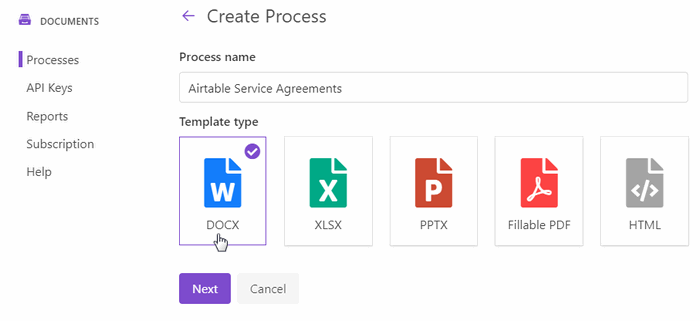

.. title:: Auto generate contracts from Airtable data in Zapier

.. meta::
  :description: Create flexible and customized documents from Airtable. Check out How to generate contracts from Airtable deals automatically with Plumsail Documents.

How to automatically generate contracts from Airtable data in Zapier
====================================================================

This article describes how to automatically populate Word contracts from Airtable closed-won opportunities, convert to PDF, and save to OneDrive with the help of `Plumsail Documents processes <../../../user-guide/processes/index.html>`_ in Zapier. 
This approach is suitable for creating any customized documents like invoices, proposals, presentations from Airtable data.

`Airtable <https://airtable.com/>`_ is a spreadsheet-alike database for team collaborating and tracking projects, orders, contacts, and more.

Plumsail Documents has `Zapier integration for document generation <../../../getting-started/use-from-zapier.html>`_. With its help, we'll pull data from Airtable and pass it to the document generation process. 

Let's concentrate on each step individually.

.. contents::
    :local:
    :depth: 2

Overview of Airtable base
~~~~~~~~~~~~~~~~~~~~~~~~~

We’ve used an Airtable Sales CRM template to create a new base for tracking customers and contracts. 
Here it is (hid some fields to show only those that will populate our service agreement template):

.. image:: ../../../_static/img/user-guide/processes/how-tos/airtable-sales-crm.png
    :alt: Airtable Sales CRM

We created fields in addition to default ones (like Services, Our company). And we added the 'Customer' field with the formula :code:`{Company name}`. 

The default 'Company name' is a linked field. It enables you to open the customer profile right from the table. 

We used the formula to turn the linked field into a text value to be able to pull data about the customer company name in Zapier.

.. image:: ../../../_static/img/user-guide/processes/how-tos/airtable-formula.png
    :alt: Airtable Sales CRM

Configure document generation process
~~~~~~~~~~~~~~~~~~~~~~~~~~~~~~~~~~~~~

Before creating a Zap (an automated connection in Zapier), we need to set a process that will generate PDFs from a DOCX template. Let’s start by preparing a Word template.

Prepare Word contract template
------------------------------

For demonstration purposes, we use a simple general service agreement template. You can `download it by this link <../../../_static/files/user-guide/processes/service_agreement_template.docx>`_. 

Do not forget to adjust the sample agreement to your unique circumstances and needs when using the document officially.

This is how our template first page looks:

You may see tokens in :code:`{{ }}` brackets. We highlighted them in green. Airtable data will replace them.

So, the templating engine thinks that everything in :code:`{{ }}` is variables where it will apply your custom data.

With Plumsail Word DOCX templates, it's easy to build rich templates with lists, tables, charts, and other graphics. To learn more, check out `how Word DOCX templates work <../../../document-generation/docx/how-it-works.html>`_.

Create new process
------------------

We've prepared our template and proceeding to create a document generation process.

Go to `the Processes section <https://auth.plumsail.com/account/Register?ReturnUrl=https://account.plumsail.com/documents/processes/reg>`_ in your Plumsail account.

Click on the *Add process* button. 

.. image:: ../../../_static/img/user-guide/processes/how-tos/add-process-button.png
    :alt: add process button

Set the recognizable process name. Select **DOCX** for the template type.

Configure template
------------------

Once you've created the process, you’ll jump to its first step – *Configure Template*.

It includes two substeps:

- Editor;
- Settings.

In `Editor <../../../user-guide/processes/online-editor.html>`_, you can compose the template from scratch or upload a pre-made one. It's also possible to modify the uploaded template online.

As we have `already prepared the template <#prepare-word-contract-template>`_, upload it to the process:

.. image:: ../../../_static/img/user-guide/processes/how-tos/upload-template.png
    :alt: upload template file

To see how the resulting service agreement will look, click on the *Test template*
You will see the dialog where you can fill in the auto-generated testing form. 
Form fields are created based on tokens from your document template. You can `adjust the look of the testing form by changing token types <../custom-testing-form.html>`_.

Click Save & Next to go to the **Settings**. Here you'll see the following parameters:

**Template mode**

It is *Testing* by default. It means you won't be charged for this process runs, but result documents will have a Plumsail watermark. Change it to *Active* to remove the watermark.

**Output filename**

Use tokens to make it personalized. They work the same way as in the template. For instance, we use the following tokens to define the output file name - :code:`{{customer}}`. As a result, we'll receive an agreement with the name - *Service Agreement/Bear Paw Solutions*.

**Output type**

By default, it is the same as your template's format. In this particular case, it's DOCX. We're changing it to PDF to generate PDF contracts from the Word template.

.. hint:: You can `protect your final PDF document with a watermark, by setting a password, or disabling some actions <../create-process.html#add-watermark>`_. 

**Test template**
Once you've customized all the settings, you can test the template to see the result as we did it before. 

When everything is done here, click on Save & Next to set up deliveries.

Delivery
--------

The next step is delivery. For demonstration purpose, we’ll store the result file in `OneDrive <../../../user-guide/processes/deliveries/one-drive.html>`_. But there are `other options <../../../user-guide/processes/create-delivery.html>`_.

You need to connect to your OneDrive from the Plumsail account. After that, set the folder's name where to save the completed document.  

You can configure as many deliveries as you need.

Start process
-------------

We will start our Process from Zapier. 

Create Zap
~~~~~~~~~~~~
Zap is a workflow that connects apps together to perform tasks automatically.
You can create it from scratch following the steps explained below.

Or you can utilize the zap template. Click *Use this zap*, and then just customize the steps as it's described further in this article.

|Widget|

.. |Widget| raw:: html

    

This is how our Zap looks:

Below is a step-by-step description.

New record in View in Airtable
------------------------------

We need to start the process of generating contracts only for opportunities with status *Closed-won*. That's why we set a trigger *New record in View*.

Once you've chosen the trigger, you'll be offered to connect to your Airtable account with Zapier. 

After that, you'll proceed to select a Base, a Table, and a View to monitor. In our case, it's *Closed-won*. 

.. image:: ../../../_static/img/user-guide/processes/how-tos/customize-airtable-record.png
    :alt: Customize Airtable record in zap

The last thing to do with the trigger - Find data. Press *Test trigger* to find data. It will allow you to use the trigger output in the next step.

.. image:: ../../../_static/img/user-guide/processes/how-tos/test-airtable-trigger.png
    :alt: Test Airtable trigger in Zapier

Start process in Plumsail Documents
-----------------------------------

Once the trigger is set, search for Plumsail Documents and add an action *Start process*.

.. image:: ../../../_static/img/user-guide/processes/how-tos/start-process-zapier.png
    :alt: start process from Zapier action

Click *Continue*. If this is your first Zap, at this point, you'll need to Sign in to your Plumsail Account from Zapier to establish a connection between the app and your Zapier account. If you already have a Plumsail account tied to the app, you can add another one at this step, and use it instead.

Customize Start Process
***********************

Choose the process you want to start by this Zap from the dropdown. 
You will see fields to complete - they have the same names as tokens from the template. 

To complete them, use the output from the Airtable trigger.

That's it! Our Zap is ready🎉 See how the resulting file looks:

Conclusion
~~~~~~~~~~

As you see, it's quite simple to generate flexible and customized documents from Airtable. You can use the approch described in the article to generate any kind of documents of various formats - Word, Excel, PowerPoint, PDF. 

If you're new to Plumsail Documents, `register an account <https://auth.plumsail.com/Account/Register?ReturnUrl=https://account.plumsail.com/documents/processes/reg>`_ to get a 1-month free trial. 